<h1>Table of Contents<span class="tocSkip"></span></h1>
<div class="toc"><ul class="toc-item"><li><span><a href="#Methods-for-Data-Science:-Coursework-1" data-toc-modified-id="Methods-for-Data-Science:-Coursework-1-1"><span class="toc-item-num">1&nbsp;&nbsp;</span>Methods for Data Science: Coursework 1</a></span><ul class="toc-item"><li><ul class="toc-item"><li><ul class="toc-item"><li><span><a href="#Tudor-Trita-Trita" data-toc-modified-id="Tudor-Trita-Trita-1.0.0.1"><span class="toc-item-num">1.0.0.1&nbsp;&nbsp;</span>Tudor Trita Trita</a></span></li><li><span><a href="#CID:-01199397" data-toc-modified-id="CID:-01199397-1.0.0.2"><span class="toc-item-num">1.0.0.2&nbsp;&nbsp;</span>CID: 01199397</a></span></li></ul></li></ul></li><li><span><a href="#Task-1:-Exploring-Data" data-toc-modified-id="Task-1:-Exploring-Data-1.1"><span class="toc-item-num">1.1&nbsp;&nbsp;</span>Task 1: Exploring Data</a></span><ul class="toc-item"><li><span><a href="#1.1-Cleaning-data" data-toc-modified-id="1.1-Cleaning-data-1.1.1"><span class="toc-item-num">1.1.1&nbsp;&nbsp;</span>1.1 Cleaning data</a></span><ul class="toc-item"><li><span><a href="#Question-1.1.1" data-toc-modified-id="Question-1.1.1-1.1.1.1"><span class="toc-item-num">1.1.1.1&nbsp;&nbsp;</span>Question 1.1.1</a></span></li><li><span><a href="#Question-1.1.2" data-toc-modified-id="Question-1.1.2-1.1.1.2"><span class="toc-item-num">1.1.1.2&nbsp;&nbsp;</span>Question 1.1.2</a></span></li><li><span><a href="#Question-1.1.3" data-toc-modified-id="Question-1.1.3-1.1.1.3"><span class="toc-item-num">1.1.1.3&nbsp;&nbsp;</span>Question 1.1.3</a></span></li></ul></li><li><span><a href="#1.2-Visualising-data" data-toc-modified-id="1.2-Visualising-data-1.1.2"><span class="toc-item-num">1.1.2&nbsp;&nbsp;</span>1.2 Visualising data</a></span><ul class="toc-item"><li><span><a href="#Question-1.2.1" data-toc-modified-id="Question-1.2.1-1.1.2.1"><span class="toc-item-num">1.1.2.1&nbsp;&nbsp;</span>Question 1.2.1</a></span></li><li><span><a href="#Question-1.2.2" data-toc-modified-id="Question-1.2.2-1.1.2.2"><span class="toc-item-num">1.1.2.2&nbsp;&nbsp;</span>Question 1.2.2</a></span></li><li><span><a href="#Question-1.2.3" data-toc-modified-id="Question-1.2.3-1.1.2.3"><span class="toc-item-num">1.1.2.3&nbsp;&nbsp;</span>Question 1.2.3</a></span></li></ul></li><li><span><a href="#1.3-Visualising-relationships-between-descriptors" data-toc-modified-id="1.3-Visualising-relationships-between-descriptors-1.1.3"><span class="toc-item-num">1.1.3&nbsp;&nbsp;</span>1.3 Visualising relationships between descriptors</a></span></li><li><span><a href="#1.4-Splitting-the-Merged-Data-into-Training-and-Validation-Sets" data-toc-modified-id="1.4-Splitting-the-Merged-Data-into-Training-and-Validation-Sets-1.1.4"><span class="toc-item-num">1.1.4&nbsp;&nbsp;</span>1.4 Splitting the Merged Data into Training and Validation Sets</a></span></li></ul></li><li><span><a href="#Task-2:-Regression-&amp;-Classification" data-toc-modified-id="Task-2:-Regression-&amp;-Classification-1.2"><span class="toc-item-num">1.2&nbsp;&nbsp;</span>Task 2: Regression &amp; Classification</a></span><ul class="toc-item"><li><span><a href="#2.1-Regression" data-toc-modified-id="2.1-Regression-1.2.1"><span class="toc-item-num">1.2.1&nbsp;&nbsp;</span>2.1 Regression</a></span><ul class="toc-item"><li><span><a href="#Question-2.1.1-Linear-Regression" data-toc-modified-id="Question-2.1.1-Linear-Regression-1.2.1.1"><span class="toc-item-num">1.2.1.1&nbsp;&nbsp;</span>Question 2.1.1 Linear Regression</a></span></li><li><span><a href="#Question-2.1.2-Ridge-Regression" data-toc-modified-id="Question-2.1.2-Ridge-Regression-1.2.1.2"><span class="toc-item-num">1.2.1.2&nbsp;&nbsp;</span>Question 2.1.2 Ridge Regression</a></span></li><li><span><a href="#Question-2.1.3-Discussion" data-toc-modified-id="Question-2.1.3-Discussion-1.2.1.3"><span class="toc-item-num">1.2.1.3&nbsp;&nbsp;</span>Question 2.1.3 Discussion</a></span></li></ul></li><li><span><a href="#2.2-Classification" data-toc-modified-id="2.2-Classification-1.2.2"><span class="toc-item-num">1.2.2&nbsp;&nbsp;</span>2.2 Classification</a></span><ul class="toc-item"><li><span><a href="#2.2.1-Preparation-of-the-data-as-categorical-variables" data-toc-modified-id="2.2.1-Preparation-of-the-data-as-categorical-variables-1.2.2.1"><span class="toc-item-num">1.2.2.1&nbsp;&nbsp;</span>2.2.1 Preparation of the data as categorical variables</a></span></li><li><span><a href="#Question-2.2.2-Logistic-Regression" data-toc-modified-id="Question-2.2.2-Logistic-Regression-1.2.2.2"><span class="toc-item-num">1.2.2.2&nbsp;&nbsp;</span>Question 2.2.2 Logistic Regression</a></span></li><li><span><a href="#Question-2.2.3-Naive-Bayes" data-toc-modified-id="Question-2.2.3-Naive-Bayes-1.2.2.3"><span class="toc-item-num">1.2.2.3&nbsp;&nbsp;</span>Question 2.2.3 Naive Bayes</a></span></li></ul></li></ul></li></ul></li><li><span><a href="#The-End" data-toc-modified-id="The-End-2"><span class="toc-item-num">2&nbsp;&nbsp;</span><em>The End</em></a></span></li></ul></div>

# Methods for Data Science: Coursework 1

#### Tudor Trita Trita
#### CID: 01199397


```python
# Imports used throughout this coursework and miscellaneous
import pandas as pd
import numpy as np
import matplotlib.pyplot as plt
import seaborn as sns
import sklearn
import sklearn.linear_model
import sklearn.naive_bayes
import sklearn.metrics
import sklearn.preprocessing
import scipy.integrate
%matplotlib inline
```

## Task 1: Exploring Data
***

### 1.1 Cleaning data
***

#### Question 1.1.1
***

In this task, we import the data using the pandas module, and we perform some data cleaning and checks.


```python
# Load climbing_statistics data into a Pandas DataFrame using the read_csv function
df_climbing_statistics = pd.read_csv("climbing_statistics.csv")
```


```python
# Checking the first five rows of the dataset
df_climbing_statistics.head()
```


<div>
<style scoped>
    .dataframe tbody tr th:only-of-type {
        vertical-align: middle;
    }

    .dataframe tbody tr th {
        vertical-align: top;
    }

    .dataframe thead th {
        text-align: right;
    }
</style>
<table border="1" class="dataframe">
  <thead>
    <tr style="text-align: right;">
      <th></th>
      <th>Date</th>
      <th>Route</th>
      <th>Attempted</th>
      <th>Succeeded</th>
      <th>Success Percentage</th>
    </tr>
  </thead>
  <tbody>
    <tr>
      <td>0</td>
      <td>11/27/2015</td>
      <td>Disappointment Cleaver</td>
      <td>2</td>
      <td>0</td>
      <td>0.0</td>
    </tr>
    <tr>
      <td>1</td>
      <td>11/21/2015</td>
      <td>Disappointment Cleaver</td>
      <td>3</td>
      <td>0</td>
      <td>0.0</td>
    </tr>
    <tr>
      <td>2</td>
      <td>10/15/2015</td>
      <td>Disappointment Cleaver</td>
      <td>2</td>
      <td>0</td>
      <td>0.0</td>
    </tr>
    <tr>
      <td>3</td>
      <td>10/13/2015</td>
      <td>Little Tahoma</td>
      <td>8</td>
      <td>0</td>
      <td>0.0</td>
    </tr>
    <tr>
      <td>4</td>
      <td>10/9/2015</td>
      <td>Disappointment Cleaver</td>
      <td>2</td>
      <td>0</td>
      <td>0.0</td>
    </tr>
  </tbody>
</table>
</div>


We immediately observe that the data has consists of attempts, successes and percentage sucesses for routes organised by dates, it is also obvious that the dates are in the MM/DD/YYYY format.

To clean the data, I will begin by performing the following basic operations:
1. Sort the data by Date, in ascending order.
2. Check that the number of attempted climbs is greater than or equal to succeeded climbs. For the ones were this is not the case, I will delete these rows from the dataframe, as these data are wrong/not possible.
3. Check  that the success percentage for each row is smaller or equal to 100%.


```python
# Operation 1: Sort the data by Date
df_climbing_statistics['Date'] = pd.to_datetime(df_climbing_statistics['Date'], dayfirst=False) # First convert to a date-time object
df_climbing_statistics.sort_values('Date', ascending=True, inplace=True)  # Sort by date ascending
df_climbing_statistics.reset_index(drop=True, inplace=True)  # Reset index of the dataframe
df_climbing_statistics.head()  # Visualising first five rows again
```


<div>
<style scoped>
    .dataframe tbody tr th:only-of-type {
        vertical-align: middle;
    }

    .dataframe tbody tr th {
        vertical-align: top;
    }

    .dataframe thead th {
        text-align: right;
    }
</style>
<table border="1" class="dataframe">
  <thead>
    <tr style="text-align: right;">
      <th></th>
      <th>Date</th>
      <th>Route</th>
      <th>Attempted</th>
      <th>Succeeded</th>
      <th>Success Percentage</th>
    </tr>
  </thead>
  <tbody>
    <tr>
      <td>0</td>
      <td>2014-01-04</td>
      <td>Gibralter Ledges</td>
      <td>3</td>
      <td>2</td>
      <td>0.666667</td>
    </tr>
    <tr>
      <td>1</td>
      <td>2014-01-05</td>
      <td>Disappointment Cleaver</td>
      <td>2</td>
      <td>0</td>
      <td>0.000000</td>
    </tr>
    <tr>
      <td>2</td>
      <td>2014-01-06</td>
      <td>Disappointment Cleaver</td>
      <td>8</td>
      <td>0</td>
      <td>0.000000</td>
    </tr>
    <tr>
      <td>3</td>
      <td>2014-01-06</td>
      <td>Disappointment Cleaver</td>
      <td>8</td>
      <td>0</td>
      <td>0.000000</td>
    </tr>
    <tr>
      <td>4</td>
      <td>2014-01-16</td>
      <td>Little Tahoma</td>
      <td>2</td>
      <td>0</td>
      <td>0.000000</td>
    </tr>
  </tbody>
</table>
</div>


```python
# Operation 2: Check data integrity
df_delete = df_climbing_statistics.query('Attempted < Succeeded')  # These are the corrupted rows to be deleted
df_delete
```


<div>
<style scoped>
    .dataframe tbody tr th:only-of-type {
        vertical-align: middle;
    }

    .dataframe tbody tr th {
        vertical-align: top;
    }

    .dataframe thead th {
        text-align: right;
    }
</style>
<table border="1" class="dataframe">
  <thead>
    <tr style="text-align: right;">
      <th></th>
      <th>Date</th>
      <th>Route</th>
      <th>Attempted</th>
      <th>Succeeded</th>
      <th>Success Percentage</th>
    </tr>
  </thead>
  <tbody>
    <tr>
      <td>898</td>
      <td>2014-07-03</td>
      <td>Disappointment Cleaver</td>
      <td>1</td>
      <td>2</td>
      <td>2.000000</td>
    </tr>
    <tr>
      <td>1082</td>
      <td>2014-07-10</td>
      <td>Disappointment Cleaver</td>
      <td>3</td>
      <td>4</td>
      <td>1.333333</td>
    </tr>
    <tr>
      <td>1126</td>
      <td>2014-07-11</td>
      <td>Kautz Glacier</td>
      <td>11</td>
      <td>12</td>
      <td>1.090909</td>
    </tr>
    <tr>
      <td>1381</td>
      <td>2014-07-24</td>
      <td>Disappointment Cleaver</td>
      <td>7</td>
      <td>8</td>
      <td>1.142857</td>
    </tr>
    <tr>
      <td>2691</td>
      <td>2015-06-12</td>
      <td>Disappointment Cleaver</td>
      <td>10</td>
      <td>11</td>
      <td>1.100000</td>
    </tr>
    <tr>
      <td>2909</td>
      <td>2015-06-23</td>
      <td>Disappointment Cleaver</td>
      <td>2</td>
      <td>5</td>
      <td>2.500000</td>
    </tr>
    <tr>
      <td>3473</td>
      <td>2015-07-20</td>
      <td>Disappointment Cleaver</td>
      <td>5</td>
      <td>71</td>
      <td>14.200000</td>
    </tr>
    <tr>
      <td>3572</td>
      <td>2015-07-27</td>
      <td>Emmons-Winthrop</td>
      <td>3</td>
      <td>4</td>
      <td>1.333333</td>
    </tr>
    <tr>
      <td>3896</td>
      <td>2015-08-21</td>
      <td>Disappointment Cleaver</td>
      <td>1</td>
      <td>2</td>
      <td>2.000000</td>
    </tr>
    <tr>
      <td>3950</td>
      <td>2015-08-26</td>
      <td>Disappointment Cleaver</td>
      <td>3</td>
      <td>4</td>
      <td>1.333333</td>
    </tr>
  </tbody>
</table>
</div>


```python
df_climbing_statistics.drop(df_delete.index, inplace=True)  # Drop these rows inplace
```


```python
# Operation 3:
df_climbing_statistics[df_climbing_statistics['Success Percentage'] > 1]  # Where percentage would be wrong
# This is empty, so all success percentages are <= 1, no work needed here
```


<div>
<style scoped>
    .dataframe tbody tr th:only-of-type {
        vertical-align: middle;
    }

    .dataframe tbody tr th {
        vertical-align: top;
    }

    .dataframe thead th {
        text-align: right;
    }
</style>
<table border="1" class="dataframe">
  <thead>
    <tr style="text-align: right;">
      <th></th>
      <th>Date</th>
      <th>Route</th>
      <th>Attempted</th>
      <th>Succeeded</th>
      <th>Success Percentage</th>
    </tr>
  </thead>
  <tbody>
  </tbody>
</table>
</div>


__Grouping Data__

We use some of the Pandas package's functionality next, by grouping the data by Date and Route, and then summing across the other columns, we obtain the total number of attempts and successes for the same route and date.

I then compute the percentage of each row of the data.


```python
# Total number of attempts and successes for the same route and date
df_climbing_statistics = df_climbing_statistics.groupby(['Date', 'Route'], as_index=False).sum()
df_climbing_statistics['Success Percentage'] = df_climbing_statistics['Succeeded']/df_climbing_statistics['Attempted']
```

#### Question 1.1.2
***

In this task, we import the rainer weather dataset, we sort the data by date again and we drop all columns which do not contain any information about weather conditions. These are: 'Battery Voltage AVG' (Voltage of battery not weather variable)


```python
df_rainier_weather = pd.read_csv("Rainier_Weather.csv")
df_rainier_weather.head()
```


<div>
<style scoped>
    .dataframe tbody tr th:only-of-type {
        vertical-align: middle;
    }

    .dataframe tbody tr th {
        vertical-align: top;
    }

    .dataframe thead th {
        text-align: right;
    }
</style>
<table border="1" class="dataframe">
  <thead>
    <tr style="text-align: right;">
      <th></th>
      <th>Date</th>
      <th>Battery Voltage AVG</th>
      <th>Temperature AVG</th>
      <th>Relative Humidity AVG</th>
      <th>Wind Speed Daily AVG</th>
      <th>Wind Direction AVG</th>
      <th>Solar Radiation AVG</th>
    </tr>
  </thead>
  <tbody>
    <tr>
      <td>0</td>
      <td>12/31/2015</td>
      <td>13.845000</td>
      <td>19.062917</td>
      <td>21.870833</td>
      <td>21.977792</td>
      <td>62.325833</td>
      <td>84.915292</td>
    </tr>
    <tr>
      <td>1</td>
      <td>12/30/2015</td>
      <td>13.822917</td>
      <td>14.631208</td>
      <td>18.493833</td>
      <td>3.540542</td>
      <td>121.505417</td>
      <td>86.192833</td>
    </tr>
    <tr>
      <td>2</td>
      <td>12/29/2015</td>
      <td>13.834583</td>
      <td>6.614292</td>
      <td>34.072917</td>
      <td>0.000000</td>
      <td>130.291667</td>
      <td>85.100917</td>
    </tr>
    <tr>
      <td>3</td>
      <td>12/28/2015</td>
      <td>13.710417</td>
      <td>8.687042</td>
      <td>70.557917</td>
      <td>0.000000</td>
      <td>164.683750</td>
      <td>86.241250</td>
    </tr>
    <tr>
      <td>4</td>
      <td>12/27/2015</td>
      <td>13.362500</td>
      <td>14.140417</td>
      <td>95.754167</td>
      <td>0.000000</td>
      <td>268.479167</td>
      <td>31.090708</td>
    </tr>
  </tbody>
</table>
</div>


```python
df_rainier_weather['Date'] = pd.to_datetime(df_rainier_weather['Date'], dayfirst=False)  # Converting to date-time objects
df_rainier_weather.sort_values('Date', ascending=True, inplace=True)  # Sort by date ascending
df_rainier_weather.reset_index(drop=True, inplace=True)  # Reset index of the dataframe
df_rainier_weather.drop(columns=['Battery Voltage AVG'], inplace=True)  # Drop corresponding column
```


```python
df_rainier_weather.head()
```


<div>
<style scoped>
    .dataframe tbody tr th:only-of-type {
        vertical-align: middle;
    }

    .dataframe tbody tr th {
        vertical-align: top;
    }

    .dataframe thead th {
        text-align: right;
    }
</style>
<table border="1" class="dataframe">
  <thead>
    <tr style="text-align: right;">
      <th></th>
      <th>Date</th>
      <th>Temperature AVG</th>
      <th>Relative Humidity AVG</th>
      <th>Wind Speed Daily AVG</th>
      <th>Wind Direction AVG</th>
      <th>Solar Radiation AVG</th>
    </tr>
  </thead>
  <tbody>
    <tr>
      <td>0</td>
      <td>2014-09-23</td>
      <td>32.857333</td>
      <td>100.000000</td>
      <td>65.110667</td>
      <td>254.273333</td>
      <td>16.593800</td>
    </tr>
    <tr>
      <td>1</td>
      <td>2014-09-24</td>
      <td>29.702917</td>
      <td>100.000000</td>
      <td>45.915000</td>
      <td>278.054167</td>
      <td>37.873708</td>
    </tr>
    <tr>
      <td>2</td>
      <td>2014-09-25</td>
      <td>26.823750</td>
      <td>99.854167</td>
      <td>3.166208</td>
      <td>278.604167</td>
      <td>142.698917</td>
    </tr>
    <tr>
      <td>3</td>
      <td>2014-09-26</td>
      <td>28.238333</td>
      <td>100.000000</td>
      <td>0.897625</td>
      <td>259.645833</td>
      <td>114.400833</td>
    </tr>
    <tr>
      <td>4</td>
      <td>2014-09-27</td>
      <td>33.318750</td>
      <td>60.200417</td>
      <td>7.140917</td>
      <td>116.294583</td>
      <td>227.597125</td>
    </tr>
  </tbody>
</table>
</div>


#### Question 1.1.3
***

For this task, we will merge the two dataframes together using the pandas function merge. We do an inner merge on the Date column, such that we discard the rows of both dataframes which are not in the intersection of the two Date columns for both dataframes.


```python
df_merged = pd.merge(df_climbing_statistics, df_rainier_weather, how='inner', on='Date')  # Inner merge on date
```


```python
df_merged.head()
```


<div>
<style scoped>
    .dataframe tbody tr th:only-of-type {
        vertical-align: middle;
    }

    .dataframe tbody tr th {
        vertical-align: top;
    }

    .dataframe thead th {
        text-align: right;
    }
</style>
<table border="1" class="dataframe">
  <thead>
    <tr style="text-align: right;">
      <th></th>
      <th>Date</th>
      <th>Route</th>
      <th>Attempted</th>
      <th>Succeeded</th>
      <th>Success Percentage</th>
      <th>Temperature AVG</th>
      <th>Relative Humidity AVG</th>
      <th>Wind Speed Daily AVG</th>
      <th>Wind Direction AVG</th>
      <th>Solar Radiation AVG</th>
    </tr>
  </thead>
  <tbody>
    <tr>
      <td>0</td>
      <td>2014-09-23</td>
      <td>Disappointment Cleaver</td>
      <td>11</td>
      <td>0</td>
      <td>0.000000</td>
      <td>32.857333</td>
      <td>100.000000</td>
      <td>65.110667</td>
      <td>254.273333</td>
      <td>16.593800</td>
    </tr>
    <tr>
      <td>1</td>
      <td>2014-09-24</td>
      <td>Disappointment Cleaver</td>
      <td>12</td>
      <td>0</td>
      <td>0.000000</td>
      <td>29.702917</td>
      <td>100.000000</td>
      <td>45.915000</td>
      <td>278.054167</td>
      <td>37.873708</td>
    </tr>
    <tr>
      <td>2</td>
      <td>2014-09-25</td>
      <td>Disappointment Cleaver</td>
      <td>14</td>
      <td>8</td>
      <td>0.571429</td>
      <td>26.823750</td>
      <td>99.854167</td>
      <td>3.166208</td>
      <td>278.604167</td>
      <td>142.698917</td>
    </tr>
    <tr>
      <td>3</td>
      <td>2014-09-26</td>
      <td>Disappointment Cleaver</td>
      <td>41</td>
      <td>19</td>
      <td>0.463415</td>
      <td>28.238333</td>
      <td>100.000000</td>
      <td>0.897625</td>
      <td>259.645833</td>
      <td>114.400833</td>
    </tr>
    <tr>
      <td>4</td>
      <td>2014-09-27</td>
      <td>Disappointment Cleaver</td>
      <td>44</td>
      <td>25</td>
      <td>0.568182</td>
      <td>33.318750</td>
      <td>60.200417</td>
      <td>7.140917</td>
      <td>116.294583</td>
      <td>227.597125</td>
    </tr>
  </tbody>
</table>
</div>


### 1.2 Visualising data
***
#### Question 1.2.1
***
For this task, we will produce three separate plots for the Success Percentage, Attempts and Successes as a function of time. We will do the following:
1. Set the index of the Dataframe as the Date
2. Produce 3 separate sublots using discrete points (for easier visualisation)


```python
fig0, axes0 = plt.subplots(nrows=3, ncols=1, figsize=(20, 20))  # Setting subplots

axes0[0].plot(df_merged['Date'], df_merged['Success Percentage'], 'bo')
axes0[0].set_ylabel("Success Percentage")


axes0[1].plot(df_merged['Date'], df_merged['Attempted'], 'r^')
axes0[1].set_ylabel('Attempted')

axes0[2].plot(df_merged['Date'], df_merged['Succeeded'], 'gx')
axes0[2].set_ylabel('Succeeded')

plt.suptitle('Plot of success percentage, attempted \n and succeded climbs', fontsize=25, fontweight='bold')
plt.show()
```

    C:\Users\redfox\Python_Venvs\Main\lib\site-packages\pandas\plotting\_matplotlib\converter.py:103: FutureWarning: Using an implicitly registered datetime converter for a matplotlib plotting method. The converter was registered by pandas on import. Future versions of pandas will require you to explicitly register matplotlib converters.

    To register the converters:
    	>>> from pandas.plotting import register_matplotlib_converters
    	>>> register_matplotlib_converters()
      warnings.warn(msg, FutureWarning)


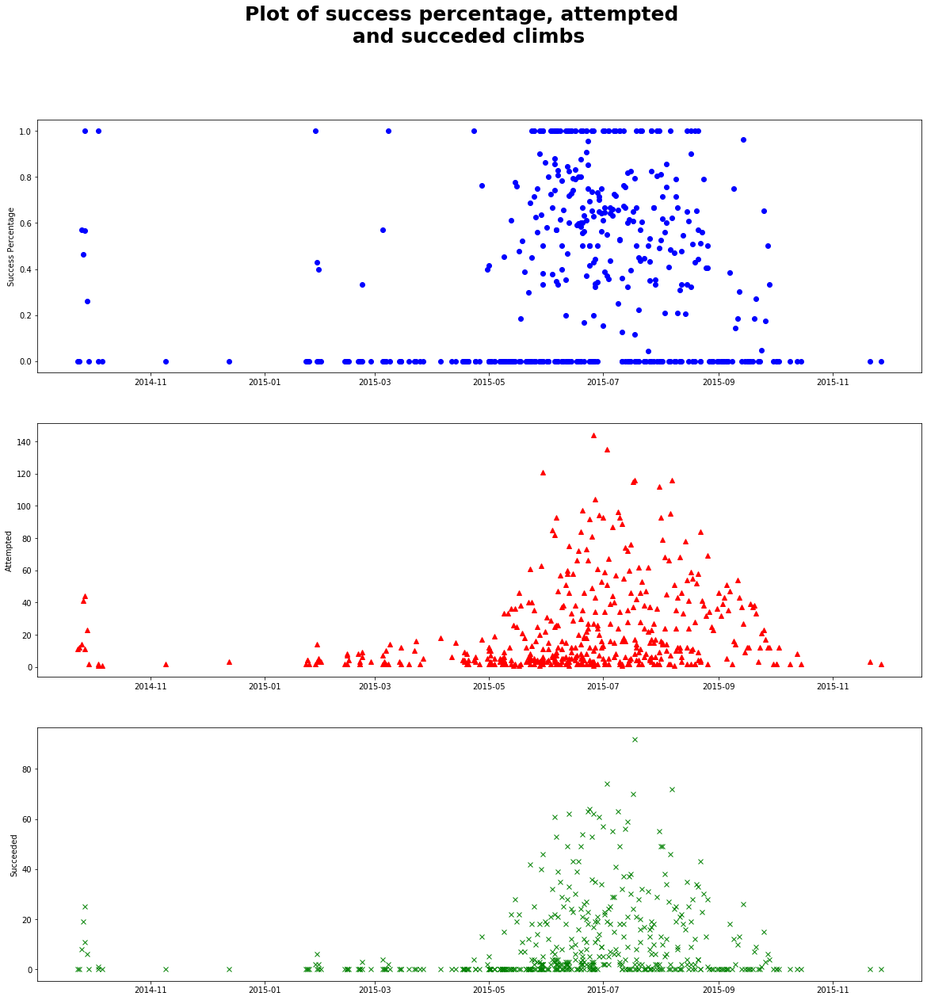


Comments on the plots: We can immediately see that there are vastly more attempts during the Summer rather than the Winter, as  well as success percentage is higher during the Summer months. This suggests seasonality in our data.

#### Question 1.2.2
***

In this task, I plot the weather variables (except Wind Direction) in one diagram with two y-axis. Notes:
- The colours and line-styles are different for easier viewing
- Temperature an Wind Speed Daily correspond to the left Y-axis
- Relative Humidity and Solar Radiation correspond to the right Y-axis


```python
x = df_merged['Date']  # Extracting Dates for the x-axis index
y1 = df_merged['Temperature AVG']
y2 = df_merged['Wind Speed Daily AVG']
y3 = df_merged['Relative Humidity AVG']
y4 = df_merged['Solar Radiation AVG']


fig1, axes11 = plt.subplots(figsize=(13, 8))

axes11.set_xlabel('Date')
axes11.set_ylabel('Temperature, Wind Speed Daily')
axes11.plot(x, y1, 'r', label='Temperature')
axes11.plot(x, y2, 'b--', label='Wind Speed Daily')

axes12 = axes11.twinx()  # Creating second y axis
axes12.set_ylabel('Relative Humidty, Solar Radiation')
axes12.plot(x, y3, 'g', label='Relative Humidity')
axes12.plot(x, y4, 'k--', label='Solar Radiation')

plt.suptitle("Plot of Weather Variables", fontsize=25, fontweight='bold')
plt.grid()
# Setting the legend to the right of diagram
plt.figlegend(loc='right', bbox_to_anchor=(0.75, 0.25, 0.5, 0.5), bbox_transform=axes11.transAxes)
plt.show()
```


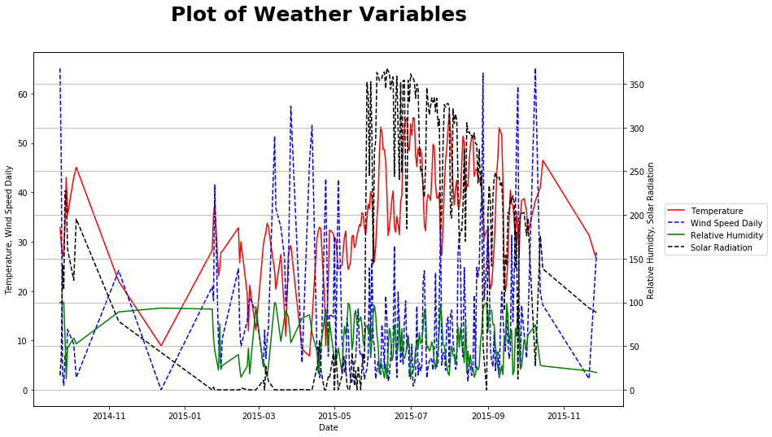


#### Question 1.2.3
***

In this question, we plot a histogram of all the five weather variables using two separate x-axes.


```python
fig2, axes21 = plt.subplots(figsize=(13, 8))

axes21.set_xlim((-5, 100))  # Setting lower x-axis to go from -5 to 100

axes22 = axes21.twiny()
axes22.set_xlim((0, 375))  # Setting higher x-axis to go from 0 to 375

axes21.set_xlabel("Temperature, Relative Humidty, Wind Speed Daily")
axes22.set_xlabel("Wind Direction, Solar Radiation")

df_merged[['Temperature AVG',
           'Relative Humidity AVG',
           'Wind Speed Daily AVG']].plot.hist(bins=50,
                                              figsize=(13, 8),
                                              ax=axes21,
                                              legend=False,
                                              color=['b', 'g', 'r'],
                                              alpha=0.7)
df_merged[['Wind Direction AVG',
           'Solar Radiation AVG']].plot.hist(bins=50,
                                             figsize=(13, 8),
                                             legend=False,
                                             ax=axes22,
                                             color=['y', 'k'],
                                             alpha=0.7)

plt.figlegend(loc='right', bbox_to_anchor=(0.72, 0.25, 0.5, 0.5), bbox_transform=axes21.transAxes)
plt.suptitle("Histogram of All Five Weather Variables", fontsize=25, fontweight='bold')
plt.show()
```


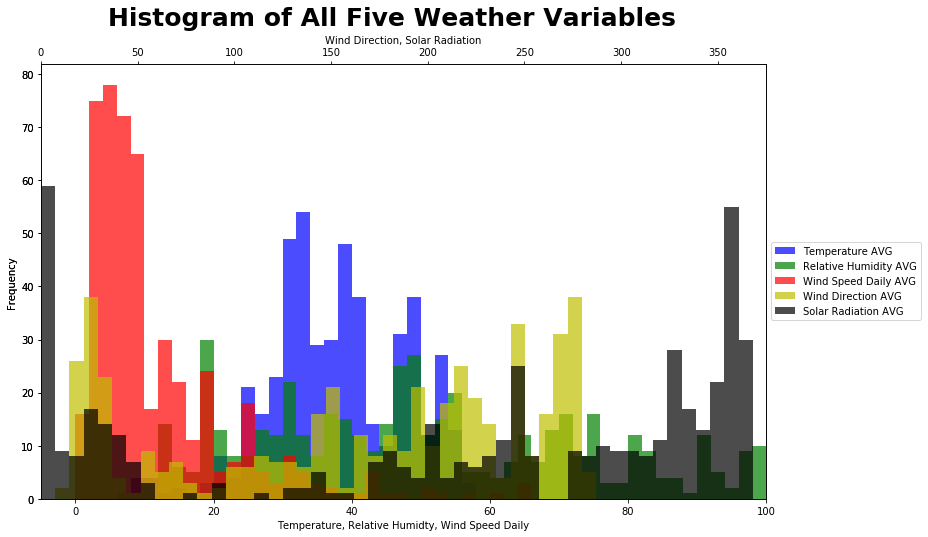


### 1.3 Visualising relationships between descriptors
***
To plot the 5x5 scatter plot of the five weather variables, I will use the in-built function in the seaborn module called pairplot.


```python
list_features = ['Temperature AVG',
                 'Relative Humidity AVG',
                 'Wind Speed Daily AVG',
                 'Wind Direction AVG',
                 'Solar Radiation AVG']
sns.pairplot(df_merged[list_features],kind='scatter')
plt.show()
```


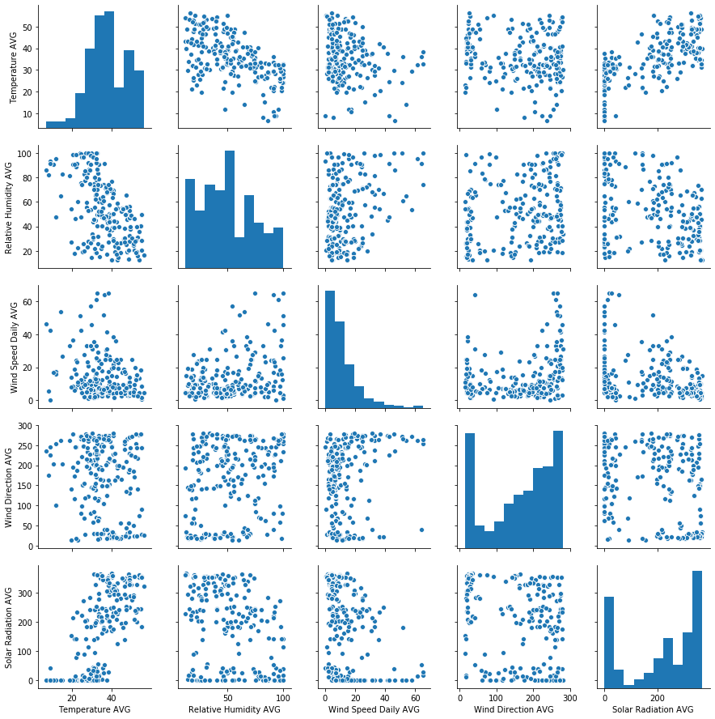


__Comments on Trends Observed:__
- The following plots give no apparent relationship:  Wind Direction/Relative Humidity, Solar Radiation/Wind Direction
- Temperature and Solar Radiation seem to have be weakly linearly correlated. This is to be expected, as higher solar radiation implies stronger sunshine, so it will be hotter.
- Temperature and Relative Humidity seem to be weakly inversely correlated.
- A weak non-linear relationship between Wind Speed Daily and Wind Direction.

Overall, the trends are very weak, and therefore there is a lot of noise in the data, which will make the regression task results difficult to interpret/give weak results. For the Wind Speed Daily/Wind Direction relationship, a linear regression model may not be the most appropriate and may need to result to non-linear models.

### 1.4 Splitting the Merged Data into Training and Validation Sets
***

We begin noting that the data with respect to Success Percentage is not equally distributed. There is a disproportionally large amount of data where the success probability is zero (or close to zero).


```python
df_merged['Success Percentage'].hist(bins=20)  # Plotting Histogram of Success Percentage:
plt.xlabel('Percentage')
plt.ylabel('Count')
plt.show()
```


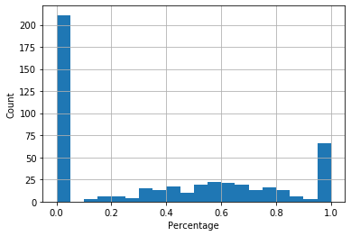


To account for this when splitting the full data into training and validation sets, we will use stratified sampling.

I will split the data into 10 equally spaced bins from 0 to 1.

We then shuffle the data within the bins and take the first 80% of each bin for the training set, and the last 20% of each bin for the validation set.

This should ensure that the training and test data have similar distributions as the full data with respect to success percentage.


```python
def split_data(df, train_size=0.8, test_size=0.2, f='Success Percentage', no_bins=10, seed=30):
    """Function to split the data into train, test sizes.

    We use stratified sampling into 10 separate categories
    """
    # Initialising empty dataframes to be loaded with training and test data
    df_train = pd.DataFrame(columns=df.columns)
    df_val = pd.DataFrame(columns=df.columns)

    # Compute 10 equally spaced bins in terms of Success Percentage using pandas.cut function
    bins = pd.cut(df[f], np.linspace(0, 1, no_bins + 1), right=True, include_lowest=True)

    # We iterate through each bin separately:
    for i in df.groupby(bins).indices.keys():
        df_category = df.iloc[df.groupby(bins).indices[i]]  # Store current 'bin data' into a dataframe
        df_category = df_category.sample(frac=1, axis=0, random_state=seed)  # Shuffle the dataframe to ensure randomness

        total_size = df_category.shape[0]  # Number of elements in current bin
        cutoff = round(total_size*train_size)  # Compute where the 80% mark is in terms of elements

        df_train = pd.concat([df_train, df_category[:cutoff]])  # Take first 80% of each bin for training
        df_val = pd.concat([df_val, df_category[cutoff:]])  # Take last 20% of each bin for validation

    return df_train, df_val
```

In the following cell, we construct a simple test to make sure that the data is sampled correctly.

We will plot a histogram success percentage for the full data, training data and validation data.


If the sample has been done correctly, we should the three histograms look similar.


```python
# Grabbing some training and testing data
df_train_example, df_val_example = split_data(df_merged)

df_merged['Success Percentage'].plot.hist(bins=20, title='FULL DATA')  # Plotting Histogram of Success Percentage:
plt.xlabel('Percentage')
plt.show()
df_train_example['Success Percentage'].plot.hist(bins=20, title='TRAIN DATA')
plt.xlabel('Percentage')
plt.show()
df_val_example['Success Percentage'].plot.hist(bins=20, title='VALIDATION DATA')
plt.xlabel('Percentage')
plt.show()
```


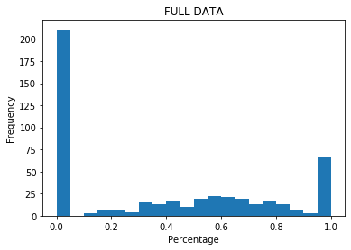


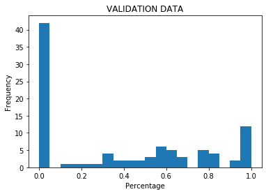


## Task 2: Regression & Classification

### 2.1 Regression
***

We begin by splitting our merged data into the Train, Validation sets and importing the Test data. We then scale the data.


```python
df_train, df_val = split_data(df_merged)

features = ['Temperature AVG', 'Relative Humidity AVG', 'Wind Speed Daily AVG', 'Solar Radiation AVG']
features_cropped = [i[:-4] for i in features]

# Selecting appropriate features for training and validation data
X_Train_Original = df_train[features]
Y_Train = df_train['Success Percentage']
X_Val_Original = df_val[features]
Y_Val = df_val['Success Percentage']
```


```python
# Importing the test data
df_test = pd.read_csv('test_set.csv')
X_Test_Original = df_test.drop(columns=['Date'])
X_Test_Original.head()
```


<div>
<style scoped>
    .dataframe tbody tr th:only-of-type {
        vertical-align: middle;
    }

    .dataframe tbody tr th {
        vertical-align: top;
    }

    .dataframe thead th {
        text-align: right;
    }
</style>
<table border="1" class="dataframe">
  <thead>
    <tr style="text-align: right;">
      <th></th>
      <th>Temperature AVG</th>
      <th>Relative Humidity AVG</th>
      <th>Wind Speed Daily AVG</th>
      <th>Solar Radiation AVG</th>
    </tr>
  </thead>
  <tbody>
    <tr>
      <td>0</td>
      <td>24.062910</td>
      <td>58.87083</td>
      <td>17.977790</td>
      <td>121.91529</td>
    </tr>
    <tr>
      <td>1</td>
      <td>44.631200</td>
      <td>53.49383</td>
      <td>13.540541</td>
      <td>191.19283</td>
    </tr>
    <tr>
      <td>2</td>
      <td>22.614291</td>
      <td>60.07291</td>
      <td>10.451290</td>
      <td>157.10091</td>
    </tr>
    <tr>
      <td>3</td>
      <td>31.687041</td>
      <td>70.55791</td>
      <td>9.876980</td>
      <td>176.24120</td>
    </tr>
  </tbody>
</table>
</div>


```python
# Scaling the Data:
Scaler = sklearn.preprocessing.MinMaxScaler(feature_range=(0, 1))
Scaler = Scaler.fit(X_Train_Original)

X_Train = pd.DataFrame(Scaler.transform(X_Train_Original), columns=features)
X_Val = pd.DataFrame(Scaler.transform(X_Val_Original), columns=features)
X_Test = pd.DataFrame(Scaler.transform(X_Test_Original), columns=features)
```

#### Question 2.1.1 Linear Regression
***

In this task we will:
- Fit a Linear Regression model to the data
- Report the parameters of the model and the in-sample error
- Apply model to validation data and compute out-of-sample error for this data
- Predict the 'Success Percentage' for the Test data 28-31 December 2018


```python
# Scikit-Learn Linear Regression
MODEL1 = sklearn.linear_model.LinearRegression()  # Create an instance of a LinearRegression model
MODEL1.fit(X_Train, Y_Train)  # Fitting the model to the training data
```


    LinearRegression(copy_X=True, fit_intercept=True, n_jobs=None, normalize=False)


```python
params_ols = MODEL1.coef_ # Parameters of the model
params_ols = np.insert(params_ols, 0, MODEL1.intercept_)
df_ols_params = pd.DataFrame(params_ols, columns=['OLS Parameters'], index=[[r'$\beta_%s$' %i for i in range(5)]])
df_ols_params
```


<div>
<style scoped>
    .dataframe tbody tr th:only-of-type {
        vertical-align: middle;
    }

    .dataframe tbody tr th {
        vertical-align: top;
    }

    .dataframe thead th {
        text-align: right;
    }
</style>
<table border="1" class="dataframe">
  <thead>
    <tr style="text-align: right;">
      <th></th>
      <th>OLS Parameters</th>
    </tr>
  </thead>
  <tbody>
    <tr>
      <td>$\beta_0$</td>
      <td>0.117663</td>
    </tr>
    <tr>
      <td>$\beta_1$</td>
      <td>-0.068112</td>
    </tr>
    <tr>
      <td>$\beta_2$</td>
      <td>0.056721</td>
    </tr>
    <tr>
      <td>$\beta_3$</td>
      <td>-0.162291</td>
    </tr>
    <tr>
      <td>$\beta_4$</td>
      <td>0.509877</td>
    </tr>
  </tbody>
</table>
</div>


```python
# In-sample prediction
mse_ols_in_sample = sklearn.metrics.mean_squared_error(MODEL1.predict(X_Train), Y_Train)
print("MSE for In-Sample predictions = %s" %(mse_ols_in_sample))

# Out-of-sample error from Validation Data
mse_ols_out_sample = sklearn.metrics.mean_squared_error(MODEL1.predict(X_Val), Y_Val)
print("MSE for Out-of-Sample predictions = %s" %(mse_ols_out_sample))
```

    MSE for In-Sample predictions = 0.10906866498919157
    MSE for Out-of-Sample predictions = 0.12494509293252187


The out-of-sample MSE is larger than the in-sample MSE. This is to be expected, as the model was fitted to the training data.

The difference in MSE is not very large, suggesting that the model has not overfitted excessively, which makes the model more generalisable.


```python
# Test on out-of-sample data prediction
ols_predictions = MODEL1.predict(X_Test)

df_ols_predictions = pd.DataFrame(ols_predictions,
                                  columns=['OLS Prediction Success Percentage'],
                                  index=[r'$P_%s$'%i for i in range(1, 5)])
df_ols_predictions
```


<div>
<style scoped>
    .dataframe tbody tr th:only-of-type {
        vertical-align: middle;
    }

    .dataframe tbody tr th {
        vertical-align: top;
    }

    .dataframe thead th {
        text-align: right;
    }
</style>
<table border="1" class="dataframe">
  <thead>
    <tr style="text-align: right;">
      <th></th>
      <th>OLS Prediction Success Percentage</th>
    </tr>
  </thead>
  <tbody>
    <tr>
      <td>$P_1$</td>
      <td>0.248072</td>
    </tr>
    <tr>
      <td>$P_2$</td>
      <td>0.323213</td>
    </tr>
    <tr>
      <td>$P_3$</td>
      <td>0.318346</td>
    </tr>
    <tr>
      <td>$P_4$</td>
      <td>0.340549</td>
    </tr>
  </tbody>
</table>
</div>


#### Question 2.1.2 Ridge Regression
***

In this task we will:
- Fit a series of Ridge Regression models, scanning for the optimal alpha (penalty) value that minimizes the MSE on the validation set
- For the optimal alpha, I will compute the parameters of the model and the percentage predictions


```python
# Testing errors for different alphas
N = 1001

alpha_vec = np.logspace(-2, 6, num=N)
train_errors = np.zeros(N)
val_errors = np.zeros(N)

for i, a in enumerate(alpha_vec):
    MODEL2 = sklearn.linear_model.Ridge(alpha=a)
    MODEL2.fit(X_Train, Y_Train)    
    train_errors[i] = sklearn.metrics.mean_squared_error(Y_Train, MODEL2.predict(X_Train))
    val_errors[i] = sklearn.metrics.mean_squared_error(Y_Val, MODEL2.predict(X_Val))
```


```python
fig3 = plt.figure(figsize=(13, 8))

plt.semilogx(alpha_vec, train_errors, 'b', label='Train Errors')
plt.semilogx(alpha_vec, val_errors, 'k', label='Validation Errors')

plt.title("Plot of errors for Ridge Regressions")
plt.xlabel(r"$\alpha$ - Ridge Regression Parameter", fontsize=12)
plt.ylabel('Error MSE')
plt.legend()
plt.grid()
plt.show()
```


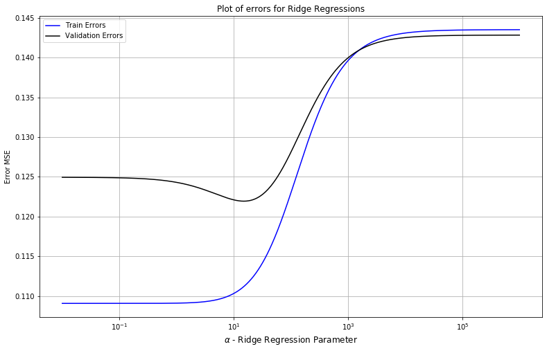


```python
# Optimal alpha is x
alpha_star = alpha_vec[np.argmin(val_errors)]  # Smallest validation error
print("Optimal alpha is %s" %alpha_star)
```

    Optimal alpha is 14.99684835502374


From the graph, we can see that by increasing the penalty parameter ($\alpha$), we do not lower the MSE for the training set, but we do lower it for the validation set.

For small $\alpha$, the variance dominates the MSE. By increasing the $\alpha$, we lower the variance, but increase the bias of the model. At some point, for large alpha, the variance vanishes to zero but the bias dominates the MSE, this can be seen for $\alpha > 10^5$. However, for $\alpha$ between 10-20, the perfect balance occurs and the MSE is at a minimum for the validation set. This is the point at which the model is most generalisable.

This makes sense, as the penalty parameter acts as a constraint to the model. Compared to the Linear Regression model, the Ridge Regression model may have higher bias, but the variance is lowered.

As MSE is linear in bias but quadratic in variance, the change in variance affects it more than the bias (This is called the Variance-Bias trade-off)

Thus we can say, that a Ridge Regression model with $\alpha \approx 15$ performs best for this data.

__Fitting model with optimal $\alpha$:__


```python
MODEL2 = sklearn.linear_model.Ridge(alpha=alpha_star)
MODEL2.fit(X_Train, Y_Train)

params_ridge = MODEL2.coef_ # Parameters of the model
params_ridge = np.insert(params_ridge, 0, MODEL2.intercept_)  # Beta_0 intercept
df_ridge_params = pd.DataFrame(params_ridge,
                               columns=['Ridge Regression Parameters'],
                               index=[[r'$\beta_%s$' %i for i in range(5)]])
df_ridge_params
```


<div>
<style scoped>
    .dataframe tbody tr th:only-of-type {
        vertical-align: middle;
    }

    .dataframe tbody tr th {
        vertical-align: top;
    }

    .dataframe thead th {
        text-align: right;
    }
</style>
<table border="1" class="dataframe">
  <thead>
    <tr style="text-align: right;">
      <th></th>
      <th>Ridge Regression Parameters</th>
    </tr>
  </thead>
  <tbody>
    <tr>
      <td>$\beta_0$</td>
      <td>0.138582</td>
    </tr>
    <tr>
      <td>$\beta_1$</td>
      <td>0.047783</td>
    </tr>
    <tr>
      <td>$\beta_2$</td>
      <td>0.009119</td>
    </tr>
    <tr>
      <td>$\beta_3$</td>
      <td>-0.084393</td>
    </tr>
    <tr>
      <td>$\beta_4$</td>
      <td>0.363914</td>
    </tr>
  </tbody>
</table>
</div>


```python
# In-sample prediction
mse_ridge_in_sample = sklearn.metrics.mean_squared_error(MODEL2.predict(X_Train), Y_Train)
print("MSE for In-Sample predictions = %s" %(mse_ridge_in_sample))

# Out-of-sample error from Validation Data
mse_ridge_out_sample = sklearn.metrics.mean_squared_error(MODEL2.predict(X_Val), Y_Val)
print("MSE for Out-of-Sample predictions = %s" %(mse_ridge_out_sample))
```

    MSE for In-Sample predictions = 0.11118403795787064
    MSE for Out-of-Sample predictions = 0.12193363037749683


```python
# Test on out-of-sample data prediction
ridge_predictions = MODEL2.predict(X_Test)

df_ridge_predictions = pd.DataFrame(ridge_predictions,
                                    columns=['Ridge Prediction Success Percentage'],
                                    index=[r'$P_%s$'%i for i in range(1, 5)])
df_ridge_predictions
```


<div>
<style scoped>
    .dataframe tbody tr th:only-of-type {
        vertical-align: middle;
    }

    .dataframe tbody tr th {
        vertical-align: top;
    }

    .dataframe thead th {
        text-align: right;
    }
</style>
<table border="1" class="dataframe">
  <thead>
    <tr style="text-align: right;">
      <th></th>
      <th>Ridge Prediction Success Percentage</th>
    </tr>
  </thead>
  <tbody>
    <tr>
      <td>$P_1$</td>
      <td>0.257364</td>
    </tr>
    <tr>
      <td>$P_2$</td>
      <td>0.350979</td>
    </tr>
    <tr>
      <td>$P_3$</td>
      <td>0.300626</td>
    </tr>
    <tr>
      <td>$P_4$</td>
      <td>0.330177</td>
    </tr>
  </tbody>
</table>
</div>


#### Question 2.1.3 Discussion
***

In this task we will:
- Displaying the parameters for both models in one table
- Discuss any differences in parameters
- Discuss difference of MSE for the models
- Discuss predictions for the Test set
- Further measures


```python
difference = params_ridge - params_ols
abs_diff = np.abs(difference)
perc_diff = (params_ridge - params_ols)/params_ols
```


```python
df_params_regression = pd.DataFrame(np.array([params_ols, params_ridge, difference, abs_diff, np.round(perc_diff, 3)*100]).T,
                                    columns=['OLS Parameters',
                                             'Ridge Parameters',
                                             'Difference in Parameters',
                                             'Abs. Diff. in Parameters',
                                             'Percentage Diff. in Parameters'],
                                   index=[[r'$\beta_%s$' %i for i in range(5)]])
df_predictions_regression = pd.concat([df_ols_predictions, df_ridge_predictions], axis=1)
```


```python
df_params_regression
```


<div>
<style scoped>
    .dataframe tbody tr th:only-of-type {
        vertical-align: middle;
    }

    .dataframe tbody tr th {
        vertical-align: top;
    }

    .dataframe thead th {
        text-align: right;
    }
</style>
<table border="1" class="dataframe">
  <thead>
    <tr style="text-align: right;">
      <th></th>
      <th>OLS Parameters</th>
      <th>Ridge Parameters</th>
      <th>Difference in Parameters</th>
      <th>Abs. Diff. in Parameters</th>
      <th>Percentage Diff. in Parameters</th>
    </tr>
  </thead>
  <tbody>
    <tr>
      <td>$\beta_0$</td>
      <td>0.117663</td>
      <td>0.138582</td>
      <td>0.020919</td>
      <td>0.020919</td>
      <td>17.8</td>
    </tr>
    <tr>
      <td>$\beta_1$</td>
      <td>-0.068112</td>
      <td>0.047783</td>
      <td>0.115895</td>
      <td>0.115895</td>
      <td>-170.2</td>
    </tr>
    <tr>
      <td>$\beta_2$</td>
      <td>0.056721</td>
      <td>0.009119</td>
      <td>-0.047602</td>
      <td>0.047602</td>
      <td>-83.9</td>
    </tr>
    <tr>
      <td>$\beta_3$</td>
      <td>-0.162291</td>
      <td>-0.084393</td>
      <td>0.077897</td>
      <td>0.077897</td>
      <td>-48.0</td>
    </tr>
    <tr>
      <td>$\beta_4$</td>
      <td>0.509877</td>
      <td>0.363914</td>
      <td>-0.145963</td>
      <td>0.145963</td>
      <td>-28.6</td>
    </tr>
  </tbody>
</table>
</div>


```python
(df_predictions_regression*100).round(2)
```


<div>
<style scoped>
    .dataframe tbody tr th:only-of-type {
        vertical-align: middle;
    }

    .dataframe tbody tr th {
        vertical-align: top;
    }

    .dataframe thead th {
        text-align: right;
    }
</style>
<table border="1" class="dataframe">
  <thead>
    <tr style="text-align: right;">
      <th></th>
      <th>OLS Prediction Success Percentage</th>
      <th>Ridge Prediction Success Percentage</th>
    </tr>
  </thead>
  <tbody>
    <tr>
      <td>$P_1$</td>
      <td>24.81</td>
      <td>25.74</td>
    </tr>
    <tr>
      <td>$P_2$</td>
      <td>32.32</td>
      <td>35.10</td>
    </tr>
    <tr>
      <td>$P_3$</td>
      <td>31.83</td>
      <td>30.06</td>
    </tr>
    <tr>
      <td>$P_4$</td>
      <td>34.05</td>
      <td>33.02</td>
    </tr>
  </tbody>
</table>
</div>


- The parameters for both models, are significantly different, suggesting that the penalty parameter has affected the model setting.
- However, the prediction of the 'Success Percentage' variables are similar, suggesting that both models arrive to similar conclusions.

__Further Plots and Calculations:__


```python
# Residual Plots for Linear Regression
fig10, axes10 = plt.subplots(nrows=3, ncols=2, figsize=(20, 20))

ols_predictions_val = MODEL1.predict(X_Val)
ridge_predictions_val = MODEL2.predict(X_Val)

# Residual Plot
sns.residplot(ols_predictions_val,Y_Val,lowess=True, line_kws={'color': 'red', 'lw': 1, 'alpha': 1}, ax=axes10[0, 0])
axes10[0, 0].set_xlabel("Fitted values")
axes10[0, 0].set_title('Residual plot for Linear Regression')

# Normal Q-Q Plot
residuals_ols = Y_Val - ols_predictions_val
scipy.stats.probplot(residuals_ols, dist="norm", plot=axes10[1, 0])
axes10[1, 0].set_title("Normal Q-Q Plot for Linear Regression")

# Scale-Location Plot
sns.regplot(ols_predictions_val, np.sqrt(np.abs(residuals_ols)),
              scatter=True,
              lowess=True,
              line_kws={'color': 'red', 'lw': 1, 'alpha': 0.8}, ax=axes10[2, 0])
axes10[2, 0].set_ylabel("Standarized residuals")
axes10[2, 0].set_xlabel("Fitted value")
axes10[2, 0].set_title("Scale-Location Plot for Linear Regression")

# Residual Plots for Ridge Regression

# Residual Plot
sns.residplot(ridge_predictions_val,Y_Val,lowess=True, line_kws={'color': 'red', 'lw': 1, 'alpha': 1}, ax=axes10[0, 1])
axes10[0, 1].set_xlabel("Fitted values")
axes10[0, 1].set_title('Residual plot for Ridge Regression')

# Normal Q-Q Plot
residuals_ridge = Y_Val - ridge_predictions_val
scipy.stats.probplot(residuals_ridge, dist="norm", plot=axes10[1, 1])
axes10[1, 1].set_title("Normal Q-Q Plot for Ridge Regression")

# Scale-Location Plot
sns.regplot(ridge_predictions_val, np.sqrt(np.abs(residuals_ridge)),
              scatter=True,
              lowess=True,
              line_kws={'color': 'red', 'lw': 1, 'alpha': 0.8}, ax=axes10[2, 1])
axes10[2, 1].set_ylabel("Standarized residuals")
axes10[2, 1].set_xlabel("Fitted value")
axes10[2, 1].set_title("Scale-Location Plot for Ridge Regression")


plt.suptitle("Goodness-of-fit Plots", fontsize=25, fontweight='bold')
plt.show()
```


- The residual plots indicate that there is some underlying signal (possibly non-linear) that has not been captured by the model. This can be seen as the line of points. If the model captured all of the signal, the residuals should look random and no obvious patterns should emerge.

- From the QQ-Plots, we can see that the fit is not perfect. The fit is better for the middle of the distribution rather than the tails. The fit is slightly better for the Linear Regression model. This suggests that the data may come from a different distribution than the assumed Normal one for regression.

- The scale-residual plots also indicate some underlying signal that has not been captured in the same way as the residual plots.

- The source of difference in the performance is due to the weak linear relationships identified in 1.3. A penalty parameter therefore improves the performance slightly.

### 2.2 Classification
***

#### 2.2.1 Preparation of the data as categorical variables
***

To prepare the categorical data, we unfold the data into Successes and Failures, where Failures=0, Successes=1. This will make classification possible using logistic regression and Naive Bayes.

In total, we should have as many rows in our dataframe as attempted climbs.


```python
# Number of attempted climbs:
print("Number of attempted climbs = %s" %(df_merged['Attempted'].sum()))
```

    Number of attempted climbs = 10134


```python
def encode_categorical(df):
    # This is going to be the unfolded dataframe
    df_expanded = pd.DataFrame(columns=['Date',
                                        'Route',
                                        'Success Bool',
                                        'Success Percentage',
                                        'Temperature AVG',
                                        'Relative Humidity AVG',
                                        'Wind Speed Daily AVG',
                                        'Wind Direction AVG',
                                        'Solar Radiation AVG'])

    for i in df.iterrows():
        # Here i represents every row in the dataframe
        number_succeeded = i[1][3]  # Number of successes
        number_failures = i[1][2] - i[1][3]  # Number of attempts - No. of successess


        # We make a 'constructor' list with N = (Np. Successes + No. Failures) copies of ith row
        # with a new column which corresponds to Success=1, Failure=0
        constructor = ([list(i[1][0:2]) + [1] + list(i[1][4:])]*number_succeeded +
                       [list(i[1][0:2]) + [0] + list(i[1][4:])]*number_failures)

        # Loading into the unfolded dataframe
        df_expanded = pd.concat([df_expanded,
                                 pd.DataFrame(constructor,  
                                              columns=['Date',
                                                       'Route',
                                                       'Success Bool',
                                                       'Success Percentage',
                                                       'Temperature AVG',
                                                       'Relative Humidity AVG',
                                                       'Wind Speed Daily AVG',
                                                       'Wind Direction AVG',
                                                       'Solar Radiation AVG'])],
                                 axis=0,
                                 ignore_index=True)
    return df_expanded
```


```python
df_expanded = encode_categorical(df_merged)
df_expanded.head()
```


<div>
<style scoped>
    .dataframe tbody tr th:only-of-type {
        vertical-align: middle;
    }

    .dataframe tbody tr th {
        vertical-align: top;
    }

    .dataframe thead th {
        text-align: right;
    }
</style>
<table border="1" class="dataframe">
  <thead>
    <tr style="text-align: right;">
      <th></th>
      <th>Date</th>
      <th>Route</th>
      <th>Success Bool</th>
      <th>Success Percentage</th>
      <th>Temperature AVG</th>
      <th>Relative Humidity AVG</th>
      <th>Wind Speed Daily AVG</th>
      <th>Wind Direction AVG</th>
      <th>Solar Radiation AVG</th>
    </tr>
  </thead>
  <tbody>
    <tr>
      <td>0</td>
      <td>2014-09-23</td>
      <td>Disappointment Cleaver</td>
      <td>0</td>
      <td>0.0</td>
      <td>32.857333</td>
      <td>100.0</td>
      <td>65.110667</td>
      <td>254.273333</td>
      <td>16.5938</td>
    </tr>
    <tr>
      <td>1</td>
      <td>2014-09-23</td>
      <td>Disappointment Cleaver</td>
      <td>0</td>
      <td>0.0</td>
      <td>32.857333</td>
      <td>100.0</td>
      <td>65.110667</td>
      <td>254.273333</td>
      <td>16.5938</td>
    </tr>
    <tr>
      <td>2</td>
      <td>2014-09-23</td>
      <td>Disappointment Cleaver</td>
      <td>0</td>
      <td>0.0</td>
      <td>32.857333</td>
      <td>100.0</td>
      <td>65.110667</td>
      <td>254.273333</td>
      <td>16.5938</td>
    </tr>
    <tr>
      <td>3</td>
      <td>2014-09-23</td>
      <td>Disappointment Cleaver</td>
      <td>0</td>
      <td>0.0</td>
      <td>32.857333</td>
      <td>100.0</td>
      <td>65.110667</td>
      <td>254.273333</td>
      <td>16.5938</td>
    </tr>
    <tr>
      <td>4</td>
      <td>2014-09-23</td>
      <td>Disappointment Cleaver</td>
      <td>0</td>
      <td>0.0</td>
      <td>32.857333</td>
      <td>100.0</td>
      <td>65.110667</td>
      <td>254.273333</td>
      <td>16.5938</td>
    </tr>
  </tbody>
</table>
</div>


```python
print("The number of rows in this new dataframe = %s" %(str(df_expanded.shape[0])))
print("Total number of attempts = %s" %(df_merged['Attempted'].sum()))
print("These two are equal, veryfing the correctness of the unfolded data")
```

    The number of rows in this new dataframe = 10134
    Total number of attempts = 10134
    These two are equal, veryfing the correctness of the unfolded data


#### Question 2.2.2 Logistic Regression

___

- In this question, we will train a logistic regression classifier model using the training data after unfolding.

- We will then proceed to plot the receiver operating characteristic curve (ROC), which should give us the performance of the model at all classification models. This is a good way of estimating the overall performance of the model.

- Following the ROC analysis, we will explore different metrics such as the accuracy, precision, recall and f-measure to determine the optimum threshold level to be used.

- Lastly we will explore the differences in errors/performance of the model for the training/validation data.


```python
# Unfolding/encoding the training/validation data for use in the classifiers
df_train_expanded = encode_categorical(df_train)
df_val_expanded = encode_categorical(df_val)

X_Train = df_train_expanded[['Temperature AVG',
                             'Relative Humidity AVG',
                             'Wind Speed Daily AVG',
                             'Solar Radiation AVG']]

Y_Train = df_train_expanded['Success Bool'].astype('int')  # Convert from object

X_Val = df_val_expanded[['Temperature AVG',
                         'Relative Humidity AVG',
                         'Wind Speed Daily AVG',
                         'Solar Radiation AVG']]

Y_Val = df_val_expanded['Success Bool'].astype('int')  # Convert from object
```


```python
# Scaling the data as part of pre-processing between 0 and 1:
Scaler = sklearn.preprocessing.MinMaxScaler(feature_range=(0, 1))
Scaler = Scaler.fit(X_Train)  # We fit the scaler on the training data

# Once scaler has been fitted on training data, we use it to rescale the rest of the data
X_Train = pd.DataFrame(Scaler.transform(X_Train), columns=features)
X_Val = pd.DataFrame(Scaler.transform(X_Val), columns=features)
X_Test = pd.DataFrame(Scaler.transform(X_Test_Original), columns=features)
```


```python
MODEL3 = sklearn.linear_model.LogisticRegression(solver='lbfgs').fit(X_Train, Y_Train)
```


```python
# Estimating the probabilities for training and validation datasets
log_reg_prob_pred_train = MODEL3.predict_proba(X_Train)
log_reg_prob_pred_val = MODEL3.predict_proba(X_Val)

# Loading into dataframe for easier processing
df_log_reg_prob_pred_train = pd.DataFrame(log_reg_prob_pred_train, columns=['Failure Prob.', 'Success Prob.'])
df_log_reg_prob_pred_val = pd.DataFrame(log_reg_prob_pred_val, columns=['Failure Prob.', 'Success Prob.'])

# Displaying probabilities for validation data
df_log_reg_prob_pred_val.head()
```


<div>
<style scoped>
    .dataframe tbody tr th:only-of-type {
        vertical-align: middle;
    }

    .dataframe tbody tr th {
        vertical-align: top;
    }

    .dataframe thead th {
        text-align: right;
    }
</style>
<table border="1" class="dataframe">
  <thead>
    <tr style="text-align: right;">
      <th></th>
      <th>Failure Prob.</th>
      <th>Success Prob.</th>
    </tr>
  </thead>
  <tbody>
    <tr>
      <td>0</td>
      <td>0.386737</td>
      <td>0.613263</td>
    </tr>
    <tr>
      <td>1</td>
      <td>0.386737</td>
      <td>0.613263</td>
    </tr>
    <tr>
      <td>2</td>
      <td>0.386737</td>
      <td>0.613263</td>
    </tr>
    <tr>
      <td>3</td>
      <td>0.706728</td>
      <td>0.293272</td>
    </tr>
    <tr>
      <td>4</td>
      <td>0.706728</td>
      <td>0.293272</td>
    </tr>
  </tbody>
</table>
</div>


We begin by plotting the ROC curves for the training and validation data. We then compute the area under the curve (AUC), which will give us an overall score for performance of the model.


```python
AUC_Train = sklearn.metrics.roc_auc_score(Y_Train, df_log_reg_prob_pred_train['Success Prob.'])
AUC_Val = sklearn.metrics.roc_auc_score(Y_Val, df_log_reg_prob_pred_val['Success Prob.'])

FPR_Train, TPR_Train, threshold_Train = sklearn.metrics.roc_curve(Y_Train, df_log_reg_prob_pred_train['Success Prob.'])
FPR_Val, TPR_Val, threshold_Val = sklearn.metrics.roc_curve(Y_Val, df_log_reg_prob_pred_val['Success Prob.'])
```


```python
fig4 = plt.figure(figsize=(13, 8))

benchmark_line = np.linspace(0, 1, 10)
plt.plot(benchmark_line, benchmark_line, 'b--', label='Benchmark Line')


plt.plot(FPR_Train, TPR_Train, 'r', label='ROC Curve Training Data')
plt.plot(FPR_Val, TPR_Val, 'g', label='ROC Curve Validation Data')

plt.legend()
plt.title('ROC Curves for Logistic Regression Classifier', fontsize=20)
plt.xlabel('False Positive Rate')
plt.ylabel('True Positive Rate')
plt.grid()
plt.show()
```


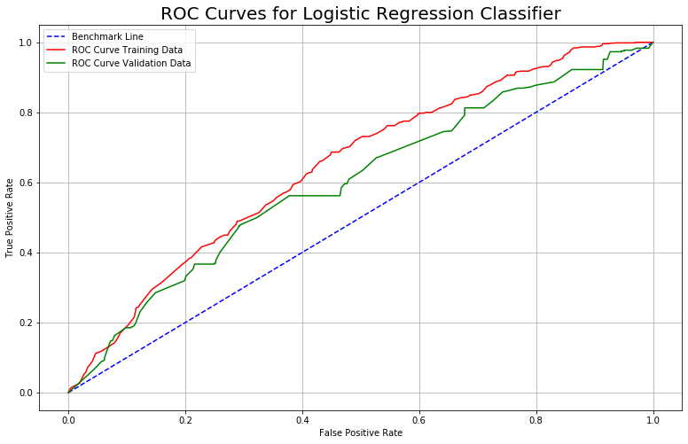


```python
print("AUC Score for Training data = %s" %AUC_Train)
print("AUC Score for Validation data = %s" %AUC_Val)
```

    AUC Score for Training data = 0.6486630023577482
    AUC Score for Validation data = 0.6026222760132436


The dashed blue line is plotted for reference. We want the ROC to be 'above' the blue line and the AUC to be greater than 0.5 (otherwise we are better off just picking at random, rendering the model useless).

We also observe that the AUC is greater for the training data rather than the validation data, indicating a worse performance for out-of-sample data rather than in-sample data, which is to be expected. At least it is larger than 0.5 suggesting a better performance than picking at random.
___

Calculating metrics to find best value of threshold:


```python
Nt = 1001
threshold_mat = np.linspace(0, 1, Nt)

# TPR, FPR GET FROM SKLEARN.METRICS.ROC_CURVE ARGMAX

accuracy_train = np.zeros(Nt)  # Accuracy
accuracy_val = np.zeros(Nt)  # Accuracy

precision_train = np.zeros(Nt)  # Precision
precision_val = np.zeros(Nt)  # Precision

recall_train = np.zeros(Nt)  # Recall
recall_val = np.zeros(Nt)  # Recall

f_test_train = np.zeros(Nt)  # F-test measure
f_test_val = np.zeros(Nt)  # F-test measure


for i, t in enumerate(threshold_mat):
    Y_Pred_Train = (df_log_reg_prob_pred_train['Success Prob.'] >= t).astype(int)
    Y_Pred_Val = (df_log_reg_prob_pred_val['Success Prob.'] >= t).astype(int)

    accuracy_train[i] = sklearn.metrics.accuracy_score(Y_Train, Y_Pred_Train)
    accuracy_val[i] = sklearn.metrics.accuracy_score(Y_Val, Y_Pred_Val)

    precision_train[i] = sklearn.metrics.average_precision_score(Y_Train, Y_Pred_Train)
    precision_val[i] = sklearn.metrics.average_precision_score(Y_Val, Y_Pred_Val)

    recall_train[i] = sklearn.metrics.recall_score(Y_Train, Y_Pred_Train)
    recall_val[i] = sklearn.metrics.recall_score(Y_Val, Y_Pred_Val)


    f_test_train[i] = sklearn.metrics.f1_score(Y_Train, Y_Pred_Train)
    f_test_val[i] = sklearn.metrics.f1_score(Y_Val, Y_Pred_Val)
```

    C:\Users\redfox\Python_Venvs\Main\lib\site-packages\sklearn\metrics\classification.py:1437: UndefinedMetricWarning: F-score is ill-defined and being set to 0.0 due to no predicted samples.
      'precision', 'predicted', average, warn_for)


```python
# Plot of Accuracy:
fig61 = plt.figure(figsize=(13, 8))

plt.plot(threshold_mat,accuracy_train, label='Accuracy Train Data')
plt.plot(threshold_mat,accuracy_val, label='Accuracy Validation Data')
plt.xlabel('Threshold')
plt.ylabel('Accuracy')
plt.title('Accuracy Measure', fontsize=15)


plt.grid()
plt.legend()
plt.show()

# Plot of Precision:
fig62 = plt.figure(figsize=(13, 8))

plt.plot(threshold_mat,precision_train, label='Precision Train Data')
plt.plot(threshold_mat,precision_val, label='Precision Validation Data')
plt.xlabel('Threshold')
plt.ylabel('Precision')
plt.title('Precision Measure', fontsize=15)

plt.grid()

plt.legend()
plt.show()


# Plot of Recall:
fig63 = plt.figure(figsize=(13, 8))

plt.plot(threshold_mat,recall_train, label='Recall Train Data')
plt.plot(threshold_mat,recall_val, label='Recall Validation Data')
plt.xlabel('Threshold')
plt.ylabel('Recall')
plt.title('Recall Measure', fontsize=15)

plt.grid()

plt.legend()
plt.show()


# Plot of f-score
fig64 = plt.figure(figsize=(13, 8))

plt.plot(threshold_mat,f_test_train, label='F-Measure Train Data')
plt.plot(threshold_mat,f_test_val, label='F-Measure Validation Data')
plt.ylabel('F-Measure')
plt.xlabel('Threshold')
plt.title('F-Measure', fontsize=15)
plt.grid()

plt.legend()
plt.show()

t_max_accuracy_train = threshold_mat[np.argmax(accuracy_train)]
t_max_accuracy_val = threshold_mat[np.argmax(accuracy_val)]

print("Max accuracy is attained at: %s for training set; %s for validation set"
       %(t_max_accuracy_train, t_max_accuracy_val))


t_max_precision_train = threshold_mat[np.argmax(precision_train)]
t_max_precision_val = threshold_mat[np.argmax(precision_val)]

print("Max precision is attained at: %s for training set; %s for validation set"
      %(t_max_precision_train, t_max_precision_val))

```


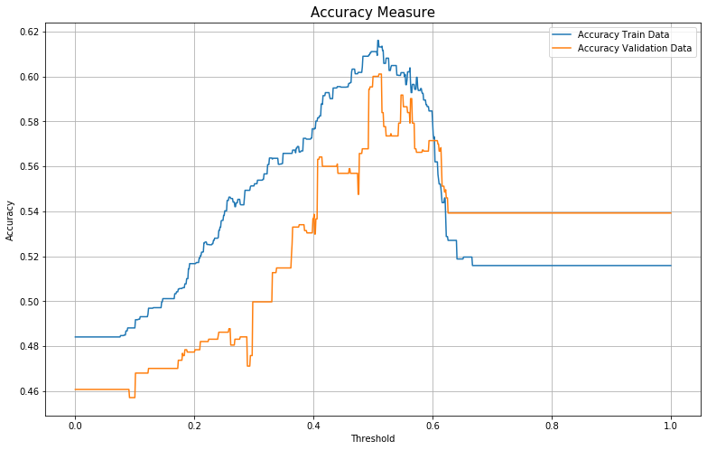


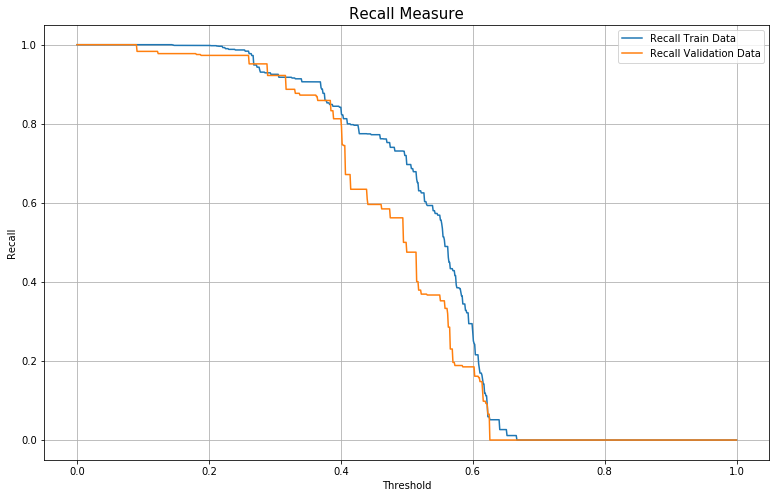


    Max accuracy is attained at: 0.508 for training set; 0.51 for validation set
    Max precision is attained at: 0.508 for training set; 0.51 for validation set


__Observations on metrics__:

We find that the accuracy and precision are greatest for $t=0.51$ for the validation set. The precision measures the fraction of relevant items among the set of items, whilst the recall measures the fraction of total relevant items that were actually picked up, aslo known as the sensitivity.

We can see that recall drops as the threshold increases, and this is captured by the f-measure as well.

From these metrics, we can conclude that for this particular set of data, a threshold of $t \approx 0.5$ is the best model to use. Further validation using external data will need to be used to improve the robustness of the model.

Overall, the errors are greater for the validation set, and therefore we have another indicator that the out-of-sample performance of this model is weaker than the in-sample performance.

#### Question 2.2.3 Naive Bayes

- In this question, we will train a naive bayes (Normal Distribution) using the training data after unfolding using a similar analysis to the previous question.

- We will then proceed to plot the receiver operating characteristic curve (ROC), which should give us the performance of the model at all threshold parameters. This is a good way of estimating the overall performance of the model.

- Following the ROC analysis, we will explore different metrics, including the accuracy, precision and f-measure to determine the optimum threshold level to be used.

- Lastly we will explore the differences in errors/performance of the model for the training/validation data.


```python
MODEL4 = sklearn.naive_bayes.GaussianNB()

MODEL4.fit(X_Train, Y_Train)
```


    GaussianNB(priors=None, var_smoothing=1e-09)


```python
naive_bayes_prob_pred_train = MODEL4.predict_proba(X_Train)
naive_bayes_prob_pred_val = MODEL4.predict_proba(X_Val)

df_naive_bayes_prob_pred_train = pd.DataFrame(naive_bayes_prob_pred_train, columns=['Failure Prob.', 'Success Prob.'])
df_naive_bayes_prob_pred_val = pd.DataFrame(naive_bayes_prob_pred_val, columns=['Failure Prob.', 'Success Prob.'])

df_naive_bayes_prob_pred_train.head()
```


<div>
<style scoped>
    .dataframe tbody tr th:only-of-type {
        vertical-align: middle;
    }

    .dataframe tbody tr th {
        vertical-align: top;
    }

    .dataframe thead th {
        text-align: right;
    }
</style>
<table border="1" class="dataframe">
  <thead>
    <tr style="text-align: right;">
      <th></th>
      <th>Failure Prob.</th>
      <th>Success Prob.</th>
    </tr>
  </thead>
  <tbody>
    <tr>
      <td>0</td>
      <td>0.215749</td>
      <td>0.784251</td>
    </tr>
    <tr>
      <td>1</td>
      <td>0.215749</td>
      <td>0.784251</td>
    </tr>
    <tr>
      <td>2</td>
      <td>0.215749</td>
      <td>0.784251</td>
    </tr>
    <tr>
      <td>3</td>
      <td>0.215749</td>
      <td>0.784251</td>
    </tr>
    <tr>
      <td>4</td>
      <td>0.215749</td>
      <td>0.784251</td>
    </tr>
  </tbody>
</table>
</div>


```python
AUC_Train = sklearn.metrics.roc_auc_score(Y_Train, df_naive_bayes_prob_pred_train['Success Prob.'])
AUC_Val = sklearn.metrics.roc_auc_score(Y_Val, df_naive_bayes_prob_pred_val['Success Prob.'])

FPR_Train, TPR_Train, threshold_Train = sklearn.metrics.roc_curve(Y_Train, df_naive_bayes_prob_pred_train['Success Prob.'])
FPR_Val, TPR_Val, threshold_Val = sklearn.metrics.roc_curve(Y_Val, df_naive_bayes_prob_pred_val['Success Prob.'])
```


```python
fig5 = plt.figure(figsize=(13, 8))

benchmark_line = np.linspace(0, 1, 10)
plt.plot(benchmark_line, benchmark_line, 'b--', label='Benchmark Line')


plt.plot(FPR_Train, TPR_Train, 'r', label='ROC Curve Training Data')
plt.plot(FPR_Val, TPR_Val, 'g', label='ROC Curve Validation Data')

plt.legend()
plt.title('ROC Curves for Naive Bayes Classifier', fontsize=20)
plt.xlabel('False Positive Rate')
plt.ylabel('True Positive Rate')
plt.grid()
plt.show()
```


```python
print("AUC Score for Training data = %s" %AUC_Train)
print("AUC Score for Validation data = %s" %AUC_Val)
```

    AUC Score for Training data = 0.6282273831370524
    AUC Score for Validation data = 0.5845102537925211


We can see that for the Naive Bayes model, the AUC score is above 0.5 but still not very large. These values are slightly lower than the Logistic Regression parameters. Again, the AUC is lower for the validation set, suggesting lower performance for the out-of-sample data.


```python
Nt = 1001
threshold_mat = np.linspace(0, 1, Nt)

# TPR, FPR GET FROM SKLEARN.METRICS.ROC_CURVE ARGMAX

accuracy_train = np.zeros(Nt)  # Accuracy
accuracy_val = np.zeros(Nt)  # Accuracy

precision_train = np.zeros(Nt)  # Precision
precision_val = np.zeros(Nt)  # Precision

recall_train = np.zeros(Nt)  # Recall
recall_val = np.zeros(Nt)  # Recall

f_test_train = np.zeros(Nt)  # F-test measure
f_test_val = np.zeros(Nt)  # F-test measure


for i, t in enumerate(threshold_mat):
    Y_Pred_Train = (df_naive_bayes_prob_pred_train['Success Prob.'] >= t).astype(int)
    Y_Pred_Val = (df_naive_bayes_prob_pred_val['Success Prob.'] >= t).astype(int)

    accuracy_train[i] = sklearn.metrics.accuracy_score(Y_Train, Y_Pred_Train)
    accuracy_val[i] = sklearn.metrics.accuracy_score(Y_Val, Y_Pred_Val)

    precision_train[i] = sklearn.metrics.average_precision_score(Y_Train, Y_Pred_Train)
    precision_val[i] = sklearn.metrics.average_precision_score(Y_Val, Y_Pred_Val)

    recall_train[i] = sklearn.metrics.recall_score(Y_Train, Y_Pred_Train)
    recall_val[i] = sklearn.metrics.recall_score(Y_Val, Y_Pred_Val)

    f_test_train[i] = sklearn.metrics.f1_score(Y_Train, Y_Pred_Train)
    f_test_val[i] = sklearn.metrics.f1_score(Y_Val, Y_Pred_Val)
```

    C:\Users\redfox\Python_Venvs\Main\lib\site-packages\sklearn\metrics\classification.py:1437: UndefinedMetricWarning: F-score is ill-defined and being set to 0.0 due to no predicted samples.
      'precision', 'predicted', average, warn_for)


```python
# Plot of Accuracy:
fig71 = plt.figure(figsize=(13, 8))

plt.plot(threshold_mat,accuracy_train, label='Accuracy Train Data')
plt.plot(threshold_mat,accuracy_val, label='Accuracy Validation Data')
plt.xlabel('Threshold')
plt.ylabel('Accuracy')
plt.title('Accuracy Measure', fontsize=15)


plt.grid()
plt.legend()
plt.show()

# Plot of Precision score:
fig72 = plt.figure(figsize=(13, 8))

plt.plot(threshold_mat,precision_train, label='Precision Train Data')
plt.plot(threshold_mat,precision_val, label='Precision Validation Data')
plt.xlabel('Threshold')
plt.ylabel('Precision')
plt.title('Precision Measure', fontsize=15)

plt.grid()

plt.legend()
plt.show()

# Plot of Precision score:
fig73 = plt.figure(figsize=(13, 8))

plt.plot(threshold_mat,recall_train, label='Recall Train Data')
plt.plot(threshold_mat,recall_val, label='Recall Validation Data')
plt.xlabel('Threshold')
plt.ylabel('Recall')
plt.title('Recall Measure', fontsize=15)
plt.grid()
plt.legend()
plt.show()


# Plot of f-score
fig74 = plt.figure(figsize=(13, 8))

plt.plot(threshold_mat,f_test_train, label='F-Measure Train Data')
plt.plot(threshold_mat,f_test_val, label='F-Measure Validation Data')
plt.ylabel('F-Measure')
plt.xlabel('Threshold')
plt.title('F-Measure', fontsize=15)
plt.grid()

plt.legend()
plt.show()

t_max_accuracy_train = threshold_mat[np.argmax(accuracy_train)]
t_max_accuracy_val = threshold_mat[np.argmax(accuracy_val)]

print("Max accuracy is attained at: %s for training set; %s for validation set"
       %(t_max_accuracy_train, t_max_accuracy_val))


t_max_precision_train = threshold_mat[np.argmax(precision_train)]
t_max_precision_val = threshold_mat[np.argmax(precision_val)]

print("Max precision is attained at: %s for training set; %s for validation set"
      %(t_max_precision_train, t_max_precision_val))

```


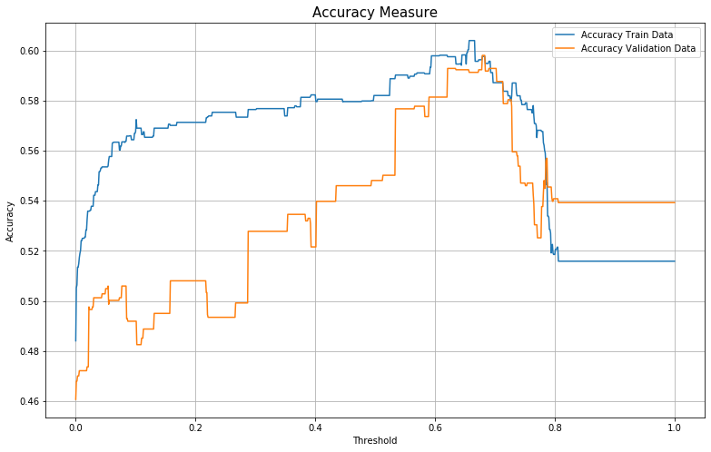


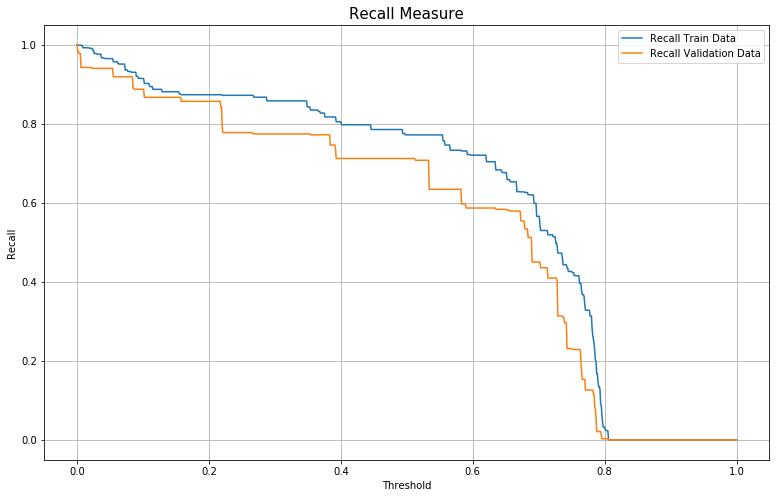


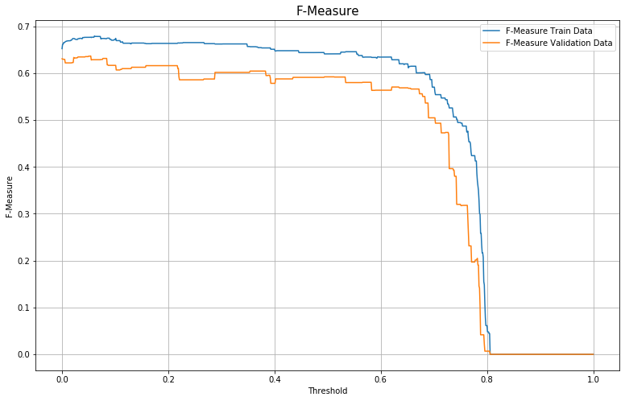


    Max accuracy is attained at: 0.657 for training set; 0.679 for validation set
    Max precision is attained at: 0.657 for training set; 0.679 for validation set


__Observation on metrics:__

- The optimum threshold for the validation data is $t = 0.679$.

- After the threshold, the f-measure drops dramatically, suggesting we should not take a threshold higher than this.

- At $t = 0.679$, the accuracy measure is similar for both the training and validation data. At this threshold, we see a larger difference in precision for the trainin and validation sets.

# *The End*
