<h1>Table of Contents<span class="tocSkip"></span></h1>
<div class="toc"><ul class="toc-item"><li><span><a href="#Methods-for-Data-Science---Coursework-3" data-toc-modified-id="Methods-for-Data-Science---Coursework-3-1"><span class="toc-item-num">1&nbsp;&nbsp;</span>Methods for Data Science - Coursework 3</a></span><ul class="toc-item"><li><span><a href="#Unsupervised-and-Supervised-Learning-on-High-Dimensional-Data" data-toc-modified-id="Unsupervised-and-Supervised-Learning-on-High-Dimensional-Data-1.1"><span class="toc-item-num">1.1&nbsp;&nbsp;</span>Unsupervised and Supervised Learning on High-Dimensional Data</a></span><ul class="toc-item"><li><ul class="toc-item"><li><span><a href="#Tudor-Trita-Trita---CID:-01199397" data-toc-modified-id="Tudor-Trita-Trita---CID:-01199397-1.1.0.1"><span class="toc-item-num">1.1.0.1&nbsp;&nbsp;</span>Tudor Trita Trita - CID: 01199397</a></span></li></ul></li></ul></li><li><span><a href="#Task-1---Unsupervised-Learning:-Text-Documents-with-an-Associated-Citation-Graph" data-toc-modified-id="Task-1---Unsupervised-Learning:-Text-Documents-with-an-Associated-Citation-Graph-1.2"><span class="toc-item-num">1.2&nbsp;&nbsp;</span>Task 1 - Unsupervised Learning: Text Documents with an Associated Citation Graph</a></span><ul class="toc-item"><li><span><a href="#Question-1.1---Clustering-of-the-Feature-Matrix" data-toc-modified-id="Question-1.1---Clustering-of-the-Feature-Matrix-1.2.1"><span class="toc-item-num">1.2.1&nbsp;&nbsp;</span>Question 1.1 - Clustering of the Feature Matrix</a></span></li><li><span><a href="#Question-1.2---Analysis-of-the-Citation-Graph" data-toc-modified-id="Question-1.2---Analysis-of-the-Citation-Graph-1.2.2"><span class="toc-item-num">1.2.2&nbsp;&nbsp;</span>Question 1.2 - Analysis of the Citation Graph</a></span></li><li><span><a href="#Question-1.3---Community-Detection-on-the-Citation-Graph" data-toc-modified-id="Question-1.3---Community-Detection-on-the-Citation-Graph-1.2.3"><span class="toc-item-num">1.2.3&nbsp;&nbsp;</span>Question 1.3 - Community Detection on the Citation Graph</a></span></li><li><span><a href="#Question-1.4---Comparison-of-Feature-and-Graph-Clusterings" data-toc-modified-id="Question-1.4---Comparison-of-Feature-and-Graph-Clusterings-1.2.4"><span class="toc-item-num">1.2.4&nbsp;&nbsp;</span>Question 1.4 - Comparison of Feature and Graph Clusterings</a></span></li></ul></li><li><span><a href="#Task-2---Classification-of-a-Set-of-Images" data-toc-modified-id="Task-2---Classification-of-a-Set-of-Images-1.3"><span class="toc-item-num">1.3&nbsp;&nbsp;</span>Task 2 - Classification of a Set of Images</a></span><ul class="toc-item"><li><span><a href="#Question-2.1---Unsupervised-Clustering-of-the-Image-Dataset" data-toc-modified-id="Question-2.1---Unsupervised-Clustering-of-the-Image-Dataset-1.3.1"><span class="toc-item-num">1.3.1&nbsp;&nbsp;</span>Question 2.1 - Unsupervised Clustering of the Image Dataset</a></span></li><li><span><a href="#Question-2.2---Supervised-Classification-of-the-Training-Set" data-toc-modified-id="Question-2.2---Supervised-Classification-of-the-Training-Set-1.3.2"><span class="toc-item-num">1.3.2&nbsp;&nbsp;</span>Question 2.2 - Supervised Classification of the Training Set</a></span><ul class="toc-item"><li><span><a href="#Question-2.2.1---MLP-Neural-Network-Supervised-Classification" data-toc-modified-id="Question-2.2.1---MLP-Neural-Network-Supervised-Classification-1.3.2.1"><span class="toc-item-num">1.3.2.1&nbsp;&nbsp;</span>Question 2.2.1 - MLP Neural Network Supervised Classification</a></span></li><li><span><a href="#Question-2.2.2---Convolutional-Neural-Network-(CNN)-Supervised-Classification" data-toc-modified-id="Question-2.2.2---Convolutional-Neural-Network-(CNN)-Supervised-Classification-1.3.2.2"><span class="toc-item-num">1.3.2.2&nbsp;&nbsp;</span>Question 2.2.2 - Convolutional Neural Network (CNN) Supervised Classification</a></span></li><li><span><a href="#Question-2.2.3---Comparison-of-the-Classifiers" data-toc-modified-id="Question-2.2.3---Comparison-of-the-Classifiers-1.3.2.3"><span class="toc-item-num">1.3.2.3&nbsp;&nbsp;</span>Question 2.2.3 - Comparison of the Classifiers</a></span></li></ul></li></ul></li><li><span><a href="#Task-3---Poster" data-toc-modified-id="Task-3---Poster-1.4"><span class="toc-item-num">1.4&nbsp;&nbsp;</span>Task 3 - Poster</a></span></li><li><span><a href="#Task-4---(Mastery)-Dimensionality-Reduction-of-Images" data-toc-modified-id="Task-4---(Mastery)-Dimensionality-Reduction-of-Images-1.5"><span class="toc-item-num">1.5&nbsp;&nbsp;</span>Task 4 - (Mastery) Dimensionality Reduction of Images</a></span><ul class="toc-item"><li><span><a href="#Question-4.1---Comparing-PCA-and-NMF-Dimensionality-Reduction" data-toc-modified-id="Question-4.1---Comparing-PCA-and-NMF-Dimensionality-Reduction-1.5.1"><span class="toc-item-num">1.5.1&nbsp;&nbsp;</span>Question 4.1 - Comparing PCA and NMF Dimensionality Reduction</a></span></li><li><span><a href="#Question-4.2---Latent-Dirichlet-Allocation-(LDA)-Applied-to-Images" data-toc-modified-id="Question-4.2---Latent-Dirichlet-Allocation-(LDA)-Applied-to-Images-1.5.2"><span class="toc-item-num">1.5.2&nbsp;&nbsp;</span>Question 4.2 - Latent Dirichlet Allocation (LDA) Applied to Images</a></span></li></ul></li></ul></li><li><span><a href="#The-End" data-toc-modified-id="The-End-2"><span class="toc-item-num">2&nbsp;&nbsp;</span><em>The End</em></a></span></li></ul></div>

# Methods for Data Science - Coursework 3

## Unsupervised and Supervised Learning on High-Dimensional Data
***

#### Tudor Trita Trita - CID: 01199397

__Note: Python 3.7 Used (F-String Enabled, 3.6+)__
***


```python
import matplotlib
import matplotlib.pyplot as plt
%matplotlib inline

import networkx as nx
import numpy as np

import pandas as pd

import seaborn as sns

import sklearn
import sklearn.cluster
import sklearn.metrics
import sklearn.neighbors

import time

import torch
import torch.nn
```

## Task 1 - Unsupervised Learning: Text Documents with an Associated Citation Graph
***

The data for this task is stored inside of the folder ```data/task1```.

We begin this task by loading the feature matrix and the adjacency matrix for this task.

The data in the feature matrix contains information on the presence or absence of a word (feature) in a set of papers. Each paper (2485 total) is stored as a row in the matrix.

The data in the adjacency matrix corresponds to the citation graph between all the papers. The adjacency matrix encodes an undirected graph with 2485 nodes, each of which corresponding to an individual paper.


```python
df_feature_matrix = pd.read_csv("data/task1/feature_matrix.csv",header=None,
                                names=[f"Word {i}" for i in range(1433)], dtype=int)
np_feature_matrix = np.asarray(df_feature_matrix)  # Convert to Numpy ndarray for Calculations

df_adjacency_matrix = pd.read_csv("data/task1/adjacency_matrix.csv", header=None,
                                  names=[f"Paper {i}" for i in range(2485)], dtype=int)
np_adjacency_matrix = np.asarray(df_adjacency_matrix)  # Convert to Numpy ndarray for Calculations
```


```python
print(f"Size of the feature matrix: {df_feature_matrix.shape}")
print(f"Number of null values in the feature matrix: {df_feature_matrix.isnull().sum().sum()}\n")
print("Displaying head of the feature matrix:")
df_feature_matrix.head()
```

    Size of the feature matrix: (2485, 1433)
    Number of null values in the feature matrix: 0

    Displaying head of the feature matrix:


<div>
<style scoped>
    .dataframe tbody tr th:only-of-type {
        vertical-align: middle;
    }

    .dataframe tbody tr th {
        vertical-align: top;
    }

    .dataframe thead th {
        text-align: right;
    }
</style>
<table border="1" class="dataframe">
  <thead>
    <tr style="text-align: right;">
      <th></th>
      <th>Word 0</th>
      <th>Word 1</th>
      <th>Word 2</th>
      <th>Word 3</th>
      <th>Word 4</th>
      <th>Word 5</th>
      <th>Word 6</th>
      <th>Word 7</th>
      <th>Word 8</th>
      <th>Word 9</th>
      <th>...</th>
      <th>Word 1423</th>
      <th>Word 1424</th>
      <th>Word 1425</th>
      <th>Word 1426</th>
      <th>Word 1427</th>
      <th>Word 1428</th>
      <th>Word 1429</th>
      <th>Word 1430</th>
      <th>Word 1431</th>
      <th>Word 1432</th>
    </tr>
  </thead>
  <tbody>
    <tr>
      <td>0</td>
      <td>0</td>
      <td>0</td>
      <td>0</td>
      <td>0</td>
      <td>0</td>
      <td>0</td>
      <td>0</td>
      <td>0</td>
      <td>0</td>
      <td>0</td>
      <td>...</td>
      <td>0</td>
      <td>0</td>
      <td>0</td>
      <td>0</td>
      <td>0</td>
      <td>0</td>
      <td>0</td>
      <td>0</td>
      <td>0</td>
      <td>0</td>
    </tr>
    <tr>
      <td>1</td>
      <td>0</td>
      <td>0</td>
      <td>0</td>
      <td>0</td>
      <td>0</td>
      <td>0</td>
      <td>0</td>
      <td>0</td>
      <td>0</td>
      <td>0</td>
      <td>...</td>
      <td>0</td>
      <td>0</td>
      <td>0</td>
      <td>0</td>
      <td>0</td>
      <td>0</td>
      <td>0</td>
      <td>0</td>
      <td>0</td>
      <td>0</td>
    </tr>
    <tr>
      <td>2</td>
      <td>0</td>
      <td>0</td>
      <td>0</td>
      <td>0</td>
      <td>0</td>
      <td>0</td>
      <td>0</td>
      <td>0</td>
      <td>0</td>
      <td>0</td>
      <td>...</td>
      <td>0</td>
      <td>0</td>
      <td>0</td>
      <td>0</td>
      <td>0</td>
      <td>0</td>
      <td>0</td>
      <td>0</td>
      <td>0</td>
      <td>0</td>
    </tr>
    <tr>
      <td>3</td>
      <td>0</td>
      <td>0</td>
      <td>0</td>
      <td>1</td>
      <td>0</td>
      <td>0</td>
      <td>0</td>
      <td>0</td>
      <td>0</td>
      <td>0</td>
      <td>...</td>
      <td>0</td>
      <td>0</td>
      <td>0</td>
      <td>0</td>
      <td>0</td>
      <td>0</td>
      <td>0</td>
      <td>0</td>
      <td>0</td>
      <td>0</td>
    </tr>
    <tr>
      <td>4</td>
      <td>0</td>
      <td>0</td>
      <td>0</td>
      <td>0</td>
      <td>0</td>
      <td>0</td>
      <td>0</td>
      <td>0</td>
      <td>0</td>
      <td>0</td>
      <td>...</td>
      <td>0</td>
      <td>0</td>
      <td>0</td>
      <td>0</td>
      <td>0</td>
      <td>0</td>
      <td>0</td>
      <td>0</td>
      <td>0</td>
      <td>0</td>
    </tr>
  </tbody>
</table>
<p>5 rows × 1433 columns</p>
</div>


```python
print(f"Size of the adjacency matrix: {df_adjacency_matrix.shape}")
print(f"Number of null values in the adjacency matrix: {df_adjacency_matrix.isnull().sum().sum()}\n")
print("Displaying head of the adjacency matrix:")
df_adjacency_matrix.head()
```

    Size of the adjacency matrix: (2485, 2485)
    Number of null values in the adjacency matrix: 0

    Displaying head of the adjacency matrix:


<div>
<style scoped>
    .dataframe tbody tr th:only-of-type {
        vertical-align: middle;
    }

    .dataframe tbody tr th {
        vertical-align: top;
    }

    .dataframe thead th {
        text-align: right;
    }
</style>
<table border="1" class="dataframe">
  <thead>
    <tr style="text-align: right;">
      <th></th>
      <th>Paper 0</th>
      <th>Paper 1</th>
      <th>Paper 2</th>
      <th>Paper 3</th>
      <th>Paper 4</th>
      <th>Paper 5</th>
      <th>Paper 6</th>
      <th>Paper 7</th>
      <th>Paper 8</th>
      <th>Paper 9</th>
      <th>...</th>
      <th>Paper 2475</th>
      <th>Paper 2476</th>
      <th>Paper 2477</th>
      <th>Paper 2478</th>
      <th>Paper 2479</th>
      <th>Paper 2480</th>
      <th>Paper 2481</th>
      <th>Paper 2482</th>
      <th>Paper 2483</th>
      <th>Paper 2484</th>
    </tr>
  </thead>
  <tbody>
    <tr>
      <td>0</td>
      <td>0</td>
      <td>0</td>
      <td>0</td>
      <td>0</td>
      <td>0</td>
      <td>0</td>
      <td>0</td>
      <td>0</td>
      <td>0</td>
      <td>0</td>
      <td>...</td>
      <td>0</td>
      <td>0</td>
      <td>0</td>
      <td>0</td>
      <td>0</td>
      <td>0</td>
      <td>0</td>
      <td>0</td>
      <td>0</td>
      <td>0</td>
    </tr>
    <tr>
      <td>1</td>
      <td>0</td>
      <td>0</td>
      <td>1</td>
      <td>0</td>
      <td>0</td>
      <td>0</td>
      <td>0</td>
      <td>0</td>
      <td>0</td>
      <td>0</td>
      <td>...</td>
      <td>0</td>
      <td>0</td>
      <td>0</td>
      <td>0</td>
      <td>0</td>
      <td>0</td>
      <td>0</td>
      <td>0</td>
      <td>0</td>
      <td>0</td>
    </tr>
    <tr>
      <td>2</td>
      <td>0</td>
      <td>1</td>
      <td>0</td>
      <td>0</td>
      <td>0</td>
      <td>0</td>
      <td>0</td>
      <td>0</td>
      <td>0</td>
      <td>0</td>
      <td>...</td>
      <td>0</td>
      <td>0</td>
      <td>0</td>
      <td>0</td>
      <td>0</td>
      <td>0</td>
      <td>0</td>
      <td>0</td>
      <td>0</td>
      <td>0</td>
    </tr>
    <tr>
      <td>3</td>
      <td>0</td>
      <td>0</td>
      <td>0</td>
      <td>0</td>
      <td>0</td>
      <td>0</td>
      <td>0</td>
      <td>0</td>
      <td>0</td>
      <td>0</td>
      <td>...</td>
      <td>0</td>
      <td>0</td>
      <td>0</td>
      <td>0</td>
      <td>0</td>
      <td>0</td>
      <td>0</td>
      <td>0</td>
      <td>0</td>
      <td>0</td>
    </tr>
    <tr>
      <td>4</td>
      <td>0</td>
      <td>0</td>
      <td>0</td>
      <td>0</td>
      <td>0</td>
      <td>0</td>
      <td>0</td>
      <td>0</td>
      <td>0</td>
      <td>0</td>
      <td>...</td>
      <td>0</td>
      <td>0</td>
      <td>0</td>
      <td>0</td>
      <td>0</td>
      <td>0</td>
      <td>0</td>
      <td>0</td>
      <td>0</td>
      <td>0</td>
    </tr>
  </tbody>
</table>
<p>5 rows × 2485 columns</p>
</div>


### Question 1.1 - Clustering of the Feature Matrix
***

In this task, we are required to find optimised clusterings of the feature matrix F using the k-means algorithm for all values of k in the interval [2, 30]. When performing clustering, we seek to 'cut' our graph into different groups based on some criterion. For unweighted graphs, this may be based on the number of connections between the nodes in the graph. For weighted graphs, we can think of grouping the nodes in a graph based on their weights or distances.

A _cluster_ refers to a set of nodes grouped together based on certan criteria/similarities. A _centroid_ of a group of nodes refers to the point that 'averages' the position of the nodes in a certain group. A graph may be well-described by a single centroid, however it is usually the case that it makes sense to find clusterings of a graph, each with its own centroid, as this may give more insight into the structure of the graph.

The K-Means algorithm is an unsupervised learning algorithm that attempts to identify K centroids within a graph, and then allocating all the data in the graph to the nearest centroid, thus creating K distinct clusters. It is easy to see that for small K, the groups may be too general, revealing too little structure, whilst for big K, we may end up creating more clusters than necessary, which may obfuscate the structure within the graph.

***

To evaluate the quality of the clustering achieved and pick an 'optimal' K, we focus on computing the Calinski-Harabasz (CH) score for each cluster size. We will compute a couple of other metrics which evaluate the quality of the clusterings, namely using the _Elbow Method_ and the _Silhouette Method_.

The meanings of the quality measures are as follows:

- The __Calinski-Harabasz Score__, also known as the Variance Ratio Criterion is a heuristic defined as the ratio between the within-cluster dispersion and the between-cluster dispersion. The CH score is higher when the resulting clusters are dense and not close to each other, making the clustering more robust. Thus the cluster size which maximises the CH score should be taken as the optimal K. The CH score can be computed using the scikit-learn function: ```sklearn.metrics.calinski_harabasz_score```
- The __Elbow Method__ relies on a concept called inertia. Inertia measures the intra-cluster variation, which determines how similar the elements of a cluster are to each other in some mathematical sense. There is a trade-off between inertia and number of clusters; more clusters leads to lower inertia. We would like to choose a clustering such that adding another cluster will not reduce the inertia a lot, and the heuristic relies on where the cutoff point on this reduction lies.
- The __Silhouette Method__ involves the calculation of the _silhouette score_ (refered to as SHS in this CW) for each clustering size. The SHS for a sample is calculated using the mean intra-cluster distance $\alpha$ and the mean nearest-cluster distance $\beta$ and is given by the formula $(\beta-\alpha) \ / \ \max(\alpha, \beta)$. The score takes a value between -1 and 1, with 1 being the best possible value, 0 indicating overlapping clusters and values less than 0 indicating that observations are assigned to the wrong cluster.


```python
# Defining Search Range
K_means_range = np.arange(2, 31)
CH_score_array = np.zeros(K_means_range.size)
INERTIA_array = np.zeros(K_means_range.size)
SHS_array = np.zeros(K_means_range.size)

# Parameter search and computing various scores
print("Starting K-Means Clustering Exploration:\n")
for i, K in enumerate(K_means_range):
    print(f"K = {K}")
    Kmean = sklearn.cluster.KMeans(n_clusters=K).fit(df_feature_matrix)
    CH_score_array[i] = sklearn.metrics.calinski_harabasz_score(df_feature_matrix, Kmean.labels_)
    INERTIA_array[i] = Kmean.inertia_
    SHS_array[i] = sklearn.metrics.silhouette_score(df_feature_matrix, Kmean.labels_)

print("\nFINISHED")
```

    Starting K-Means Clustering Exploration:

    K = 2
    K = 3
    K = 4
    K = 5
    K = 6
    K = 7
    K = 8
    K = 9
    K = 10
    K = 11
    K = 12
    K = 13
    K = 14
    K = 15
    K = 16
    K = 17
    K = 18
    K = 19
    K = 20
    K = 21
    K = 22
    K = 23
    K = 24
    K = 25
    K = 26
    K = 27
    K = 28
    K = 29
    K = 30

    FINISHED


```python
# Plot of CH score
# Finding first K that minimises the CH score is less than 7
K_criterion = np.argwhere(CH_score_array < 7)[0][0] + 2  # +2 to compensate for indexing
CH_score = CH_score_array[K_criterion - 2]  # Index in array

# Plotting Calinski-Harabasz Scores for Different Clusterings
fig110 = plt.figure(figsize=(10, 7))
plt.plot(K_means_range, CH_score_array)
plt.plot(K_criterion, CH_score, 'ro', label=f"Criteria: K={K_criterion}, CH={CH_score:.2f}")
plt.legend()
plt.grid()
plt.xlabel("K")
plt.ylabel("CH Score")

title110 = "Figure 110 - Calinski-Harabsz Score for Different Clustering K-Means"
plt.title(title110, fontsize=14)
plt.savefig(f"figures/{title110}.png")
plt.show()
```


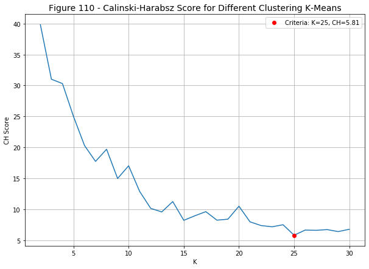


```python
# Plot of Inertia for Elbow Method:
fig111 = plt.figure(figsize=(10, 7))
plt.plot(K_means_range, INERTIA_array)
plt.grid()
plt.xlabel("K")
plt.ylabel("Inertia")

title111 = "Figure 111 - Inertia for Different Clustering K-Means (Elbow Method)"
plt.title(title111, fontsize=14)
plt.savefig(f"figures/{title111}.png")
plt.show()
```


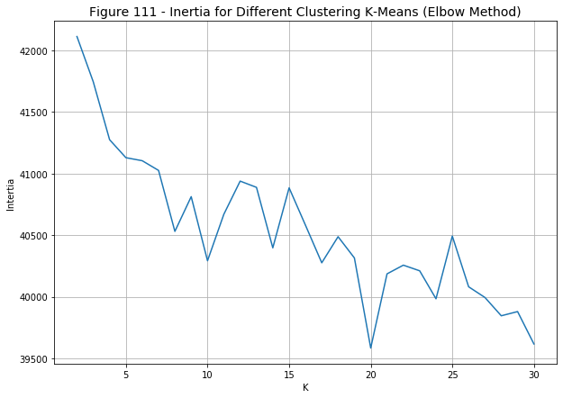


```python
# Plot of Silhouette Score:
fig112 = plt.figure(figsize=(10, 7))
plt.plot(K_means_range, SHS_array)
plt.grid()
plt.xlabel("K")
plt.ylabel("Silhouette Score")

title112 = "Figure 112 - Silhouette Score for Different Clustering K-Means (Silhouette Method)"
plt.title(title112, fontsize=14)
plt.savefig(f"figures/{title112}.png")
plt.show()
```


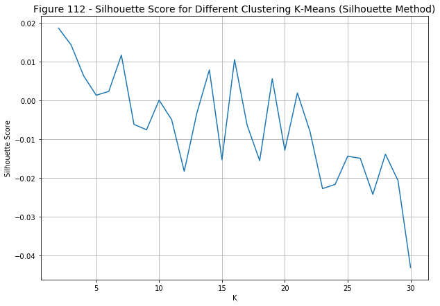


***
We now evaluate the 'quality' of this optimal clustering by looking at the distribution of cluster sizes and the within group and across group similarities.


```python
# Fitting the 'optimal' K-Means Cluster Algorithm
Kmeans_optimal = sklearn.cluster.KMeans(n_clusters=K_criterion).fit(df_feature_matrix)
```


```python
# Distribution of Cluster Sizes
df_kmeans_optimal_labels = pd.Series(Kmeans_optimal.labels_ + 1)
cluster_distribution = df_kmeans_optimal_labels.value_counts().sort_index()

fig113, ax113 = plt.subplots(figsize=(10, 6))

cluster_distribution.plot(ax=ax113, kind='bar')
ax113.set_xticklabels(cluster_distribution.index, rotation='horizontal')
ax113.set_xlabel("Cluster Number")
ax113.set_ylabel("No. of Elements in Cluster")

title113 = "Figure 113 - Cluster Size of the Clusters Generated"
plt.title(title113)
plt.savefig(f"figures/{title113}.png")
plt.show()

# Inertia & SHS score
print(f"Inertia of this model = {Kmeans_optimal.inertia_:.2f}")
print(f"CH Score of this model = {sklearn.metrics.calinski_harabasz_score(df_feature_matrix, Kmeans_optimal.labels_):.3f}")
print(f"Silhouette Score of this model = {sklearn.metrics.silhouette_score(df_feature_matrix, Kmeans_optimal.labels_):.3f}")
```


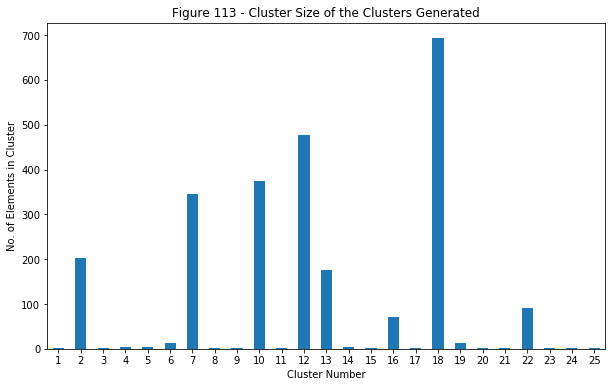


    Inertia of this model = 40040.51
    CH Score of this model = 7.031
    Silhouette Score of this model = -0.090


__Comments on results__:

For some problems, the CH score may be high for low K, even though an optimal clustering number may not have been reached. This is why the threshold of CH = 7 is used.

1. From Figure 110 we can see that the CH score is first < 7 for K=25 within the first run. This corresponds with fitting 25 clusters to the model. However, when fitting another K-Means clustering with K=25, we can see that the CH score changes to just above 7. This is due to the randomness in the K-Means algorithm, which may not give the same results at every run.

2. Figure 111 gives a graphical representation of how inertia changes as we vary K. The overall trend is for the inertia to decrease as we increase K as expected. However, for K=25 as suggested by the CH score, there isn't an obvious elbow in the graph, suggesting that the quality of the clustering is not necessarily the best.

3. Figure 112 shows the silhouette score for the different clusterings. We can see that the scores are very near to zero for all different clusterings, suggesting that 1. the quality of the clustering of K=25 is poor and 2. K-Means algorithm may not be the best clustering algorithm available for this dataset.

4. Figure 113 shows the number of elements for each of the 25 different clusters. We can see that a relatively low number of clusters have a small amount of elements in them and there are a lot of clusters with very few elements in them. This suggests that K=25 is not actual the optimal number of clusters and a lower K should be used.

From the above, we conclude that K=25 is not the appropriate number of clusters. In fact, Figure 113 shows that there are only 7-8 clusters contain a significant amount of elements, suggesting this may be the optimal K. Looking at Figure 112, we can indeed see a peak at K=7. This leads us to believe that the criterion of _first clustering with CH < 7_ as optimal may have been mistaken, as the cut-off point seems to be too low. From Figure 110, we suggest that a higher cuttoff point, CH = 20 should have been used.

Coincidentaly, K=7 is also the believed 'ground truth' of the Cora dataaset, although it is not universally accepted.

The randomness of the K-Means algorithm together with the fact that the trends observed contain a lot of noise means that the robustness of the results presented above are not very high. This can have two implications - 1) if we re-run the analysis, we may get different conclusions (a different optimal K may be achieved) and 2) there may be too much noise in the data and/or the structure of the data may not be suitable for the K-Means algorithm.

### Question 1.2 - Analysis of the Citation Graph
***
In this task, we will analyse the citation graph described by the Adjacency Matrix. We will perform this analysis using the _NetworkX_ package. This is a package for the study of complex networks. In this task we will:
1. Generate a NetworkX graph from the adjacency matrix.
2. Display the citation graph using NetworkX and Matplotlib.
3. Plot degree distribution of the graph as a histogram.
4. Compute and study centrality measures for all the nodes of the graph.
5. Discuss differences & similarities between node rankings according to the centrality measures.


```python
# Generating the citation graph
# This is easily done using networkx and the adjacency matrix stored as a numpy matrix
G = nx.convert_matrix.from_numpy_matrix(np_adjacency_matrix)
pos_set = nx.spring_layout(G, seed=2)

# Plotting Network
fig120 = plt.figure(figsize=(20, 15))
nx.draw(G, pos=pos_set, node_size=30, width=0.4, node_color='blue')
title120 = "Figure 120 - Citation Graph described by Adjacency Matrix"
plt.title(title120, fontsize=20)
plt.savefig(f"figures/{title120}.png")
plt.show()
```


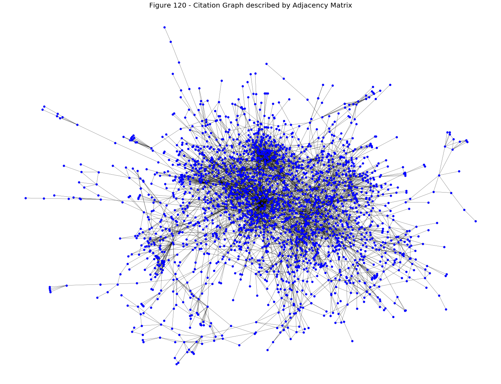


```python
# Extracting list with degree histogram
degree_histogram = nx.degree_histogram(G)

# Loading into Pandas DataFrame
df_degree_hist = pd.DataFrame(degree_histogram,
                              columns=["Count"])
                              #index=[f"Degree {i}" for i, j in enumerate(degree_histogram)])

# Calculating Distribution for each degree
df_degree_hist.insert(1, "Distribution", df_degree_hist['Count']/df_degree_hist['Count'].sum(), True)

# Plotting the Degree Distribution
fig121 = plt.figure(figsize=(20, 10))

ax = df_degree_hist['Distribution'].plot(kind='bar')
ax.set_xticks(np.arange(0, 170, 10))
ax.set_xticklabels(np.arange(0, 170, 10))

plt.ylabel("Count")
plt.xlabel("Degree")

title121 = "Figure 121 - Histogram of Degrees for the Citation Graph"
plt.title(title121, fontsize=18)
plt.savefig(f"figures/{title121}.png")
plt.show()
```


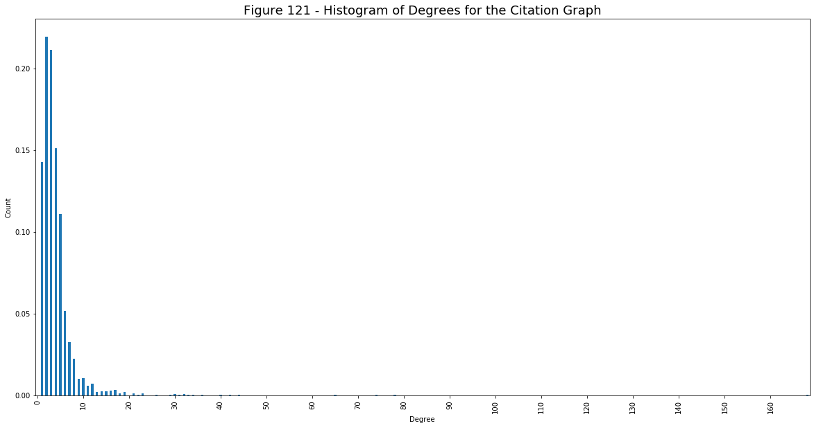


From the degree distribution histogram we can infer that there are many nodes with degrees less than 10, with degree=2 being the mode, and there are very few nodes with larger degrees. For example, there is only 1 node with degree=168.

We will now focus on computing and discussing the centrality measures (i) degree, (ii) betweenness centrality, (iii) pagerank.


```python
# (i) Degrees for each node
degrees_per_node = list(dict(G.degree).values())

# Degrees for each node
fig122 = plt.figure(figsize=(15, 5))
#plt.bar(range(2485), degrees_per_node, width=0.8)
plt.plot(range(2485), degrees_per_node, 'bx')
plt.xlabel("Node (Text)")
plt.ylabel("Degree (Citations)")

title122 = "Figure 122 - Degrees of all the Nodes in the Citation Graph"
plt.title(title122)
plt.savefig(f"figures/{title122}.png")
plt.show()
```


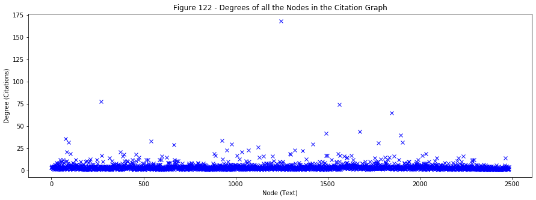


```python
# (ii) Betweenness Centrality for each node
betweenness_centrality = list(nx.betweenness_centrality(G).values())

# Betweenness Centrality plot
fig123 = plt.figure(figsize=(15, 5))
plt.plot(range(2485), betweenness_centrality, 'rx')
plt.xlabel("Node (Text)")
plt.ylabel("Betweenness Centrality")

title123 = "Figure 123 - Betweenness Centrality of all Nodes in Citation Graph"
plt.title(title123)
plt.savefig(f"figures/{title123}.png")
plt.show()
```


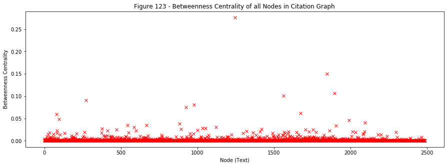


```python
# (iii) Page-Rank for each node
pagerank = list(nx.pagerank(G).values())

# Pagerank plot
fig124 = plt.figure(figsize=(15, 5))
plt.plot(range(2485), pagerank, 'kx')
plt.xlabel("Node (Text)")
plt.ylabel("Pagerank")

title124 = "Figure 124 - Pagerank of all Nodes in Citation Graph"
plt.title(title124)
plt.savefig(f"figures/{title124}.png")
plt.show()
```


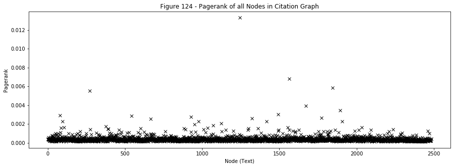


```python
# Comparison of Centrality Measures
df_cit_graph_centrality = pd.DataFrame(np.array([degrees_per_node, betweenness_centrality, pagerank]).T,
                                       columns=["Degree", "BC", "Pagerank"])

print("Most 'Central' nodes according to the different Centrality Measures:\n")
print("(i) Nodes with Largest Degree:")
print(list(df_cit_graph_centrality["Degree"].nlargest(10).index.values))

print("\n(ii) Nodes with Largest Betweenness Centrality:")
print(list(df_cit_graph_centrality["BC"].nlargest(10).index.values))

print("\n(iii) Nodes with Largest Pagerank:")
print(list(df_cit_graph_centrality["Pagerank"].nlargest(10).index.values))
```

    Most 'Central' nodes according to the different Centrality Measures:

    (i) Nodes with Largest Degree:
    [1245, 271, 1563, 1846, 1672, 1491, 1894, 78, 926, 542]

    (ii) Nodes with Largest Betweenness Centrality:
    [1245, 1846, 1894, 1563, 271, 977, 926, 1672, 78, 95]

    (iii) Nodes with Largest Pagerank:
    [1245, 1563, 1846, 271, 1672, 1894, 1491, 78, 542, 926]


From the output above, we can see that based on the threee centrality measures, there are indeed highly central nodes in the citation graph. Node 1245 is arguably the most central node of the graph, as it comes out on top in all three centrality measures. There are many repeats in the top 10 most central nodes by each measure, suggesting that these nodes may indeed be the top 10 'most central' nodes in the citation graph, even though they may not appear in the same order for each measure.

We now concentrate in computing the correlations between all the three measures:


```python
# Data for correlations
print("Table 125 with Correlations between Centrality Measures:")
df_cit_graph_centrality.corr()
```

    Table 125 with Correlations between Centrality Measures:


<div>
<style scoped>
    .dataframe tbody tr th:only-of-type {
        vertical-align: middle;
    }

    .dataframe tbody tr th {
        vertical-align: top;
    }

    .dataframe thead th {
        text-align: right;
    }
</style>
<table border="1" class="dataframe">
  <thead>
    <tr style="text-align: right;">
      <th></th>
      <th>Degree</th>
      <th>BC</th>
      <th>Pagerank</th>
    </tr>
  </thead>
  <tbody>
    <tr>
      <td>Degree</td>
      <td>1.000000</td>
      <td>0.876926</td>
      <td>0.988432</td>
    </tr>
    <tr>
      <td>BC</td>
      <td>0.876926</td>
      <td>1.000000</td>
      <td>0.884791</td>
    </tr>
    <tr>
      <td>Pagerank</td>
      <td>0.988432</td>
      <td>0.884791</td>
      <td>1.000000</td>
    </tr>
  </tbody>
</table>
</div>


This table suggests a relatively high correlation between all the measures. However, it is noted that Degree and PageRank are extremly correlated (at 99%), whereas Degree, BC and PageRank are not very correlated between each other)


```python
# Scatter plot between the measures:
fig125 = sns.pairplot(df_cit_graph_centrality, kind='reg')

title125 = "Figure 125 - Scatter Plot for Different Centrality Measures"
fig125.fig.suptitle(title125, y=1.02, fontsize=14)
plt.savefig(f"figures/{title125}.png")
plt.show()
```


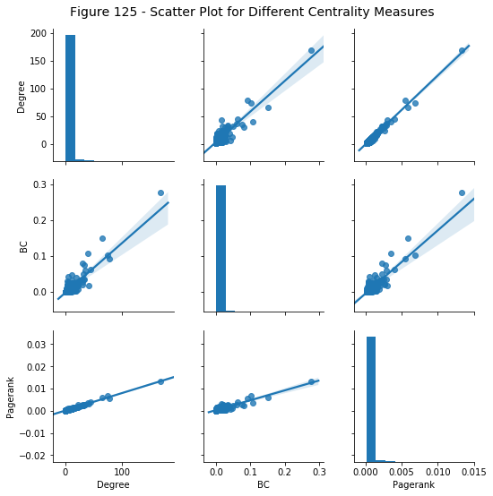


From the scatter plots, we can see that the three measures are highly correlated. However they are not exactly the same, and this is to be expected, as they do not measure the same things.

### Question 1.3 - Community Detection on the Citation Graph
***
In this task, we will use the Clauset-Newman-Moore greedy modularity maximisation (CNMGMM) algorithm to compute the optimal number of communities $k^{*}$ and the corresponding partition of the citation graph. We will be

1. Plotting each of these partitions separately with a different colour for each.
2. Plotting the distribution of the top 30 'most central nodes' according to degree and Pagerank computed in 1.2.

***
Modularity is a measure of division of a graph. It measures how good a division of a graph is, in the sense that nodes within a group have a lot of connections (edges) between them, whereas nodes across different groups have not many connections between them. A more mathematical definition can be found in the paper _Finding community structure in very large networks (Clauset, Newman, Moore)_.


```python
# Computing the CNM Greedy Modularity Maximisation Algorithm
GM_communities = nx.algorithms.community.modularity_max.greedy_modularity_communities(G)

print("Optimal Number of Communities:")
print(f"K* = {len(GM_communities)}\n")

print("Total Number of Nodes:")
print(sum([len(c) for c in GM_communities]))
```

    Optimal Number of Communities:
    K* = 29

    Total Number of Nodes:
    2485


```python
# Setting colours for each Community:
colours = np.zeros(2485)
for i, c in enumerate(GM_communities):
    for idx in list(c):
        colours[idx] = i

# Drawing Communities in different colours
fig130 = plt.figure(figsize=(20, 15))
nx.draw(G, pos=pos_set, node_size=30, width=0.5, node_color=colours, cmap=plt.cm.viridis)

title130 = "Figure 130 - Citation Graph described by Adjacency Matrix with Communities SuperImposed"
plt.title(title130, fontsize=20)
plt.savefig(f"figures/{title130}.png")
plt.show()
```


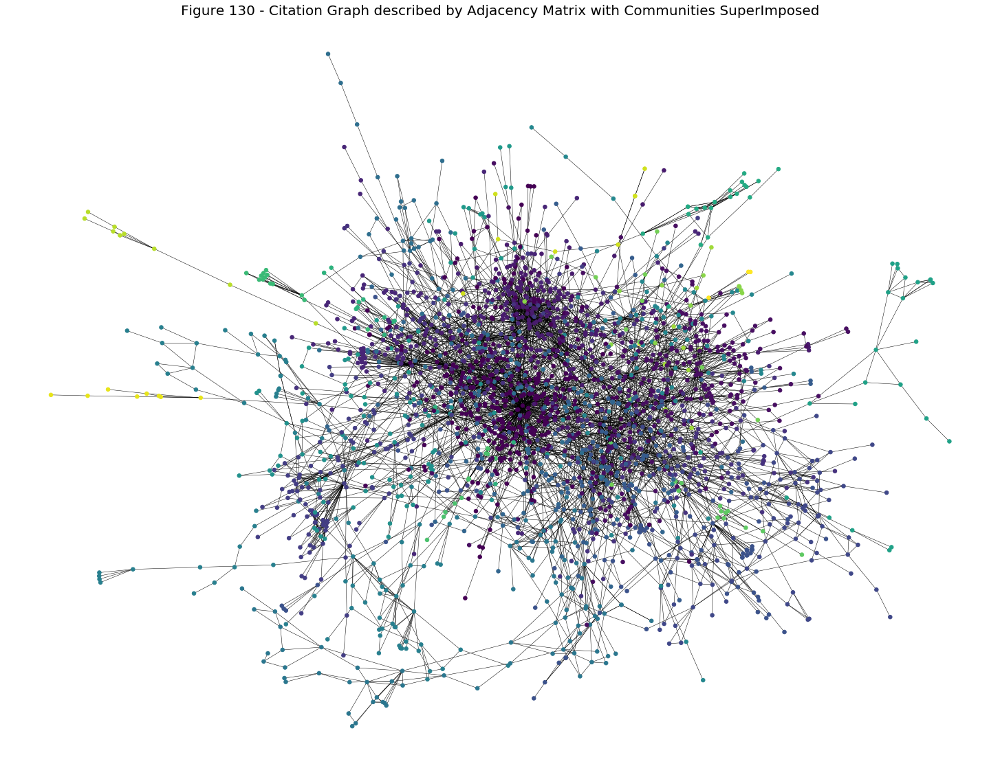


```python
# Dictionary of Mappings for Nodes and Communities
node_communities = {}
for i, c in enumerate(GM_communities):
    for idx in list(c):
        node_communities[idx] = i+1

GM_degree_dist = {(x+1):0 for x in range(len(GM_communities))}
for n in df_cit_graph_centrality["Degree"].nlargest(30).index.values:
    c = node_communities[n]
    GM_degree_dist[c] += 1


GM_pagerank_dist = {(x+1):0 for x in range(len(GM_communities))}
for n in df_cit_graph_centrality["Pagerank"].nlargest(30).index.values:
    c = node_communities[n]
    GM_pagerank_dist[c] += 1
```


```python
# Figure of Number of Top 30 in communities:
fig131 = plt.figure(figsize=(13, 8))

plt.plot(range(1, len(GM_communities) + 1), list(GM_degree_dist.values()), label='Degree')
plt.plot(range(1, len(GM_communities) + 1), list(GM_pagerank_dist.values()), label='Pagerank')

plt.xlabel("Community")
plt.ylabel("Count")
plt.xticks(range(1, len(GM_communities) + 1))
plt.grid()
plt.legend()

title131 = "Figure 131 - Count for Top 30 Most Central Nodes in Communities"
plt.title(title131)
plt.savefig(f"figures/{title131}.png")
plt.show()
```


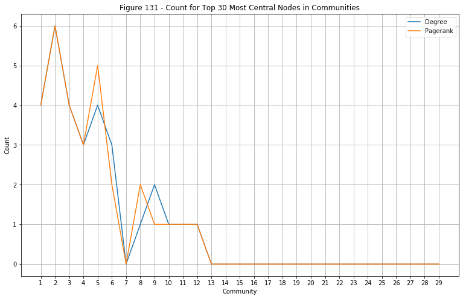


```python
number_nodes_communities = [sum(value == i+1 for value in node_communities.values()) for i in range(29)]

fig132 = plt.figure(figsize=(13, 8))
plt.bar(np.arange(1, 30), number_nodes_communities)
plt.xlabel("Community")
plt.ylabel("Number of Nodes")
plt.xticks(range(1, len(GM_communities) + 1))

title132 = "Figure 132 - Number of Nodes in All Communities"
plt.title(title132)
plt.savefig(f"figures/{title132}.png")
plt.show()
```


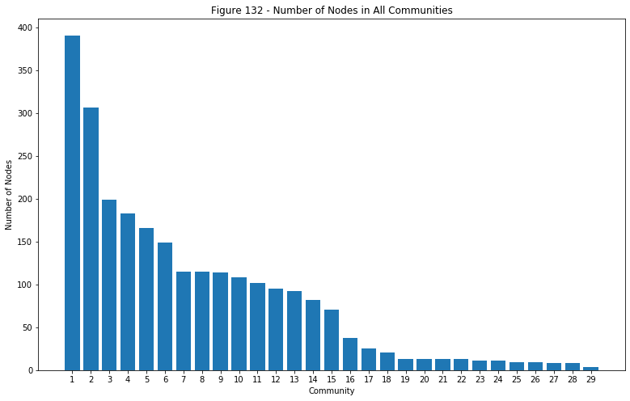


__Discussion of Results:__

Figure 132 shows the number of nodes in all the communities. We can see that the output of the CNMGMM algorithm gives outputs the communities in order in terms of number of nodes in each community.

We can see in Figure 131 that the 30 most central nodes according to pagerank and degree are located in the first 13 communities. Our interpretation of this is that the most central nodes are located in the largest communities; the smaller communities do not contain any of the 30 most central nodes inside of them.

### Question 1.4 - Comparison of Feature and Graph Clusterings
***

In this task, we compare the clusterings found in parts 1.1 & 1.2. We do this by comparing the labels in which each of the two methods, K-Means and CNMGMM, have generated.

We then plot the clusterings on two graphs side-by-side to be able to perform a visual comparison between the clusterings.

To give perform a more quantitative analysis, we will be calculating the Adjusted Mutual Information (AMI) and the Adjusted Rand Index (ARI) between the clusters:
- The AMI returns a score of 1 if the two clusterings are perfectly matched. It returns a score of 0 for randomly independent labellings and it can be negative.
- The ARI returns a score in the range $[-1, 1]$, with 1 indicating a perfect match and approx. 0 when the two clusterings are independent of each other.


```python
graph_clustering_labels = np.zeros(len(node_communities), dtype=int)

for i, c in enumerate(sorted(node_communities)):
    graph_clustering_labels[i] = node_communities[c]

feature_clustering_labels = Kmeans_optimal.labels_

# Computing AMI & ARI
AMI = sklearn.metrics.adjusted_mutual_info_score(graph_clustering_labels,
                                           feature_clustering_labels,
                                           average_method="arithmetic")
ARI = sklearn.metrics.adjusted_rand_score(graph_clustering_labels,
                                           feature_clustering_labels)

print("Adjusted Mutual Information:")
print(AMI)

print("\nAdjusted Rand Index:")
print(ARI)
```

    Adjusted Mutual Information:
    0.17720236279525883

    Adjusted Rand Index:
    0.08328612607356335


```python
# Figure showing graph using both communities
fig140, ax140 = plt.subplots(nrows=1, ncols=2, figsize=(40, 20))

nx.draw(G, ax=ax140[0], pos=pos_set, node_size=40, width=0.5, node_color=feature_clustering_labels, cmap=plt.cm.viridis)
nx.draw(G, ax=ax140[1], pos=pos_set, node_size=40, width=0.5, node_color=graph_clustering_labels, cmap=plt.cm.viridis)

ax140[0].set_title("Communities Part 1.1", fontsize=25)
ax140[1].set_title("Communities Part 1.3", fontsize=25)

title140 = "Figure 140 - Graph Communities found in 1.1, 1.3 side-by-side"
plt.suptitle(title140, fontsize=30)
plt.savefig(f"figures/{title140}.png")
plt.show()
```


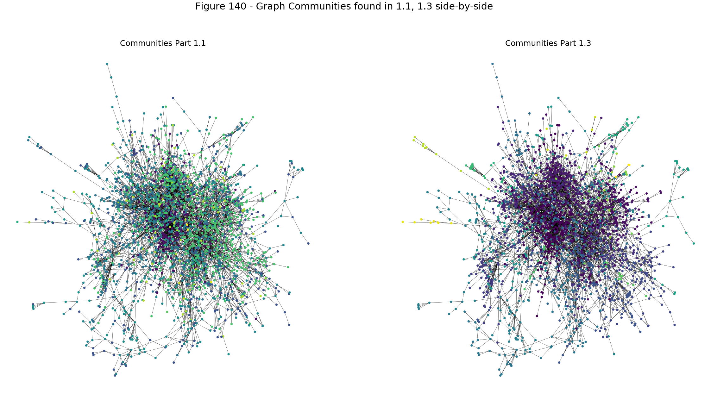


__Summary of Results found in this Section:__

With an AMI of approx. 0.2 and an ARI of approx. 0.1 we can say that the two clusterings are at best very weakly similar.

Visually, we can see that the clustering of Part 1.3 form better defined clusters. Our conclusion is that CNM Greedy Modularity Maximisation Algorithm is to be favoured over K-Means for this problem.

Visually, we cannot spot any obvious patterns emerging between the two clusters and we can therefore conclude that the two optimal clusters are not all that similar.

## Task 2 - Classification of a Set of Images
***
__Description of the Task__:


```python
df_train_fashion_original = pd.read_csv("data/task2/fashion-mnist_train.csv")
df_test_fashion_original = pd.read_csv("data/task2/fashion-mnist_test.csv")
```

We now split the data into descriptors and labels:


```python
X_Train = df_train_fashion_original.drop(columns=['label'])
Y_Train = df_train_fashion_original['label']

X_Test = df_test_fashion_original.drop(columns=['label'])
Y_Test = df_test_fashion_original['label']
```

We now need to standardise the covariates (X values). There is no need to modify the labels as they are already zero-indexed.


```python
# Column names
pixel_names = X_Train.columns

# Fitting a scaler
scaler = sklearn.preprocessing.MinMaxScaler(feature_range=(0, 1))
scaler.fit(X_Train)

# Standardising the data
X_Train_Stand = pd.DataFrame(scaler.transform(X_Train), columns=pixel_names)
X_Test_Stand = pd.DataFrame(scaler.transform(X_Test), columns=pixel_names)

# Torch MLP data
X_Train_MLP = torch.from_numpy(X_Train_Stand.values).float()
Y_Train_MLP = torch.from_numpy(Y_Train.values)
X_Test_MLP = torch.from_numpy(X_Test_Stand.values).float()
Y_Test_MLP = torch.from_numpy(Y_Test.values)

# Convert data to Images Format n_images x 28 x 28
X_Train_Reshaped = np.reshape(np.asarray(X_Train_Stand), (X_Train_Stand.shape[0], 28, 28))
X_Test_Reshaped = np.reshape(np.asarray(X_Test_Stand), (X_Test_Stand.shape[0], 28, 28))

# Torch CNN data
X_Train_CNN = torch.from_numpy(X_Train_Reshaped).float()
Y_Train_CNN = torch.from_numpy(Y_Train.values)
X_Test_CNN = torch.from_numpy(X_Test_Reshaped).float()
Y_Test_CNN = torch.from_numpy(Y_Test.values)
```

### Question 2.1 - Unsupervised Clustering of the Image Dataset
***
We begin by running the KMeans algorithm over the range of K=[2,30] on the fashion-MNIST dataset.


```python
# Defining Search Range
K_means_range = np.arange(2, 31)
CH_score_array = np.zeros(K_means_range.size)
INERTIA_array = np.zeros(K_means_range.size)
SHS_array = np.zeros(K_means_range.size)


# Parameter search:
print("Beginning K-Means Parameter Search:\n")
for i, K in enumerate(K_means_range):
    print(f"K = {K}")
    KM_CLF = sklearn.cluster.KMeans(n_clusters=K)
    KM_CLF.fit(X_Train_Stand)
    predicted_labels = KM_CLF.predict(X_Train_Stand)

    CH_score_array[i] = sklearn.metrics.calinski_harabasz_score(X_Train_Stand, predicted_labels)
    INERTIA_array[i] = KM_CLF.inertia_
    SHS_array[i] = sklearn.metrics.silhouette_score(X_Train_Stand, KM_CLF.labels_)

print("\nFINISHED")
```

    Beginning K-Means Parameter Search:

    K = 2
    K = 3
    K = 4
    K = 5
    K = 6
    K = 7
    K = 8
    K = 9
    K = 10
    K = 11
    K = 12
    K = 13
    K = 14
    K = 15
    K = 16
    K = 17
    K = 18
    K = 19
    K = 20
    K = 21
    K = 22
    K = 23
    K = 24
    K = 25
    K = 26
    K = 27
    K = 28
    K = 29
    K = 30

    FINISHED


To deal with the inherent randomness of the K-Means output we have two options:
1. Set a random seed to the KMeans implementation that would give the same output every time
2. Increase the number of initialisations of the KMeans algorithm into the function. This is controlled by the n_init parameter. The default value is 10, so the output of the default scikit-learn implementation already controls for the effects of randomness of the algorithm.

For computing the optimal clustering, we will set a random seed to be able to reproduce our results later on.


```python
# Plotting Calinski-Harabasz Scores for Different Clusterings
fig210 = plt.figure(figsize=(10, 7))
plt.plot(K_means_range, CH_score_array)
plt.grid()
plt.xlabel("K")
plt.ylabel("CH Score")

title210 = "Figure 210 - Calinski-Harabsz Score for Different Clustering K-Means"
plt.title(title210, fontsize=14)
plt.savefig(f"figures/{title210}.png")
plt.show()
```


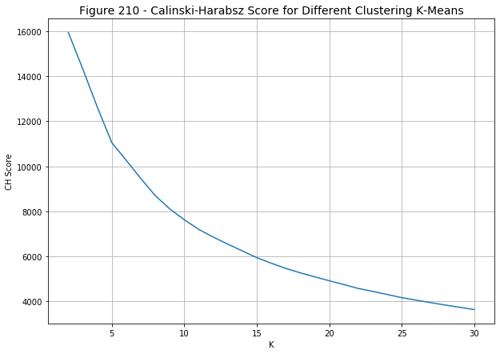


```python
# Plot of Inertia for Elbow Method:
fig211 = plt.figure(figsize=(10, 7))
plt.plot(K_means_range, INERTIA_array)
plt.grid()
plt.xlabel("K")
plt.ylabel("Inertia")

title211 = "Figure 211 - Inertia for Different Clustering K-Means (Elbow Method)"
plt.title(title211, fontsize=14)
plt.savefig(f"figures/{title211}.png")
plt.show()
```


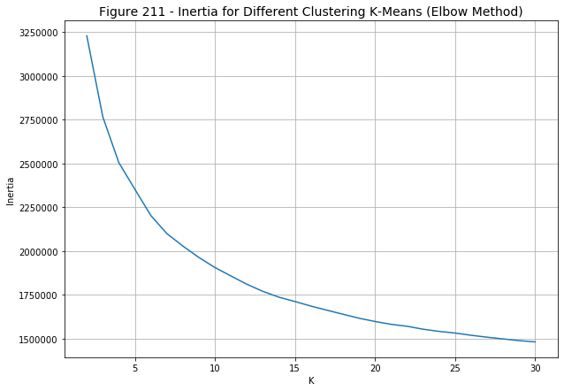


```python
# Plot of Silhouette Score:
fig212 = plt.figure(figsize=(10, 7))
plt.plot(K_means_range, SHS_array)
plt.grid()
plt.xlabel("K")
plt.ylabel("Silhouette Score")

title212 = "Figure 212 - Silhouette Score for Different Clustering K-Means (Silhouette Method)"
plt.title(title212, fontsize=14)
plt.savefig(f"figures/{title212}.png")
plt.show()
```


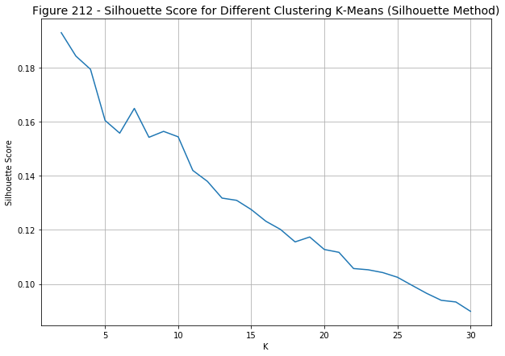


Figures 210-212 do not provide enough evidence that there are 10 classes in the data. We cannot see a peak in the CH score, and there is no obvious cutoff point for the CH score near K=10. The rate of decrease of inertia in Figure 211 does decrese as we go from K=9, 10, 11, but it is not significant enough to constitute an elbow. The Silhouette scores do not have a peak at K=10, therefore this gives no evidence of 10 classes in the data by the K-Means method.

***
We now proceed to visualise the centroids generated when fitting a 10-Means model to this data.


```python
# Fitting this 'optimal' K=10 K-Means Model
KM_10 = sklearn.cluster.KMeans(n_clusters=10, random_state=42).fit(X_Train_Stand)
```


```python
# Visualising all 10 clusters
fig213, ax213 = plt.subplots(nrows=5, ncols=2, figsize=(10, 20))

for i, centroid in enumerate(KM_10.cluster_centers_):
    idx1 = i%5
    idx2 = int(np.floor(i/5))

    centroid_reshaped = np.reshape(centroid, (28, 28))
    ax213[idx1, idx2].imshow(centroid_reshaped, cmap='gray', aspect='auto')
    ax213[idx1, idx2].set_title(f"Centroid {i + 1}")
    ax213[idx1, idx2].axis('off')

title213 = "Figure 213 - Centroids Generated for 10-Means Clustering"
plt.suptitle(title213, y=0.91, fontsize=14)
plt.savefig(f"figures/{title213}.png")

plt.show()
```


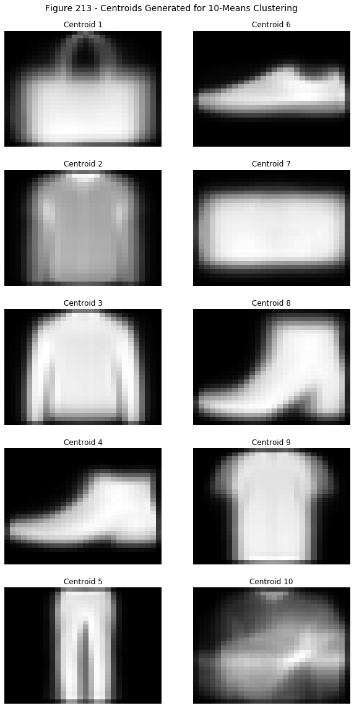


***
Lastly, we will use this model as a kNN classifier on the test set, report its classification report and the confusion matrix generated.

To do this we need to:
1. Map the KMeans clusters clusters to the 'true' data visually to see which clusters resemble the item of clothing best. This is done after fitting so learning is still unsupervised. Store this mapping to convert KMeans predictions later.
2. Generate predictions with KMeans and transform the labels.
3. Fit this data as the 'real' labels into a KNN algorithm, with the image dataset as the X matrix
4. Generate preditions on the test data with this KNN algorithm and compare the output with the real labels.


```python
# Features judged as corresponding to actual labels: fashion-mnist source
mapping = dict(zip(range(10), [8, 6, 4, 7, 1, 5, 2, 9, 0, 3]))
Y_Train_Kmean_Preds_Mapped = np.zeros(KM_10.labels_.size)

for i in range(KM_10.labels_.shape[0]):
    Y_Train_Kmean_Preds_Mapped[i] = mapping[KM_10.labels_[i]]

KNN = sklearn.neighbors.KNeighborsClassifier(n_neighbors=5)
KNN.fit(X_Train_Stand, Y_Train_Kmean_Preds_Mapped)
Y_Test_KNN_Preds = KNN.predict(X_Test_Stand)

accuracy_KNN = sklearn.metrics.accuracy_score(Y_Test, Y_Test_KNN_Preds)
print("Accuracy Score for K-Means Clustering (K=10)")
print(f"\t{accuracy_KNN*100:.1f}%")

# SKLearn Classification Report
cl_report_KNN = sklearn.metrics.classification_report(Y_Test,
                                                       np.array(Y_Test_KNN_Preds),
                                                       target_names=[f"Class {i+1}" for i in range(10)])
print("\n\n\t Classification Report for K-Means Clustering (K=10): \n")
print(cl_report_KNN)
print("---------------------------------------------------------------")

# Confusion Matrix
df_conf_mat_KNN = pd.DataFrame(sklearn.metrics.confusion_matrix(Y_Test,
                                                                np.array(Y_Test_KNN_Preds)),
                                                                columns=[f"Class {i+1}" for i in range(10)],
                                                                index=[f"Class {i+1}" for i in range(10)])
fig214 = plt.figure(figsize=(15, 10))
sns.heatmap(df_conf_mat_KNN, annot=True, cbar=True, fmt='g', cbar_kws={'label': "Count"})

title214 = "Figure 214 - Confusion Matrix for K-Means Clustering (K=10)"
plt.title(title214)
plt.savefig(f"figures/{title214}.png")
plt.show()
```

    Accuracy Score for K-Means Clustering (K=10)
    	37.2%


    	 Classification Report for K-Means Clustering (K=10):

                  precision    recall  f1-score   support

         Class 1       0.46      0.58      0.52      1000
         Class 2       0.58      0.92      0.71      1000
         Class 3       0.02      0.01      0.01      1000
         Class 4       0.06      0.08      0.07      1000
         Class 5       0.38      0.61      0.47      1000
         Class 6       0.19      0.20      0.20      1000
         Class 7       0.30      0.33      0.31      1000
         Class 8       0.21      0.16      0.18      1000
         Class 9       0.98      0.42      0.59      1000
        Class 10       0.92      0.41      0.57      1000

        accuracy                           0.37     10000
       macro avg       0.41      0.37      0.36     10000
    weighted avg       0.41      0.37      0.36     10000

    ---------------------------------------------------------------


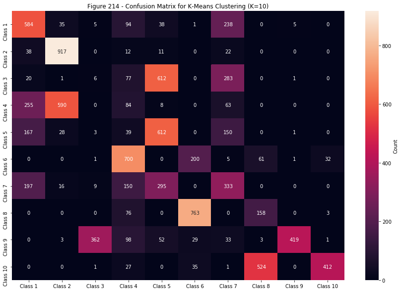


### Question 2.2 - Supervised Classification of the Training Set
***

In this question, we will be studying the classification properties of using neural networks for supervised learning. We will do the following:
- Implement an MLP neural network in PyTorch, using negative log-likelihood loss and stochastic gradient descent as the optimisation method.
- Implement a CNN neural network in PyTorch, with ReLU activation functions.
- Compare the performance of these two neural networks as well as the kNN classifier in 2.1. Further, we will improve the performance of the CNN to over 90% by changing its architecture.

#### Question 2.2.1 - MLP Neural Network Supervised Classification
***
The following class 'MLPNeuralNet' defines an MLP neural network with the following properties:
1. Input nodes (784) corresponding to the number of pixels in each image (28x28)
2. 3 Hidden layers, each containing 100 nodes
3. An output layer with 10 nodes corresponding to the number of classes in our dataset. Note that we need to apply log-softmax to this last layer to be able to compute loss with negative log-likelihood loss.
4. ReLu activation function with no dropout.


```python
class MLPNeuralNet(torch.nn.Module):
    def __init__(self):
        super(MLPNeuralNet, self).__init__()

        # Hidden Layers
        self.fc1 = torch.nn.Linear(784, 100)
        self.fc2 = torch.nn.Linear(100, 100)
        self.fc3 = torch.nn.Linear(100, 100)

        # Output Layer
        self.fc4 = torch.nn.Linear(100, 10)

    def forward(self, x):
        # ReLU Activation Functions
        out = torch.nn.functional.relu(self.fc1(x))
        out = torch.nn.functional.relu(self.fc2(out))
        out = torch.nn.functional.relu(self.fc3(out))

        # log(SoftMAX(output)) for Negative Log-Likelihood Loss
        out = torch.nn.functional.log_softmax(self.fc4(out), dim=1)
        return out
```

The following class 'MLPComps' performs training, testing and computes the accuracy of the MLP neural network:


```python
class MLPComps:
    """ Performs training/testing of the MLP Neural Network.
        Methods:
            - fit: Training the Neural Network.
            - predict: Computes predictions as labels.
            - compute_model_accuracy: Computes accuracy attained on the data.
    """
    def __init__(self, neural_net, tot_epochs, criterion, optimiser, display_train=False, display_test=True):
        self.neural_net = neural_net
        self.tot_epochs = tot_epochs
        self.criterion = criterion
        self.optimiser = optimiser
        self.display_train = display_train
        self.display_test = display_test

    def fit(self, train_loader):
        """Performs training of the MLP Neural Network"""
        T1 = time.perf_counter()
        self.neural_net.train()  # Toggle Training Mode ON
        loss_vals = []  # List to store loss values

        for epoch in range(self.tot_epochs + 1):
            # Perform Batches:
            current_loss_batches = []
            for i, (features, labels) in enumerate(train_loader):
                outputs = self.neural_net(features)  # Generate Predictions
                loss = self.criterion(outputs, labels)  # Compute the Loss
                self.optimiser.zero_grad()  # Zero all the gradients
                loss.backward()  # Computing Gradients
                self.optimiser.step()  # Update Parameters
                current_loss_batches.append(loss.item())

            # Computing loss - averaging over batches
            current_loss = np.mean(current_loss_batches)
            if self.display_train:
                print(f"Epoch [{epoch}/{self.tot_epochs}]" \
                      f"\tTraining Loss: {(current_loss):.6f}")
            loss_vals.append(current_loss)
        T2 = time.perf_counter()
        TD = T2 - T1
        if TD < 60:
            print(f"\tTraining Complete\n" \
                  f"- Training Time = {TD:.2f}s\n" \
                  f"- Final Loss = {loss_vals[-1]:.4f}")
        else:
            TDS = TD % 60
            TDM = (TD - TDS) // 60
            print(f"\tTraining Complete\n" \
                  f"- Training Time = {TDM}m {TDS:.2f}s \n" \
                  f"- Final Loss = {loss_vals[-1]:.4f}")
        return loss_vals, TD

    def predict(self, test_loader):
        T1 = time.perf_counter()
        self.neural_net.eval()  # Toggling Training Mode OFF
        predicted_labels = []
        for features, labels in test_loader:
            outputs = self.neural_net(features)
            _, preds = torch.max(outputs.data, 1)
            predicted_labels = predicted_labels + preds.tolist()
        self.neural_net.train()  # Toggling Training Mode ON
        T2 = time.perf_counter()
        TD = T2 - T1
        if self.display_test:
            print(f"\tTest Complete\n- Test Time = {TD:2f}s")
        return predicted_labels, TD

    def compute_model_accuracy(self, test_loader):
        self.neural_net.eval()  # Toggling Training Mode OFF
        total_labels, correct_labels = (0, 0)
        predicted_labels = []
        for features, labels in test_loader:
            outputs = self.neural_net(features)
            _, preds = torch.max(outputs.data, 1)
            total_labels += labels.size(0)
            correct_labels += (preds == labels).sum().item()
            predicted_labels = predicted_labels + preds.tolist()

        accuracy = (100*correct_labels/total_labels)

        if self.display_test:
            print(f"Accuracy = {accuracy:.3f}%")

        self.neural_net.train()  # Toggling Training Mode ON
        return accuracy, predicted_labels
```

We now proceed to prepare the data for classification on the MLP Neural Network. The data will be passed as a (Nsamples, 28 * 28) vector for the input layer into a PyTorch dataloader that handles batches automatically. We then perform training of the network.


```python
# Parameters:
learning_rate_mlp = 0.005
batch_size_mlp = 128
tot_epochs_mlp = 30

train_mlp = torch.utils.data.TensorDataset(X_Train_MLP.cuda(), Y_Train_MLP.cuda())
train_loader_mlp = torch.utils.data.DataLoader(train_mlp, batch_size=batch_size_mlp, shuffle=True)

test_mlp = torch.utils.data.TensorDataset(X_Test_MLP.cuda(), Y_Test_MLP.cuda())
test_loader_mlp = torch.utils.data.DataLoader(test_mlp, batch_size=batch_size_mlp, shuffle=False)

# Defining MLP Neural NET
MLP_NN = MLPNeuralNet().cuda()

criterion_mlp = torch.nn.NLLLoss().cuda()  # Negative log-likelihood loss
optimiser_mlp = torch.optim.SGD(MLP_NN.parameters(), lr=learning_rate_mlp)

# Performing Training:
MLPC = MLPComps(MLP_NN, tot_epochs_mlp, criterion_mlp, optimiser_mlp, display_train=True)
loss_vals_mlp, training_time_mlp = MLPC.fit(train_loader_mlp)

# Reporting Accuracies Attained
print("Training Set/In-Sample-Accuracy for MLP Neural Network:")
acc_insample_mlp, preds_train_mlp = MLPC.compute_model_accuracy(train_loader_mlp)
print("------------------\n")

print("Test Set/Out-of-Sample Accuracy for MLP Neural Network:")
acc_outsample_mlp, preds_test_mlp = MLPC.compute_model_accuracy(test_loader_mlp)
print("------------------")
```

    Epoch [0/30]	Training Loss: 2.282172
    Epoch [1/30]	Training Loss: 2.151167
    Epoch [2/30]	Training Loss: 1.677696
    Epoch [3/30]	Training Loss: 1.197664
    Epoch [4/30]	Training Loss: 0.961330
    Epoch [5/30]	Training Loss: 0.839220
    Epoch [6/30]	Training Loss: 0.767621
    Epoch [7/30]	Training Loss: 0.719188
    Epoch [8/30]	Training Loss: 0.682306
    Epoch [9/30]	Training Loss: 0.651403
    Epoch [10/30]	Training Loss: 0.626156
    Epoch [11/30]	Training Loss: 0.604134
    Epoch [12/30]	Training Loss: 0.586823
    Epoch [13/30]	Training Loss: 0.571781
    Epoch [14/30]	Training Loss: 0.559227
    Epoch [15/30]	Training Loss: 0.547470
    Epoch [16/30]	Training Loss: 0.537454
    Epoch [17/30]	Training Loss: 0.528563
    Epoch [18/30]	Training Loss: 0.519599
    Epoch [19/30]	Training Loss: 0.511778
    Epoch [20/30]	Training Loss: 0.504906
    Epoch [21/30]	Training Loss: 0.498994
    Epoch [22/30]	Training Loss: 0.493284
    Epoch [23/30]	Training Loss: 0.488123
    Epoch [24/30]	Training Loss: 0.482187
    Epoch [25/30]	Training Loss: 0.476884
    Epoch [26/30]	Training Loss: 0.472215
    Epoch [27/30]	Training Loss: 0.467935
    Epoch [28/30]	Training Loss: 0.463235
    Epoch [29/30]	Training Loss: 0.458892
    Epoch [30/30]	Training Loss: 0.455089
    	Training Complete
    - Training Time = 1.0m 34.80s
    - Final Loss = 0.4551
    Training Set/In-Sample-Accuracy for MLP Neural Network:
    Accuracy = 83.992%
    ------------------

    Test Set/Out-of-Sample Accuracy for MLP Neural Network:
    Accuracy = 83.630%
    ------------------


```python
# SKLearn Classification Report
cl_report_mlp = sklearn.metrics.classification_report(Y_Test_MLP,
                                                      np.array(preds_test_mlp),
                                                      target_names=[f"Class {i+1}" for i in range(10)])
print("\t Classification Report for MLP Neural Network: \n")
print(cl_report_mlp)
print("---------------------------------------------------------------")

# Confusion Matrix
df_conf_mat_mlp = pd.DataFrame(sklearn.metrics.confusion_matrix(Y_Test_MLP,
                                                                np.array(preds_test_mlp)),
                                                                columns=[f"Class {i+1}" for i in range(10)],
                                                                index=[f"Class {i+1}" for i in range(10)])
fig2210 = plt.figure(figsize=(15, 10))
sns.heatmap(df_conf_mat_mlp, annot=True, cbar=True, fmt='g', cbar_kws={'label': "Count"})

title2210 = "Figure 2210 - Confusion Matrix for MLP Neural Network"
plt.title(title2210)
plt.savefig(f"figures/{title2210}.png")
plt.show()
```

    	 Classification Report for MLP Neural Network:

                  precision    recall  f1-score   support

         Class 1       0.79      0.79      0.79      1000
         Class 2       0.96      0.96      0.96      1000
         Class 3       0.68      0.83      0.75      1000
         Class 4       0.85      0.84      0.84      1000
         Class 5       0.75      0.80      0.77      1000
         Class 6       0.92      0.91      0.92      1000
         Class 7       0.71      0.49      0.58      1000
         Class 8       0.90      0.86      0.88      1000
         Class 9       0.91      0.94      0.93      1000
        Class 10       0.89      0.94      0.91      1000

        accuracy                           0.84     10000
       macro avg       0.84      0.84      0.83     10000
    weighted avg       0.84      0.84      0.83     10000

    ---------------------------------------------------------------


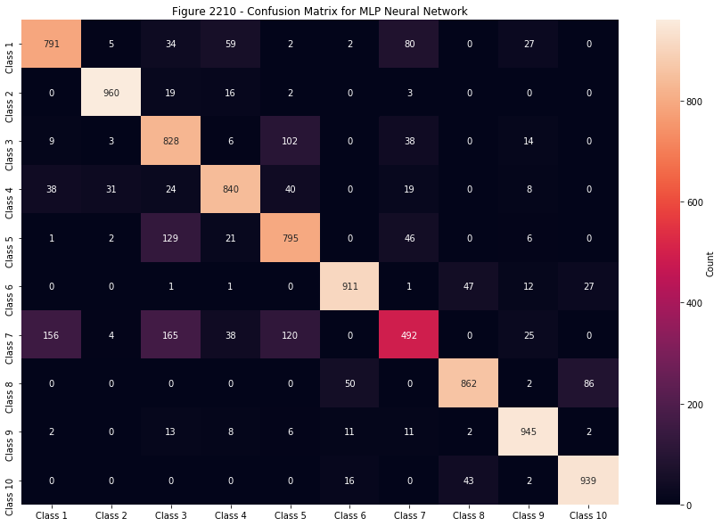


#### Question 2.2.2 - Convolutional Neural Network (CNN) Supervised Classification
***

The following Class Implements the Convolutional Neural Network as described in the question. A convolutional neural network is a type of neural network which performs convolutions (operations on data), and feeds the output of these convolutions into an fully-connected neural network. They are especially good at image recognition.


```python
class CNNBase(torch.nn.Module):
    """Convolutional Neural Network for Question 2.2.2"""
    def __init__(self):
        super(CNNBase, self).__init__()
        self.conv_layer = torch.nn.Sequential(
            torch.nn.Conv2d(1, 6, kernel_size=5, stride=1, dilation=1),
            torch.nn.ReLU(),
            torch.nn.MaxPool2d(2, stride=2),

            torch.nn.Conv2d(6, 16, kernel_size=5, stride=1, dilation=1),
            torch.nn.ReLU(),
            torch.nn.MaxPool2d(2, stride=2)
        )
        self.fc_layer = torch.nn.Sequential(
            torch.nn.Linear(256, 120),
            torch.nn.ReLU(),
            torch.nn.Linear(120, 84),
            torch.nn.ReLU(),
            torch.nn.Linear(84, 10)
        )

    def forward(self, x):
        out = self.conv_layer(x)
        out = out.reshape(out.size(0), -1)  # Flatten output for fully-connected
        out = self.fc_layer(out)
        return torch.nn.functional.log_softmax(out, dim=1)
```

Class that performs training, computes accuracy and generates prediction for CNNs. Note that the input to the 2D-Convolution needs to be a 4-dimensional tensor: (Nsamples, Nchannels, NHPixels, NVPixels).


```python
class CNNComps:
    """ Performs training/testing of the CNN."""
    def __init__(self, neural_net, tot_epochs, criterion, optimiser, display_train=False, display_test=True):
        self.neural_net = neural_net
        self.tot_epochs = tot_epochs
        self.criterion = criterion
        self.optimiser = optimiser
        self.display_train = display_train
        self.display_test = display_test

    def fit(self, train_loader):
        """Performs training of the CNN Neural Network"""
        T1 = time.perf_counter()
        self.neural_net.train()  # Toggle Training Mode ON
        loss_vals = []  # List to store loss values

        for epoch in range(self.tot_epochs + 1):
            # Perform Batches:
            current_loss_batches = []
            for features, labels in train_loader:
                features = features[:, None, :, :]  # Convert into 4D Vector with 1 channel input
                outputs = self.neural_net(features)  # Generate Predictions
                loss = self.criterion(outputs, labels)  # Compute the Loss
                self.optimiser.zero_grad()  # Zero all the gradients
                loss.backward()  # Computing Gradients
                self.optimiser.step()  # Update Parameters
                current_loss_batches.append(loss.item())

            # Computing loss - averaging over batches
            current_loss = np.mean(current_loss_batches)  # TAKE SUM NOW TO CHECK IF VALUES CHANGE
            if self.display_train:
                print(f"Epoch [{epoch}/{self.tot_epochs}]" \
                      f"--- Training Loss: {(current_loss):.6f}")
            loss_vals.append(current_loss)
        T2 = time.perf_counter()
        TD = T2 - T1

        if TD < 60:
            print(f"\tTraining Complete\n" \
                  f"- Training Time = {TD:.2f}s\n" \
                  f"- Final Loss = {loss_vals[-1]:.4f}")
        else:
            TDS = TD % 60
            TDM = (TD - TDS) // 60
            print(f"\tTraining Complete\n" \
                  f"- Training Time = {TDM}m {TDS:.2f}s\n" \
                  f"- Final Loss = {loss_vals[-1]:.4f}")
        return loss_vals, TD

    def predict(self, test_loader):
        T1 = time.perf_counter()
        self.neural_net.eval()  # Toggling Training Mode OFF
        predicted_labels = []
        for features, labels in test_loader:
            features = features[:, None, :, :]  # Convert into 4D Vector with 1 channel input
            outputs = self.neural_net(features)
            _, preds = torch.max(outputs.data, 1)
            predicted_labels = predicted_labels + preds.tolist()
        self.neural_net.train()  # Toggling Training Mode ON
        T2 = time.perf_counter()
        TD = T2 - T1
        if self.display_test:
            print(f"\Test Complete\n- Test Time = {TD:.2f}s")
        return predicted_labels, TD

    def compute_model_accuracy(self, test_loader):
        self.neural_net.eval()  # Toggling Training Mode OFF
        total_labels, correct_labels = (0, 0)
        predicted_labels = []
        for features, labels in test_loader:
            features = features[:, None, :, :]  # Convert into 4D Vector with 1 channel input
            outputs = self.neural_net(features)
            _, preds = torch.max(outputs.data, 1)
            total_labels += labels.size(0)
            correct_labels += (preds == labels).sum().item()
            predicted_labels = predicted_labels + preds.tolist()

        accuracy = (100*correct_labels/total_labels)
        if self.display_test:
            print(f"Accuracy = {accuracy:.3f}%")

        self.neural_net.train()  # Toggling Training Mode ON
        return accuracy, predicted_labels
```

We now define and train this first CNN:


```python
# Parameters:
learning_rate_cnn = 0.005
batch_size_cnn = 128
tot_epochs_cnn = 30

train_cnn = torch.utils.data.TensorDataset(X_Train_CNN.cuda(), Y_Train_CNN.cuda())
train_loader_cnn = torch.utils.data.DataLoader(train_cnn, batch_size=batch_size_cnn, shuffle=True)

test_cnn = torch.utils.data.TensorDataset(X_Test_CNN.cuda(), Y_Test_CNN.cuda())
test_loader_cnn = torch.utils.data.DataLoader(test_cnn, batch_size=batch_size_cnn, shuffle=False)

CNN_Base = CNNBase().cuda()
criterion_cnnb = torch.nn.NLLLoss().cuda()
optimiser_cnnb = torch.optim.SGD(CNN_Base.parameters(), lr=learning_rate_cnn)

# Training the Network
CNNBC = CNNComps(CNN_Base, tot_epochs_cnn, criterion_cnnb, optimiser_cnnb, display_train=True)
loss_vals_cnnb, training_time_cnnb = CNNBC.fit(train_loader_cnn)

print("Training Set/In-Sample-Accuracy for Initial CNN:")
acc_insample_cnnb, preds_train_cnnb = CNNBC.compute_model_accuracy(train_loader_cnn)
print("------------------\n")

print("Test Set/Out-of-Sample Accuracy for Initial CNN:")
acc_outsample_cnnb, preds_test_cnnb = CNNBC.compute_model_accuracy(test_loader_cnn)
print("------------------")
```

    Epoch [0/30]--- Training Loss: 2.296568
    Epoch [1/30]--- Training Loss: 2.262919
    Epoch [2/30]--- Training Loss: 1.725909
    Epoch [3/30]--- Training Loss: 1.000704
    Epoch [4/30]--- Training Loss: 0.894376
    Epoch [5/30]--- Training Loss: 0.835769
    Epoch [6/30]--- Training Loss: 0.791994
    Epoch [7/30]--- Training Loss: 0.756257
    Epoch [8/30]--- Training Loss: 0.726771
    Epoch [9/30]--- Training Loss: 0.702806
    Epoch [10/30]--- Training Loss: 0.682339
    Epoch [11/30]--- Training Loss: 0.665509
    Epoch [12/30]--- Training Loss: 0.648179
    Epoch [13/30]--- Training Loss: 0.630896
    Epoch [14/30]--- Training Loss: 0.618170
    Epoch [15/30]--- Training Loss: 0.602727
    Epoch [16/30]--- Training Loss: 0.590743
    Epoch [17/30]--- Training Loss: 0.578575
    Epoch [18/30]--- Training Loss: 0.566057
    Epoch [19/30]--- Training Loss: 0.555795
    Epoch [20/30]--- Training Loss: 0.544475
    Epoch [21/30]--- Training Loss: 0.534057
    Epoch [22/30]--- Training Loss: 0.525457
    Epoch [23/30]--- Training Loss: 0.516403
    Epoch [24/30]--- Training Loss: 0.509290
    Epoch [25/30]--- Training Loss: 0.500573
    Epoch [26/30]--- Training Loss: 0.493575
    Epoch [27/30]--- Training Loss: 0.486455
    Epoch [28/30]--- Training Loss: 0.479269
    Epoch [29/30]--- Training Loss: 0.472872
    Epoch [30/30]--- Training Loss: 0.467888
    	Training Complete
    - Training Time = 2.0m 9.19s
    - Final Loss = 0.4679
    Training Set/In-Sample-Accuracy for Initial CNN:
    Accuracy = 83.308%
    ------------------

    Test Set/Out-of-Sample Accuracy for Initial CNN:
    Accuracy = 83.540%
    ------------------


```python
# SKLearn Classification Report
cl_report_cnnb = sklearn.metrics.classification_report(Y_Test_CNN,
                                                       np.array(preds_test_cnnb),
                                                       target_names=[f"Class {i+1}" for i in range(10)])
print("\t Classification Report for CNN: \n")
print(cl_report_cnnb)
print("---------------------------------------------------------------")

# Confusion Matrix
df_conf_mat_cnnb = pd.DataFrame(sklearn.metrics.confusion_matrix(Y_Test_CNN,
                                        np.array(preds_test_cnnb)),
                                        columns=[f"Class {i+1}" for i in range(10)],
                                        index=[f"Class {i+1}" for i in range(10)])
fig2211 = plt.figure(figsize=(15, 10))
sns.heatmap(df_conf_mat_cnnb, annot=True, cbar=True, fmt='g', cbar_kws={'label': "Count"})

title2211 = "Figure 2211 - Confusion Matrix for CNN Base Neural Network"
plt.title(title2211)
plt.savefig(f"figures/{title2211}.png")
plt.show()
```

    	 Classification Report for CNN:

                  precision    recall  f1-score   support

         Class 1       0.74      0.85      0.79      1000
         Class 2       0.98      0.95      0.97      1000
         Class 3       0.67      0.75      0.71      1000
         Class 4       0.88      0.85      0.86      1000
         Class 5       0.67      0.88      0.76      1000
         Class 6       0.96      0.90      0.93      1000
         Class 7       0.76      0.34      0.47      1000
         Class 8       0.88      0.94      0.91      1000
         Class 9       0.92      0.96      0.94      1000
        Class 10       0.94      0.94      0.94      1000

        accuracy                           0.84     10000
       macro avg       0.84      0.84      0.83     10000
    weighted avg       0.84      0.84      0.83     10000

    ---------------------------------------------------------------


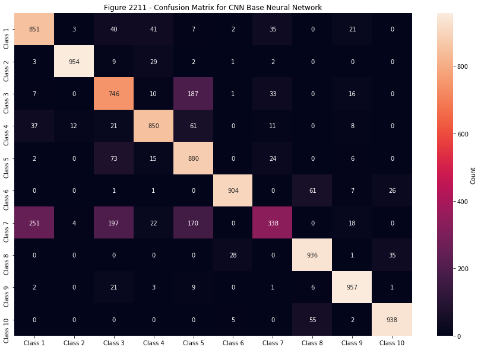


#### Question 2.2.3 - Comparison of the Classifiers
***
We begin this task by comparing the performance of the MLP and CNN models developed in Questions 2.2.1 & 2.2.2:


```python
# Computing Testing Time
ave_predict_time_mlp = 0
ave_predict_time_cnnb = 0

for i in range(10):
    _, predict_time_mlp = MLPC.predict(test_loader_mlp)
    _, predict_time_cnnb = CNNBC.predict(test_loader_cnn)
    ave_predict_time_mlp += predict_time_mlp
    ave_predict_time_cnnb += predict_time_cnnb
ave_predict_time_mlp /= 10
ave_predict_time_cnnb /= 10    
```

    	Test Complete
    - Test Time = 0.572826s
    \Test Complete
    - Test Time = 0.36s
    	Test Complete
    - Test Time = 0.315052s
    \Test Complete
    - Test Time = 0.40s
    	Test Complete
    - Test Time = 0.333811s
    \Test Complete
    - Test Time = 0.39s
    	Test Complete
    - Test Time = 0.315188s
    \Test Complete
    - Test Time = 0.35s
    	Test Complete
    - Test Time = 0.310873s
    \Test Complete
    - Test Time = 0.36s
    	Test Complete
    - Test Time = 0.310763s
    \Test Complete
    - Test Time = 0.37s
    	Test Complete
    - Test Time = 0.318420s
    \Test Complete
    - Test Time = 0.37s
    	Test Complete
    - Test Time = 0.315603s
    \Test Complete
    - Test Time = 0.36s
    	Test Complete
    - Test Time = 0.309896s
    \Test Complete
    - Test Time = 0.37s
    	Test Complete
    - Test Time = 0.329675s
    \Test Complete
    - Test Time = 0.36s


```python
print("Table 2230 - Summary Table Comparing MLP & CNN Classifiers")
df_table2230 = pd.DataFrame(np.array([[acc_insample_mlp, acc_insample_cnnb],
                                      [acc_outsample_mlp, acc_outsample_cnnb],
                                      [training_time_mlp, training_time_cnnb],
                                      [ave_predict_time_mlp, ave_predict_time_cnnb]]),
                            columns=["MLP", "CNN"],
                            index=["In-Sample (Train) Accuracy", "Out-Sample (Test) Accuracy",
                                   "Training Time (s)", "Prediction Time (s)"])
display(df_table2230.round(2))
```

    Table 2230 - Summary Table Comparing MLP & CNN Classifiers


<div>
<style scoped>
    .dataframe tbody tr th:only-of-type {
        vertical-align: middle;
    }

    .dataframe tbody tr th {
        vertical-align: top;
    }

    .dataframe thead th {
        text-align: right;
    }
</style>
<table border="1" class="dataframe">
  <thead>
    <tr style="text-align: right;">
      <th></th>
      <th>MLP</th>
      <th>CNN</th>
    </tr>
  </thead>
  <tbody>
    <tr>
      <td>In-Sample (Train) Accuracy</td>
      <td>83.99</td>
      <td>83.31</td>
    </tr>
    <tr>
      <td>Out-Sample (Test) Accuracy</td>
      <td>83.63</td>
      <td>83.54</td>
    </tr>
    <tr>
      <td>Training Time (s)</td>
      <td>94.80</td>
      <td>129.19</td>
    </tr>
    <tr>
      <td>Prediction Time (s)</td>
      <td>0.34</td>
      <td>0.37</td>
    </tr>
  </tbody>
</table>
</div>


```python
fig2231 = plt.figure(figsize=(10, 6))
plt.plot(range(31), loss_vals_mlp, label="Loss MLP")
plt.plot(range(31), loss_vals_cnnb, label="Loss CNN")
plt.xlabel("Epoch")
plt.ylabel("NLLLoss")
title2231 = "Figure 2231 - Loss Values for MLP and CNN"
plt.title(title2231)
plt.grid()
plt.savefig(f"figures/{title2231}.png")
plt.show()
```


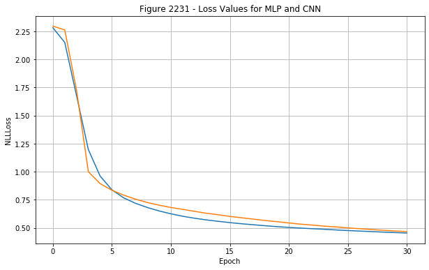


```python
mlp_no_params = np.sum([np.prod(x.size()) for x in MLP_NN.parameters()])
cnnb_no_params = np.sum([np.prod(x.size()) for x in CNN_Base.parameters()])

print(f"Number of Parameters MLP = {mlp_no_params}")
print(f"Number of Parameters CNN = {cnnb_no_params}")
```

    Number of Parameters MLP = 99710
    Number of Parameters CNN = 44426


Immediately we can see that the classifying performance of both MLP and CNN is remarkably similar. The accuracies are within a percent of each other, the graph of loss values is very similar (Figure 2231), and even the confusion matrices (figures/output_ 2210 & 2211) are relatively similar. In terms of being able to classify the fashion items, these models performance is very similar.

The difference arrises in training times. The training time for the MLP was 95 seconds, and the training time for CNN was 129 seconds. This is a difference of approximately 30% in training time. Even though the CNN has a lot less parameters, the convolutional layers perform computationally more complex tasks than the operations in the MLP, and enough to more than offset the fact that the MLP model has many more parameters than the CNN model.

***
We now move on to comparing the performance of the unsupervised k-NN+K-Means method vs the supervised Neural Networks.

The approaches taken in supervised and unsupervised learning are very different. In supervised learning, we know the 'ground truth', as all of our data is labelled. In unsupervised learning (clustering specifically), we do not know the ground truth, and we can attempt to cluster the data into N classes, where N may be arbitrary. This introduces extra noise in the classification, as even if, as in the case of this problem, we know that there are 10 classes and we force 10 clusterings, these clusterings may not be a 1-1 correspondence with the 10 real classes.

One advantage of unsupervised learning is that it is a more general way of learning from data, as the restriction of knowing anything about the data a priori is lifted. Once we are happy that we have found the right number of clusters, it is up to us to decide what each of those clusters represent.

The difference in performance between these models is stricking. The unsupervised model is able to achieve an accuracy of approx. 40% compared with the accuracy of approximately 85% achieved by the supervised methods. Furthermore, the time it takes to fit the kNN model is much greater than the time it takes to train the neural networks, therefore the supervised learning come out on top this time.

***
We now move on to creating an 'optimal' CNN which achieves an accuracy over 90% on the test set using 5-Fold Cross-Validation.

The following are a list of changes made to the original 'Base' CNN and the reasons for doing these changes:

1. Reduced the size of the convolutional filter from 5 to 3. The decrease in filter size increases the resolution of it, being able to pick up finer details of the picture after each convolution.
2. Added a convolutional layer to the network to be able to trim the image down to in size enough for the fully connected layers. This is due to the decrease in window-size, at each convolution, the output image will be larger than if the window size was larger.
3. Added batch normalisation to the first convolutional layer as well as the hidden fully-connected layers. Batch normalisation is a technique that normalises the output of a specific layer in the neural network by subtracting the batch mean and dividing by the batch standard deviation. It has been shown in the literature that this increases stability and is able to reduce overfitting when used in conjunction with dropout.
4. Implemented dropout at the 2nd and 3rd convolutional layers as well as the hidden fully-connected layers. Dropout randomly deactivates (sets to zero) a proportion of the weights of the layer that it is being performed on. It has been shown in the literature that this reduces overfitting to the training data.
5. Increased the number of convolutions performed. The first convolutional layer performs 10 convolutions, and then doubles for the second and third convolutional layer.

Together, these changes are achieving the objective of capturing finer information about the input images (achieved by changes 1 and 2) and at the same time reducing the chance that this will overfit to the data (achieved by changes 3 and 4).


```python
class CNNOptim(torch.nn.Module):
    """Optimal Convolutional Neural Network for Question 2.2.3"""
    def __init__(self, dropout_rate, fc_neurons):
        self.dropout_rate = dropout_rate
        self.fc_neurons = fc_neurons

        super(CNNOptim, self).__init__()
        self.conv_layer = torch.nn.Sequential(                            # NB = No. Batches
            torch.nn.Conv2d(1, 10, kernel_size=3, stride=1, dilation=1),  # (NB, 1, 28, 28) - (NB, 10, 26, 26)
            torch.nn.ReLU(),
            torch.nn.BatchNorm2d(10),

            torch.nn.Conv2d(10, 20, kernel_size=3, stride=1, dilation=1), # (NB, 10, 26, 26) - (NB, 20, 24, 24)
            torch.nn.ReLU(),
            torch.nn.MaxPool2d(2, stride=2),                              # (NB, 20, 24, 24) - (NB, 20, 12, 12)
            torch.nn.Dropout(self.dropout_rate),

            torch.nn.Conv2d(20, 40, kernel_size=3, stride=1, dilation=1), # (NB, 20, 12, 12) - (NB, 40, 10, 10)
            torch.nn.ReLU(),
            torch.nn.MaxPool2d(2, stride=2),                              # (NB, 40, 10, 10) - (NB, 40, 5, 5)
            torch.nn.Dropout(self.dropout_rate)
        )
                                                                          # Flatten (NB, 40, 5, 5) - (NB, 1000)
        self.fc_layer = torch.nn.Sequential(
            torch.nn.Linear(1000, self.fc_neurons),                       # (NB, 1000) - (NB, self.fc_neurons)
            torch.nn.ReLU(),
            torch.nn.BatchNorm1d(self.fc_neurons),
            torch.nn.Dropout(self.dropout_rate),

            torch.nn.Linear(self.fc_neurons, self.fc_neurons),            # (NB, self.fc_neurons) - (NB, self.fc_neurons)
            torch.nn.ReLU(),
            torch.nn.BatchNorm1d(self.fc_neurons),
            torch.nn.Dropout(self.dropout_rate),

            torch.nn.Linear(self.fc_neurons, 10)                          # (NB, self.fc_neurons) - (NB, 10)
        )

    def forward(self, x):
        out = self.conv_layer(x)
        out = out.reshape(out.size(0), -1)
        out = self.fc_layer(out)
        return torch.nn.functional.log_softmax(out, dim=1)
```

We now proceed to creating the 5-Fold Cross Validation Data from our Training Data. We perform a small grid-search of parameters where we wish to optimise for the dropout rate and the inner neuron count. In an ideal scenario, we would optimise hyperparameters on a much larger grid, but unfortunately, we did not have access to enough computational power/time to perform this. Nonetheless, this small grid search should give us a rough picture of the parameter-space. We optimise for the highest mean validation accuracy after performing 5-Fold cross validation on the _training data_.


```python
dropout_range = np.array([0.1, 0.25, 0.5])
inner_neuron_range = np.array([40, 80, 120])
val_accuracy_grid = np.zeros((dropout_range.size, inner_neuron_range.size))
```


```python
Y_Train_NP = np.asarray(Y_Train)

for i, d in enumerate(dropout_range):
    for j, n in enumerate(inner_neuron_range):
        skf = sklearn.model_selection.StratifiedKFold(n_splits=5, shuffle=True)
        skf_split = skf.split(X_Train_Reshaped, Y_Train_NP)
        for k, (train_id, val_id) in enumerate(skf_split):
            print(f"D={d}, N={n}, K={k+1}")

            # Creating data for training/validation
            XK_Train_CNN = torch.from_numpy(X_Train_Reshaped[train_id]).float().cuda()
            YK_Train_CNN = torch.from_numpy(Y_Train_NP[train_id]).cuda()

            XK_Val_CNN = torch.from_numpy(X_Train_Reshaped[val_id]).float().cuda()
            YK_Val_CNN = torch.from_numpy(Y_Train_NP[val_id]).cuda()

            train_loader_KF = torch.utils.data.DataLoader(torch.utils.data.TensorDataset(XK_Train_CNN, YK_Train_CNN),
                                                       batch_size=128, shuffle=True)
            val_loader_KF = torch.utils.data.DataLoader(torch.utils.data.TensorDataset(XK_Val_CNN, YK_Val_CNN),
                                                     batch_size=128, shuffle=False)

            # Declaring Model:
            CNN = CNNOptim(d, n).cuda()
            criterion_cnn = torch.nn.NLLLoss().cuda()
            optimiser_cnn = torch.optim.SGD(CNN.parameters(), lr=0.005)

            CNNC = CNNComps(CNN, 30, criterion_cnn, optimiser_cnn, display_train=False, display_test=True)

            loss_vals_cnn, training_time_cnn = CNNC.fit(train_loader_KF)
            acc_val_KF, _ = CNNC.compute_model_accuracy(val_loader_KF)

            val_accuracy_grid[i, j] += acc_val_KF

val_accuracy_grid /= 5
```

    D=0.1, N=40, K=1
    	Training Complete
    - Training Time = 2.0m 39.30s
    - Final Loss = 0.2489
    Accuracy = 91.283%
    D=0.1, N=40, K=2
    	Training Complete
    - Training Time = 2.0m 49.22s
    - Final Loss = 0.2488
    Accuracy = 90.833%
    D=0.1, N=40, K=3
    	Training Complete
    - Training Time = 2.0m 48.79s
    - Final Loss = 0.2405
    Accuracy = 91.617%
    D=0.1, N=40, K=4
    	Training Complete
    - Training Time = 2.0m 48.20s
    - Final Loss = 0.2539
    Accuracy = 91.642%
    D=0.1, N=40, K=5
    	Training Complete
    - Training Time = 2.0m 49.26s
    - Final Loss = 0.2547
    Accuracy = 91.342%
    D=0.1, N=80, K=1
    	Training Complete
    - Training Time = 2.0m 49.03s
    - Final Loss = 0.2373
    Accuracy = 91.392%
    D=0.1, N=80, K=2
    	Training Complete
    - Training Time = 2.0m 50.05s
    - Final Loss = 0.2366
    Accuracy = 91.217%
    D=0.1, N=80, K=3
    	Training Complete
    - Training Time = 2.0m 50.53s
    - Final Loss = 0.2319
    Accuracy = 92.117%
    D=0.1, N=80, K=4
    	Training Complete
    - Training Time = 2.0m 49.36s
    - Final Loss = 0.2325
    Accuracy = 91.242%
    D=0.1, N=80, K=5
    	Training Complete
    - Training Time = 2.0m 49.22s
    - Final Loss = 0.2377
    Accuracy = 91.233%
    D=0.1, N=120, K=1
    	Training Complete
    - Training Time = 2.0m 51.15s
    - Final Loss = 0.2205
    Accuracy = 91.250%
    D=0.1, N=120, K=2
    	Training Complete
    - Training Time = 2.0m 50.98s
    - Final Loss = 0.2305
    Accuracy = 91.283%
    D=0.1, N=120, K=3
    	Training Complete
    - Training Time = 2.0m 54.63s
    - Final Loss = 0.2290
    Accuracy = 91.800%
    D=0.1, N=120, K=4
    	Training Complete
    - Training Time = 2.0m 50.92s
    - Final Loss = 0.2334
    Accuracy = 91.633%
    D=0.1, N=120, K=5
    	Training Complete
    - Training Time = 2.0m 50.71s
    - Final Loss = 0.2332
    Accuracy = 91.083%
    D=0.25, N=40, K=1
    	Training Complete
    - Training Time = 2.0m 49.54s
    - Final Loss = 0.3508
    Accuracy = 90.242%
    D=0.25, N=40, K=2
    	Training Complete
    - Training Time = 2.0m 52.92s
    - Final Loss = 0.3454
    Accuracy = 90.208%
    D=0.25, N=40, K=3
    	Training Complete
    - Training Time = 2.0m 52.55s
    - Final Loss = 0.3480
    Accuracy = 90.150%
    D=0.25, N=40, K=4
    	Training Complete
    - Training Time = 2.0m 50.88s
    - Final Loss = 0.3484
    Accuracy = 90.275%
    D=0.25, N=40, K=5
    	Training Complete
    - Training Time = 2.0m 51.06s
    - Final Loss = 0.3605
    Accuracy = 90.033%
    D=0.25, N=80, K=1
    	Training Complete
    - Training Time = 2.0m 50.37s
    - Final Loss = 0.3271
    Accuracy = 89.683%
    D=0.25, N=80, K=2
    	Training Complete
    - Training Time = 2.0m 55.33s
    - Final Loss = 0.3236
    Accuracy = 90.192%
    D=0.25, N=80, K=3
    	Training Complete
    - Training Time = 2.0m 50.64s
    - Final Loss = 0.3235
    Accuracy = 89.733%
    D=0.25, N=80, K=4
    	Training Complete
    - Training Time = 2.0m 55.11s
    - Final Loss = 0.3242
    Accuracy = 90.408%
    D=0.25, N=80, K=5
    	Training Complete
    - Training Time = 2.0m 52.71s
    - Final Loss = 0.3338
    Accuracy = 88.833%
    D=0.25, N=120, K=1
    	Training Complete
    - Training Time = 2.0m 53.60s
    - Final Loss = 0.3112
    Accuracy = 90.858%
    D=0.25, N=120, K=2
    	Training Complete
    - Training Time = 2.0m 52.39s
    - Final Loss = 0.3077
    Accuracy = 90.467%
    D=0.25, N=120, K=3
    	Training Complete
    - Training Time = 2.0m 51.96s
    - Final Loss = 0.3184
    Accuracy = 90.450%
    D=0.25, N=120, K=4
    	Training Complete
    - Training Time = 2.0m 52.90s
    - Final Loss = 0.3113
    Accuracy = 90.575%
    D=0.25, N=120, K=5
    	Training Complete
    - Training Time = 2.0m 51.55s
    - Final Loss = 0.3131
    Accuracy = 90.975%
    D=0.5, N=40, K=1
    	Training Complete
    - Training Time = 2.0m 51.48s
    - Final Loss = 0.6055
    Accuracy = 83.775%
    D=0.5, N=40, K=2
    	Training Complete
    - Training Time = 2.0m 53.65s
    - Final Loss = 0.5810
    Accuracy = 84.125%
    D=0.5, N=40, K=3
    	Training Complete
    - Training Time = 2.0m 49.53s
    - Final Loss = 0.6142
    Accuracy = 81.850%
    D=0.5, N=40, K=4
    	Training Complete
    - Training Time = 2.0m 54.69s
    - Final Loss = 0.5927
    Accuracy = 84.783%
    D=0.5, N=40, K=5
    	Training Complete
    - Training Time = 2.0m 50.00s
    - Final Loss = 0.5973
    Accuracy = 85.133%
    D=0.5, N=80, K=1
    	Training Complete
    - Training Time = 2.0m 51.25s
    - Final Loss = 0.5151
    Accuracy = 86.717%
    D=0.5, N=80, K=2
    	Training Complete
    - Training Time = 2.0m 50.38s
    - Final Loss = 0.5208
    Accuracy = 85.892%
    D=0.5, N=80, K=3
    	Training Complete
    - Training Time = 2.0m 51.00s
    - Final Loss = 0.5153
    Accuracy = 84.825%
    D=0.5, N=80, K=4
    	Training Complete
    - Training Time = 2.0m 49.83s
    - Final Loss = 0.5114
    Accuracy = 85.642%
    D=0.5, N=80, K=5
    	Training Complete
    - Training Time = 2.0m 50.80s
    - Final Loss = 0.5039
    Accuracy = 85.608%
    D=0.5, N=120, K=1
    	Training Complete
    - Training Time = 2.0m 49.64s
    - Final Loss = 0.4870
    Accuracy = 85.867%
    D=0.5, N=120, K=2
    	Training Complete
    - Training Time = 2.0m 51.88s
    - Final Loss = 0.5096
    Accuracy = 84.625%
    D=0.5, N=120, K=3
    	Training Complete
    - Training Time = 2.0m 49.76s
    - Final Loss = 0.4888
    Accuracy = 85.492%
    D=0.5, N=120, K=4
    	Training Complete
    - Training Time = 2.0m 51.90s
    - Final Loss = 0.5047
    Accuracy = 85.258%
    D=0.5, N=120, K=5
    	Training Complete
    - Training Time = 2.0m 58.32s
    - Final Loss = 0.4866
    Accuracy = 86.333%


```python
print("Accuracy for Different K-Folds:")

df_val_accuracy_grid = pd.DataFrame(val_accuracy_grid,
                                    index=["D = 0.1", "D = 0.25", "D = 0.5"],
                                    columns=["N = 40", "N = 80", "N = 120"])

display(df_val_accuracy_grid.round(2))
```

    Accuracy for Different K-Folds:


<div>
<style scoped>
    .dataframe tbody tr th:only-of-type {
        vertical-align: middle;
    }

    .dataframe tbody tr th {
        vertical-align: top;
    }

    .dataframe thead th {
        text-align: right;
    }
</style>
<table border="1" class="dataframe">
  <thead>
    <tr style="text-align: right;">
      <th></th>
      <th>N = 40</th>
      <th>N = 80</th>
      <th>N = 120</th>
    </tr>
  </thead>
  <tbody>
    <tr>
      <td>D = 0.1</td>
      <td>91.34</td>
      <td>91.44</td>
      <td>91.41</td>
    </tr>
    <tr>
      <td>D = 0.25</td>
      <td>90.18</td>
      <td>89.77</td>
      <td>90.66</td>
    </tr>
    <tr>
      <td>D = 0.5</td>
      <td>83.93</td>
      <td>85.74</td>
      <td>85.52</td>
    </tr>
  </tbody>
</table>
</div>


We can see that maximum validation accuracy of 91.44 was attained at: N=80, D=0.1


```python
d_optim = 0.1
n_optim = 80

CNN = CNNOptim(d_optim, n_optim).cuda()
criterion_cnn = torch.nn.NLLLoss().cuda()
optimiser_cnn = torch.optim.SGD(CNN.parameters(), lr=0.005)

train_cnn = torch.utils.data.TensorDataset(X_Train_CNN.cuda(), Y_Train_CNN.cuda())
train_loader_cnn = torch.utils.data.DataLoader(train_cnn, batch_size=128, shuffle=True)

test_cnn = torch.utils.data.TensorDataset(X_Test_CNN.cuda(), Y_Test_CNN.cuda())
test_loader_cnn = torch.utils.data.DataLoader(test_cnn, batch_size=128, shuffle=False)

# Training the Network
CNNC = CNNComps(CNN, 30, criterion_cnn, optimiser_cnn, display_train=True)

loss_vals_cnn, training_time_cnn = CNNC.fit(train_loader_cnn)

print("Training Set/In-Sample-Accuracy for Optimal CNN:")
acc_insample_cnn, preds_train_cnn = CNNC.compute_model_accuracy(train_loader_cnn)
print("------------------\n")

print("Test Set/Out-of-Sample Accuracy for Optimal CNN:")
acc_outsample_cnn, preds_test_cnn = CNNC.compute_model_accuracy(test_loader_cnn)
print("------------------")
```

    Epoch [0/30]--- Training Loss: 0.905550
    Epoch [1/30]--- Training Loss: 0.569992
    Epoch [2/30]--- Training Loss: 0.487389
    Epoch [3/30]--- Training Loss: 0.439055
    Epoch [4/30]--- Training Loss: 0.405403
    Epoch [5/30]--- Training Loss: 0.380372
    Epoch [6/30]--- Training Loss: 0.362166
    Epoch [7/30]--- Training Loss: 0.348588
    Epoch [8/30]--- Training Loss: 0.336784
    Epoch [9/30]--- Training Loss: 0.326377
    Epoch [10/30]--- Training Loss: 0.316697
    Epoch [11/30]--- Training Loss: 0.305256
    Epoch [12/30]--- Training Loss: 0.298513
    Epoch [13/30]--- Training Loss: 0.292445
    Epoch [14/30]--- Training Loss: 0.286838
    Epoch [15/30]--- Training Loss: 0.281342
    Epoch [16/30]--- Training Loss: 0.273715
    Epoch [17/30]--- Training Loss: 0.269092
    Epoch [18/30]--- Training Loss: 0.265433
    Epoch [19/30]--- Training Loss: 0.261416
    Epoch [20/30]--- Training Loss: 0.256805
    Epoch [21/30]--- Training Loss: 0.251795
    Epoch [22/30]--- Training Loss: 0.248249
    Epoch [23/30]--- Training Loss: 0.244691
    Epoch [24/30]--- Training Loss: 0.240808
    Epoch [25/30]--- Training Loss: 0.239008
    Epoch [26/30]--- Training Loss: 0.236737
    Epoch [27/30]--- Training Loss: 0.234007
    Epoch [28/30]--- Training Loss: 0.230323
    Epoch [29/30]--- Training Loss: 0.227026
    Epoch [30/30]--- Training Loss: 0.225699
    	Training Complete
    - Training Time = 3.0m 30.60s
    - Final Loss = 0.2257
    Training Set/In-Sample-Accuracy for Optimal CNN:
    Accuracy = 93.660%
    ------------------

    Test Set/Out-of-Sample Accuracy for Optimal CNN:
    Accuracy = 92.070%
    ------------------


As we can see above, making these changes has greatly improved the performance of the network (92% out-of-sample error), and the optimal parameters are: Dropout Rate = 0.1 Inner Hidden Size of Fully Connected Layer = 80.

## Task 3 - Poster
***
The poster associated with this submission can be found inside the file _Poster_01199397_TritaTrita.pdf_ file in the directory of this coursework. The poster illustrates the work and findings of __Task 1__. The poster contains tables and figures found in this notebook.

## Task 4 - (Mastery) Dimensionality Reduction of Images

### Question 4.1 - Comparing PCA and NMF Dimensionality Reduction
***

__Principal Component Analysis (PCA)__:

PCA is perhaps the most famous dimensionality reduction technique available. The technique boils down to finding a set of orthonormal vectors within the space of the dataset which attempt to explain as much of the dataset's variance as possible. PCA relies on the Singular Value Decomposition (SVD) technique, and can be accessed within Scikit-Learn ```sklearn.decomposition.PCA```.

We now reduce the dimensionality of the data using 10-component PCA.


```python
PCA10 = sklearn.decomposition.PCA(n_components=10).fit(X_Train)
```

We now extract the explained variance from each of the 10 principal components found. The total variance of the dataset can be found by summing over all the individual explained variances. The explained variance of a component is the amount of variance captured by that individual component, i.e. explained. The explained variance ratio of a component is simply the percentage of the total variance that is captured by the component.


```python
df_pca10_variance = pd.DataFrame(np.array([PCA10.explained_variance_,
                                           PCA10.explained_variance_ratio_,
                                           PCA10.explained_variance_ratio_.cumsum()]).T,
                                 columns=["Explained Variance",
                                          "Explained Variance Ratio",
                                          "Cumulative Explained Variance"],
                                 index=[f"Component {i+1}" for i in range(PCA10.n_components_)])
print("\tTable 410 - Explained Variance for the Top 10 Principal Components")
display(df_pca10_variance.round(3))
```

    	Table 410 - Explained Variance for the Top 10 Principal Components


<div>
<style scoped>
    .dataframe tbody tr th:only-of-type {
        vertical-align: middle;
    }

    .dataframe tbody tr th {
        vertical-align: top;
    }

    .dataframe thead th {
        text-align: right;
    }
</style>
<table border="1" class="dataframe">
  <thead>
    <tr style="text-align: right;">
      <th></th>
      <th>Explained Variance</th>
      <th>Explained Variance Ratio</th>
      <th>Cumulative Explained Variance</th>
    </tr>
  </thead>
  <tbody>
    <tr>
      <td>Component 1</td>
      <td>1284697.742</td>
      <td>0.290</td>
      <td>0.290</td>
    </tr>
    <tr>
      <td>Component 2</td>
      <td>785026.992</td>
      <td>0.177</td>
      <td>0.467</td>
    </tr>
    <tr>
      <td>Component 3</td>
      <td>266700.707</td>
      <td>0.060</td>
      <td>0.528</td>
    </tr>
    <tr>
      <td>Component 4</td>
      <td>220096.484</td>
      <td>0.050</td>
      <td>0.577</td>
    </tr>
    <tr>
      <td>Component 5</td>
      <td>170013.630</td>
      <td>0.038</td>
      <td>0.616</td>
    </tr>
    <tr>
      <td>Component 6</td>
      <td>153704.706</td>
      <td>0.035</td>
      <td>0.650</td>
    </tr>
    <tr>
      <td>Component 7</td>
      <td>103800.325</td>
      <td>0.023</td>
      <td>0.674</td>
    </tr>
    <tr>
      <td>Component 8</td>
      <td>84754.093</td>
      <td>0.019</td>
      <td>0.693</td>
    </tr>
    <tr>
      <td>Component 9</td>
      <td>59498.307</td>
      <td>0.013</td>
      <td>0.706</td>
    </tr>
    <tr>
      <td>Component 10</td>
      <td>58042.265</td>
      <td>0.013</td>
      <td>0.720</td>
    </tr>
  </tbody>
</table>
</div>


We now visualise these components (singular vectors) using ```matplotlib.pyplot.imshow```:


```python
# Visualising all 10 components for PCA
fig411, ax411 = plt.subplots(nrows=5, ncols=2, figsize=(10, 20))

for i, component in enumerate(PCA10.components_):
    idx1 = i%5
    idx2 = int(np.floor(i/5))

    explained_variance_ratio = PCA10.explained_variance_ratio_[i]

    component_reshaped = np.reshape(component, (28, 28))
    ax411[idx1, idx2].imshow(component_reshaped, cmap='gray', aspect='auto')
    ax411[idx1, idx2].set_title(f"Component {i + 1}: Explained Variance {explained_variance_ratio*100:.2f}%")
    ax411[idx1, idx2].axis('off')

title411 = "Figure 411 - 10 Principal Components (Eigenclothes) of MNIST-Fashion Dataset"
plt.suptitle(title411, y=0.91, fontsize=14)
plt.savefig(f"figures/{title411}.png")
plt.show()
```


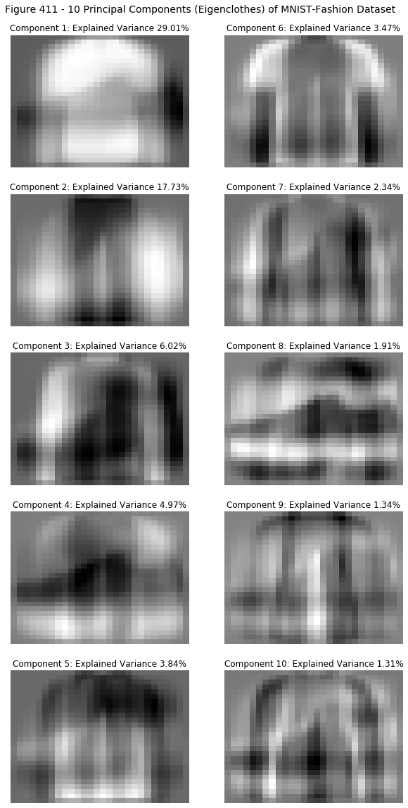


We now move on to studying how these 10 components are related to the original data. To do this, we create a 10x10 matrix of all the correlations between the components and the original classes of the data:


```python
correlations_array = np.zeros((10, 10))
# Computing all the correlations between components
for i, C in enumerate(PCA10.components_):
    for j in range(10):
        pictures_labelj = df_train_fashion_original[df_train_fashion_original["label"] == j].drop(columns=["label"])
        for k in range(pictures_labelj.shape[0]):
            P = pictures_labelj.iloc[k]
            correlation_comp_pic = np.corrcoef(C, P)[0, 1]
            correlations_array[i, j] += correlation_comp_pic
correlations_array /= 6000

fashion_names = ["T-shirt/Top", "Trouser","Pullover", "Dress", "Coat", "Sandal",
                 "Shirt", "Sneaker", "Bag", "Ankle Boot"]
df_correlations_pca10 = pd.DataFrame(correlations_array,
                                     index=[f"Component {i+1}" for i in range(10)],
                                     columns=fashion_names)

fig412 = plt.figure(figsize=(15, 10))
sns.heatmap(df_correlations_pca10.round(2), annot=True, cbar=True, fmt='g', cbar_kws={'label': "Correlation"})

title412 = "Figure 412 - Correlation Matrix of Components vs. Clothing Type for 10-PCA"
plt.title(title412)
plt.savefig(f"figures/{title412}.png")
plt.show()
```


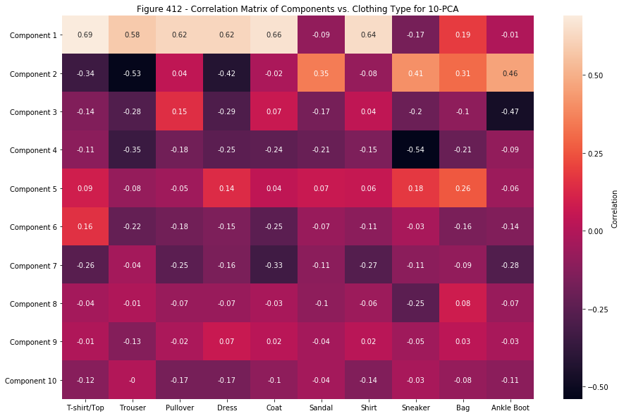


From the Heatmap above, we can clearly see that the first principal component is mostly positively correlated with a lot of the different clothing types, the second principal component is negatively correlated with Tops, trousers and Dresses but positively correlated with Sandals, Sneakers and Ankle Boots, indicating that this component is more related to clothes that resemble shoes.

***
__Negative Matrix Factorisation (NMF)__:

NMF is a dimensionality reduction technique, an alternative to the popular PCA discussed above. We saw that earlier that PCA creates a basis of components (vectors) which are constrained to be orthogonal to each other. In NMF, a different constraint is used, and it is that the component vectors are not allowed to contain negative entries, and a consequence of this is that the reconstruction into the image is additive-only, and so this is where the intuitive approach of combining by parts to create an image comes from. This improves the interpretability of the method when in comparison with PCA.

A feature of NMF is that its components are essentially localised features of the dataset. For example, for a dataset composed of faces, each component may correspond to some edge in the face (e.g. chin, nose, eyebrows, etc.). It turns out that for the Fashion-MNIST dataset, the components of NMF correspond well with different clothing types.

We now proceed to perform NMF dimensionality reduction on the whole training data of the MNIST-Fashion dataset:


```python
NMF10 = sklearn.decomposition.NMF(n_components=10).fit(X_Train)

# Visualising all 10 components for NMF
fig413, ax413 = plt.subplots(nrows=5, ncols=2, figsize=(10, 20))

for i, component in enumerate(NMF10.components_):
    idx1 = i%5
    idx2 = int(np.floor(i/5))

    component_reshaped = np.reshape(component, (28, 28))
    ax413[idx1, idx2].imshow(component_reshaped, cmap='gray', aspect='auto')
    ax413[idx1, idx2].set_title(f"Component {i + 1}")
    ax413[idx1, idx2].axis('off')

title413 = "Figure 413 - 10 NMF Components of MNIST-Fashion Dataset"
plt.suptitle(title413, y=0.91, fontsize=14)
plt.savefig(f"figures/{title413}.png")
plt.show()
```


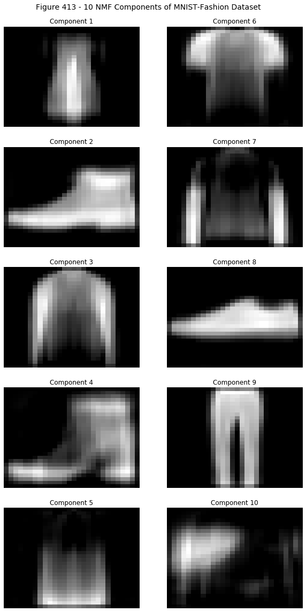


We now move on to studying how these 10 components are related to the original data. To do this, we create a 10x10 matrix of all the correlations between the components and the original classes of the data:


```python
correlations_array = np.zeros((10, 10))
# Computing all the correlations between components
for i, C in enumerate(NMF10.components_):
    for j in range(10):
        pictures_labelj = df_train_fashion_original[df_train_fashion_original["label"] == j].drop(columns=["label"])
        for k in range(pictures_labelj.shape[0]):
            P = pictures_labelj.iloc[k]
            correlation_comp_pic = np.corrcoef(C, P)[0, 1]
            correlations_array[i, j] += correlation_comp_pic
correlations_array /= 6000

fashion_names = ["T-shirt/Top", "Trouser","Pullover", "Dress", "Coat", "Sandal",
                 "Shirt", "Sneaker", "Bag", "Ankle Boot"]
df_correlations_nmf10 = pd.DataFrame(correlations_array,
                                     index=[f"Component {i+1}" for i in range(10)],
                                     columns=fashion_names)

fig414 = plt.figure(figsize=(15, 10))
sns.heatmap(df_correlations_nmf10.round(2), annot=True, cbar=True, fmt='g', cbar_kws={'label': "Correlation"})

title414 = "Figure 414 - Correlation Matrix of Components vs. Clothing Type for 10-NMF"
plt.title(title414)
plt.savefig(f"figures/{title414}.png")
plt.show()
```


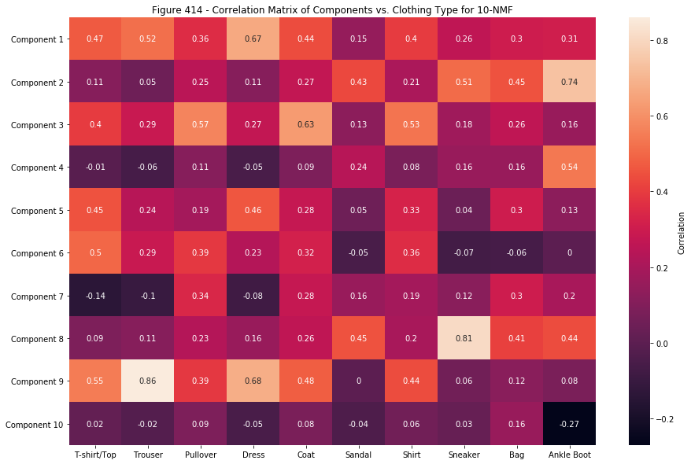


Figure 414 clearly shows that the many of the NMF components are strongly correlated with some items of clothing. In fact, we can confirm this correlation visually. For example, Component 8 is 81% correlated with the Sneaker category; we can see this in Figure 413 as it clearly looks like a sneaker.

From figures 413 & 414 we can see that the NMF method handles objects with holes the worst, as 1) none of the components resemble a Sandal object, 2) Component 5 vaguely resembles a bag, but the handle is not very clear, 3) Component 7 is very vague, and a mix between a bag and a pullover. Furthermore, Figure 414 shows that these components are least correlated with any fashion item, and the conversely, Pullover, Sandal and Bag are least correlated with any components.

***
__Differences observed between PCA & NMF__:

We first compute the sparsity of each component of PCA & NMF. For our purposes, we take any elements in the vector that are less than 1e-03 to be equal to zero to calculate sparsity. We will use the definition of sparsity: (number of zero elements)/(total number of elements).


```python
# Each component contains 784 pixels:
sparsity_pca10 = (np.abs(PCA10.components_) < 1e-03).sum(axis=1) / 784
sparsity_nmf10 = (np.abs(NMF10.components_) < 1e-03).sum(axis=1) / 784

df_sparsity_pca_nmf_10 = pd.DataFrame(np.array([sparsity_pca10, sparsity_nmf10]).T,
                                      columns=["PCA10", "NMF10"],
                                      index=[f"Component {i+1}" for i in range(10)])

df_sparsity_pca_nmf_10["NMF/PCA Sparsity"] = df_sparsity_pca_nmf_10["NMF10"] / df_sparsity_pca_nmf_10["PCA10"]

print("Table 415 - Sparsity Comparison PCA vs NMF")
display(df_sparsity_pca_nmf_10.round(3))
print(f"Average sparsity ratio NMF/PCA = {df_sparsity_pca_nmf_10['NMF/PCA Sparsity'].mean():.3f}")
```

    Table 415 - Sparsity Comparison PCA vs NMF


<div>
<style scoped>
    .dataframe tbody tr th:only-of-type {
        vertical-align: middle;
    }

    .dataframe tbody tr th {
        vertical-align: top;
    }

    .dataframe thead th {
        text-align: right;
    }
</style>
<table border="1" class="dataframe">
  <thead>
    <tr style="text-align: right;">
      <th></th>
      <th>PCA10</th>
      <th>NMF10</th>
      <th>NMF/PCA Sparsity</th>
    </tr>
  </thead>
  <tbody>
    <tr>
      <td>Component 1</td>
      <td>0.124</td>
      <td>0.647</td>
      <td>5.227</td>
    </tr>
    <tr>
      <td>Component 2</td>
      <td>0.074</td>
      <td>0.485</td>
      <td>6.552</td>
    </tr>
    <tr>
      <td>Component 3</td>
      <td>0.108</td>
      <td>0.439</td>
      <td>4.047</td>
    </tr>
    <tr>
      <td>Component 4</td>
      <td>0.075</td>
      <td>0.277</td>
      <td>3.678</td>
    </tr>
    <tr>
      <td>Component 5</td>
      <td>0.098</td>
      <td>0.500</td>
      <td>5.091</td>
    </tr>
    <tr>
      <td>Component 6</td>
      <td>0.074</td>
      <td>0.386</td>
      <td>5.224</td>
    </tr>
    <tr>
      <td>Component 7</td>
      <td>0.057</td>
      <td>0.390</td>
      <td>6.800</td>
    </tr>
    <tr>
      <td>Component 8</td>
      <td>0.059</td>
      <td>0.614</td>
      <td>10.457</td>
    </tr>
    <tr>
      <td>Component 9</td>
      <td>0.065</td>
      <td>0.577</td>
      <td>8.863</td>
    </tr>
    <tr>
      <td>Component 10</td>
      <td>0.048</td>
      <td>0.321</td>
      <td>6.632</td>
    </tr>
  </tbody>
</table>
</div>


    Average sparsity ratio NMF/PCA = 6.257


From Table 415, we can see the components in NMF are on average approx 6 times more sparse than the components of PCA. By comparing Figures 411 & 413 we can visually see that NMF components have a much higher correspondence to the visual features than PCA compoments. PCA components look like amalgamation of features into every component in different ratios. The sparsity and the correspondence to visual features make NMF a much more interpretable dimensionality reduction method than PCA.

### Question 4.2 - Latent Dirichlet Allocation (LDA) Applied to Images
***

LDA is a method used to group documents into topics according to their similarities. LDA is a topic modelling technique used in natural language thought, which can be thought of as a soft-clustering technique (i.e. boundaries between clusters are not hard). The main idea behind topic modelling is that any document is composed of topics, and each topic itself a distribution of words. In LDA, we can specify the number of topics we wish to identify across a set of documents.

There are some assumptions that LDA makes:
1. Each document is composed of a soup of words, and order is ignored. We can immediately see that this is already a simplication of language.
2. Articles and other superfluous words are ignored as they are too general to be included in any specific topic, and so we can delete these from our dataset of documents.
3. The topics are assumed to have a Dirichlet prior distribution.

LDA uses Bayesian inference with a Dirichlet prior for the topics to identify topics in a dataset of documents.

__Relating LDA to our use-case__:

Using the analogy presented in the question, (document - image, word - pixel), we introduce the third analogy of (topic - image feature (this time clothing feature)) to adapt the problem to our domain. Assumption 1 implies that the order of the pixels does not matter. Assumption 2 implies that there may be pixels in our image which might not be of relevance in our images (around the borders for example). Assumption 3 means that the features across the dataset of images are assumed to be Dirichlet distributed.

We can now use the scikit-learn implementation of LDA ```sklearn.decomposition.LatentDirichletAllocation``` with the parameter n_components equal to 10 to attempt to find to 'topics' in our images that display high similarities.


```python
LDA10 = sklearn.decomposition.LatentDirichletAllocation(n_components=10).fit(X_Train)

# Visualising all 10 centroids for LDA
fig420, ax420 = plt.subplots(nrows=5, ncols=2, figsize=(10, 20))

for i, component in enumerate(LDA10.components_):
    idx1 = i%5
    idx2 = int(np.floor(i/5))

    component_reshaped = np.reshape(component, (28, 28))
    ax420[idx1, idx2].imshow(component_reshaped, cmap='gray', aspect='auto')
    ax420[idx1, idx2].set_title(f"Centroid {i + 1}")
    ax420[idx1, idx2].axis('off')

title420 = "Figure 420 - 10 LDA Centroids of MNIST-Fashion Dataset"
plt.suptitle(title420, y=0.91, fontsize=14)
plt.savefig(f"figures/{title420}.png")
plt.show()
```


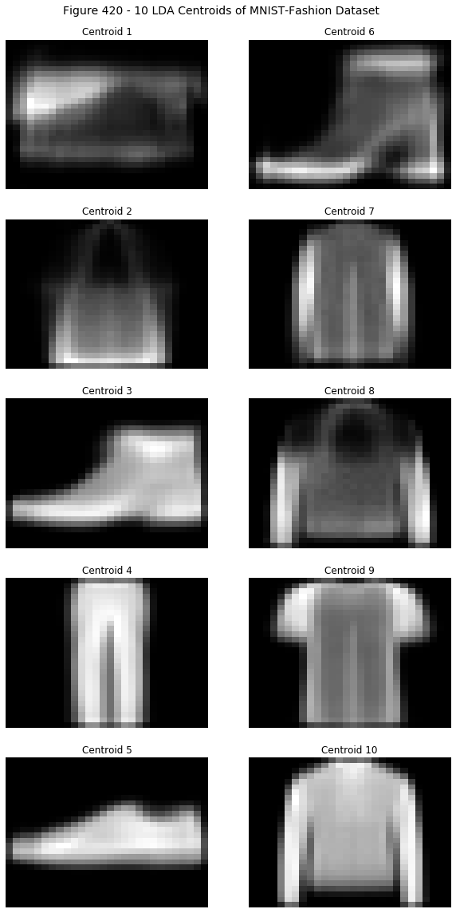


We now move on to studying how these 10 components are related to the original data. To do this, we create a 10x10 matrix of all the correlations between the components and the original classes of the data:


```python
correlations_array = np.zeros((10, 10))
# Computing all the correlations between components
for i, C in enumerate(LDA10.components_):
    for j in range(10):
        pictures_labelj = df_train_fashion_original[df_train_fashion_original["label"] == j].drop(columns=["label"])
        for k in range(pictures_labelj.shape[0]):
            P = pictures_labelj.iloc[k]
            correlation_comp_pic = np.corrcoef(C, P)[0, 1]
            correlations_array[i, j] += correlation_comp_pic
correlations_array /= 6000

fashion_names = ["T-shirt/Top", "Trouser","Pullover", "Dress", "Coat", "Sandal",
                 "Shirt", "Sneaker", "Bag", "Ankle Boot"]
df_correlations_lda10 = pd.DataFrame(correlations_array,
                                     index=[f"Component {i+1}" for i in range(10)],
                                     columns=fashion_names)

fig421 = plt.figure(figsize=(15, 10))
sns.heatmap(df_correlations_lda10.round(2), annot=True, cbar=True, fmt='g', cbar_kws={'label': "Correlation"})

title421 = "Figure 421 - Correlation Matrix of Components vs. Clothing Type for 10-NMF"
plt.title(title421)
plt.savefig(f"figures/{title421}.png")
plt.show()
```


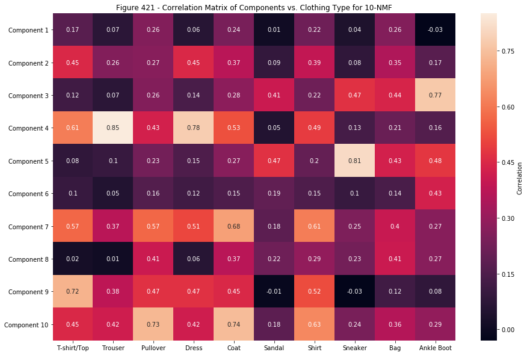


I would expect LDA to work on this problem, as LDA is a very general method that works on datasets assuming sparsity of topics in documents and sparsity of words in the topic, which after making the analogy above amounts to saying sparsity of image-features in the images and sparsity of pixels in the image-features.

From Figure 420, we can already recognise some familiar shapes. Compared with the components in part 4.1, the components of LDA are more easily interpretable.


In a sense, this analogy is not necessarily the most intuitive one for processing images. By using pixels as 'words', we are actually breaking down the image into its smallest possible components. In literative-speak, the most basic components of text are not words, but letters. Thus to actually represent 'words' of an image, we could use larger portions of the image (e.g. a 3x3 window of the image) or even convolutions of the image as words, which would then be fed into the LDA algorithm.

# _The End_
